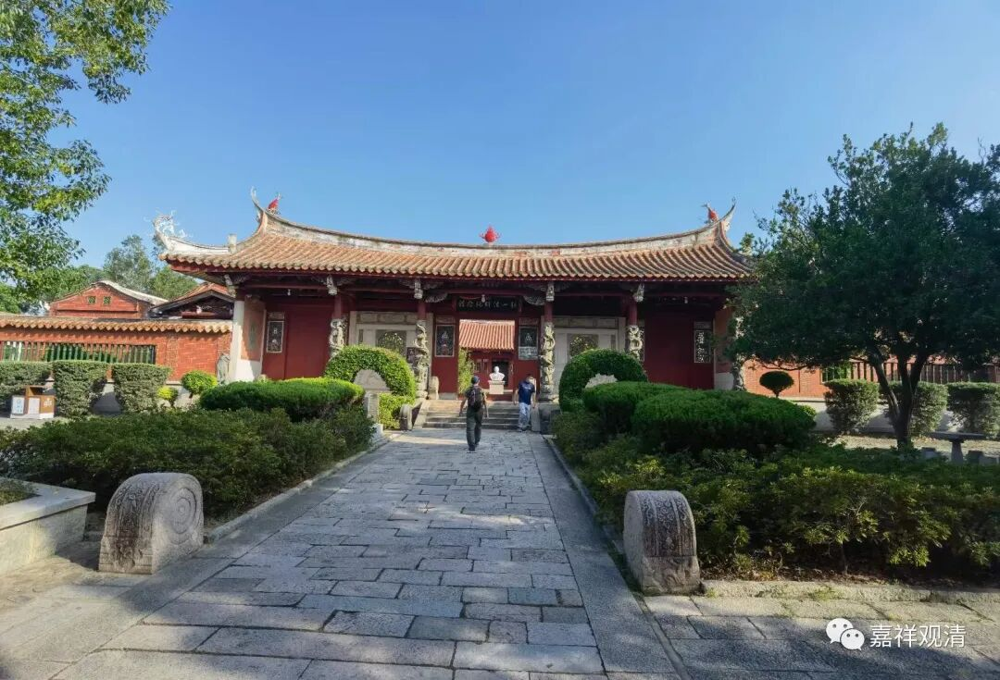
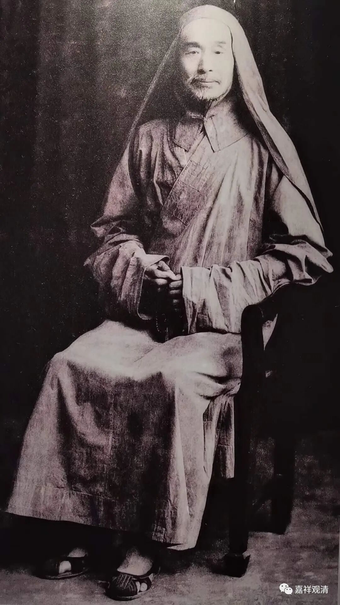
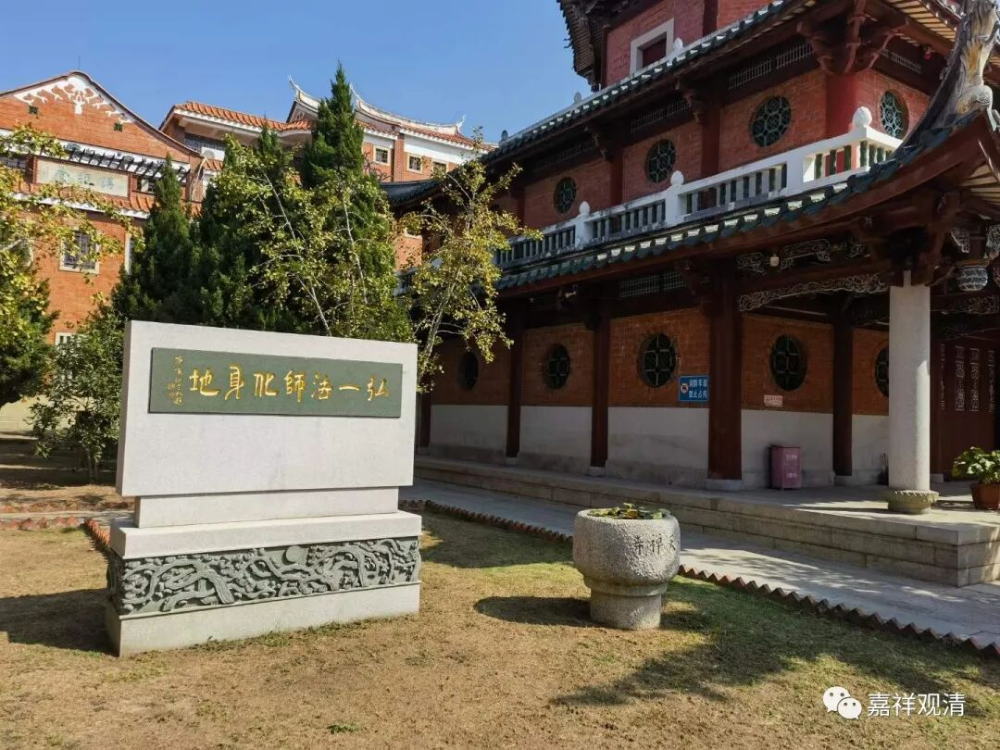

**无题**

来到了泉州。感觉到了泉州的气候，真是舒爽，至少这个秋（冬）天，挺暖和的——这些天（十一月初）都三十多度了，出门一动，浑身是汗，我还以为是我气虚了呢，赶紧泡人参吃。

弘一法师晚年长期待在泉州，他在泉州开元寺圆寂，在泉州承天寺荼毗。晚年的弘一法师在闽南地区待了有十四年，闽南地区（可考的）有五十多个寺院留下了他的足迹，后来闽南佛教恢复，很多大佬也都是弘一法师的学生。今天闽南很多寺院都挂着弘一法师的书法、对联，感觉弘一体都快统一全闽寺院了。

实地走了一下、体验了一下，就明白弘一法师为什么晚年待在泉州（及附近）了——他身体虚弱，闽南的气候比较合适——昨天说了，气候、气象上，这里已经属于南海周边的气象范围了。

（泉州承天寺“弘一法师化身地”。有俩游客说：这是弘一法师坐化的地方我赶紧走两步过去，说：这不是“坐化”的化，是“火化”的化。）

弘一法师作为一时的名僧，当时（民国）在任何寺院都是作为上宾、客卿被对待的，今天，就是他再来都不可能有这样的待遇了。今天的寺院对“高僧”（不是职位的“高”）是没有敬畏的，对“著名佛教学者”则极尽谄媚——名校的佛教相关的教授在今天的大小寺院可以横行，得到的待遇都远超当年弘一法师的待遇，至于教界顶尖的学问僧若是想要有三四流佛教学者的待遇，呵呵，“雷斌沟啊”“你怎么能有如此僭越的想法呢”！

呵呵……

“噶当十密财”说：“出于人群，入于狗伍，得于圣道。”被动的“出于人群，入于狗伍”，大概离圣道也不远了吧……

