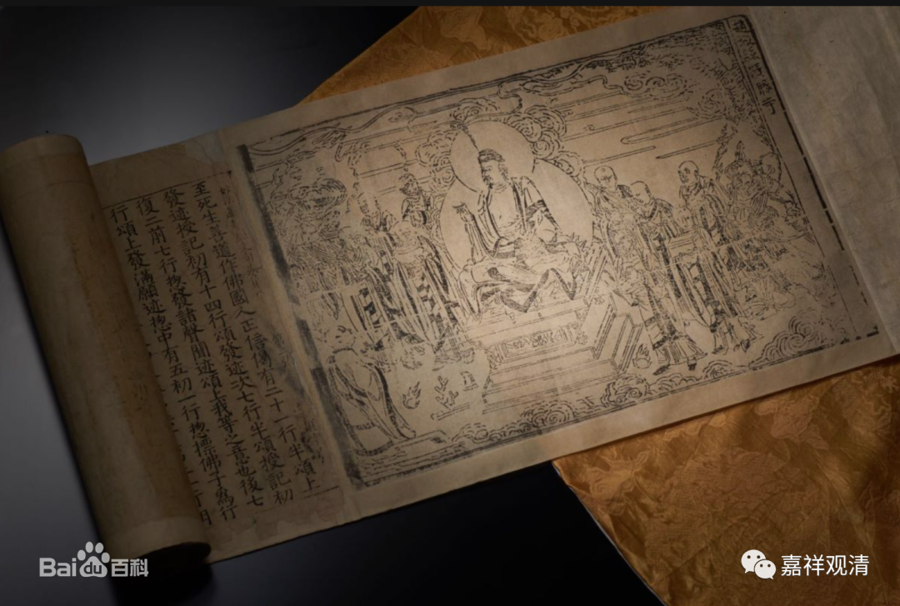

**“苦行”及其他**

堂堂发来几张照片——

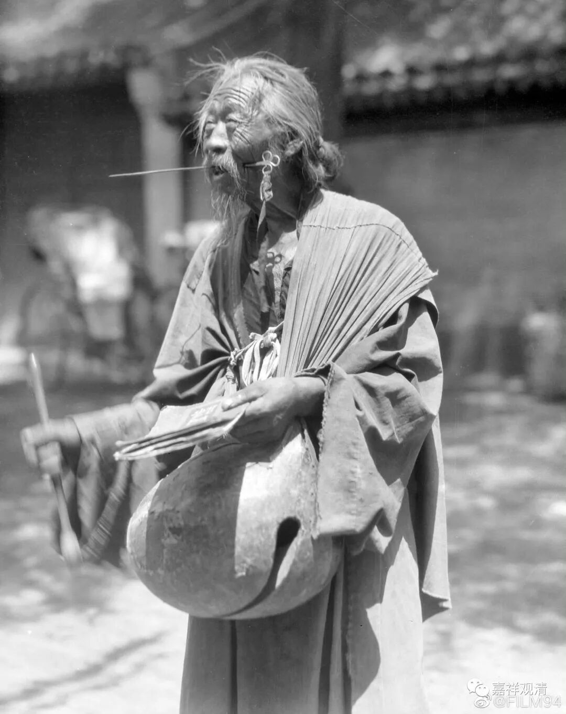

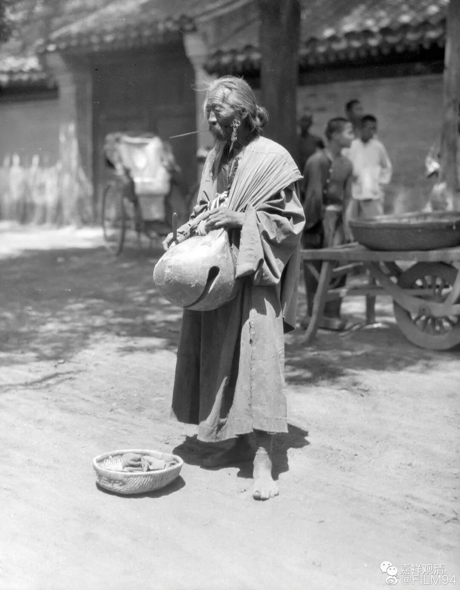

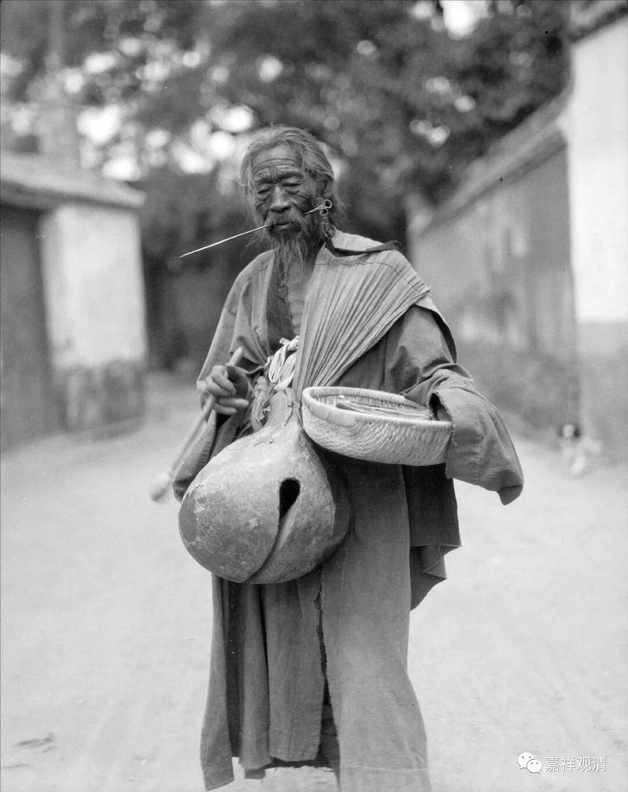

是外国人西德尼·D·甘博在1926年在北京拍摄的“苦行化缘”的照片了——

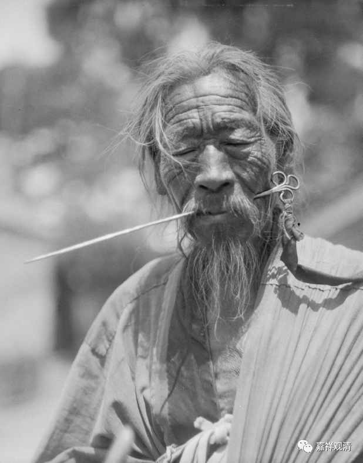

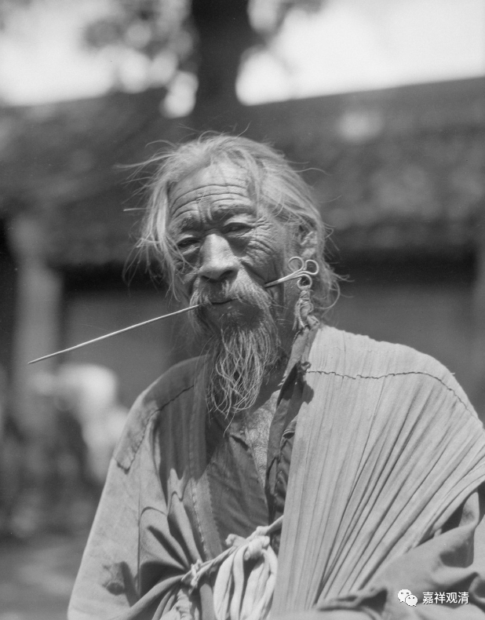

现在还有后期染色的——

这种“苦行化缘”，其实是有点类似“卖惨”的套路啦，不能真的叫“苦行僧”，算是在民间的宗教、民俗的一种常见的行为了。它用一种自虐的方式博得同情与夸赞，来化缘，有些化缘本身就是目的（如上图），有些也有为了建寺院的（见仇英版《清明上河图》），甚至也有募刻藏经的（《赵城金藏》）。

这是仇英版《清明上河图》里沿街礼拜化缘建庙的（一人礼拜，周围几个人介绍的介绍，收钱的收钱）——

纽约大都会版《清明上河图》里沿街礼拜化缘建庙——

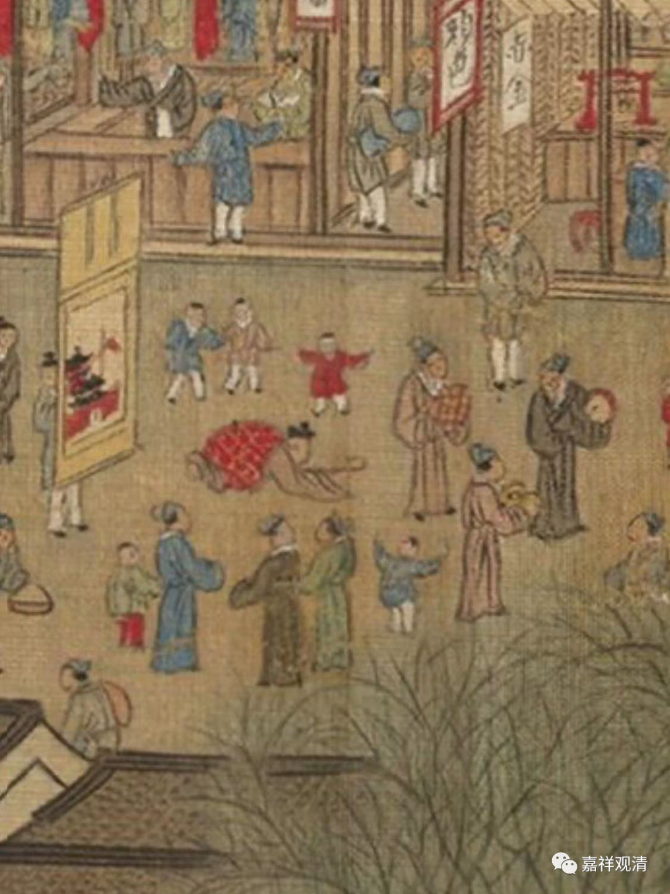

这是仇英版《清明上河图》头顶宝塔化缘的——

台北故宫版《清明上河图》头顶宝塔化缘——

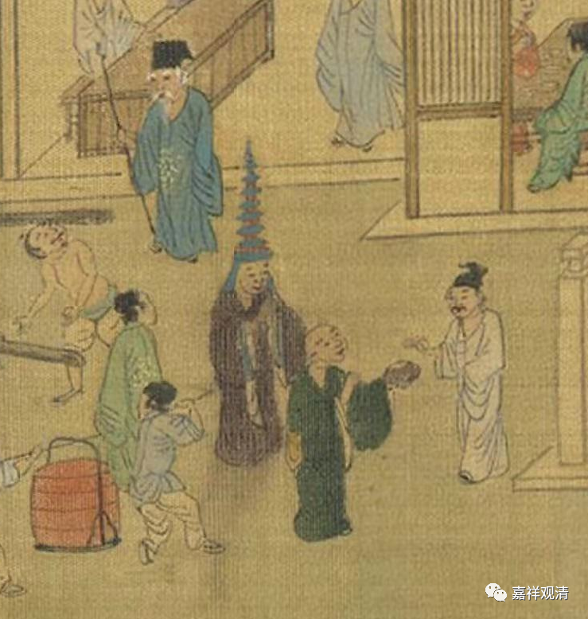

著名的《赵城金藏》，最初也是民间私刻的，它的缘起，就是潞州崔法珍断臂募刻，其“烈度”更大，所谋也更大。

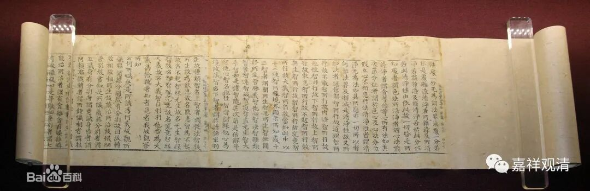

赵城金藏·阿毗达摩杂集论

民国初年北京街头这种钢钎穿腮帮子，海南叫“公期”，专门有“军颇节”，有单人的——

也有多人串串的——

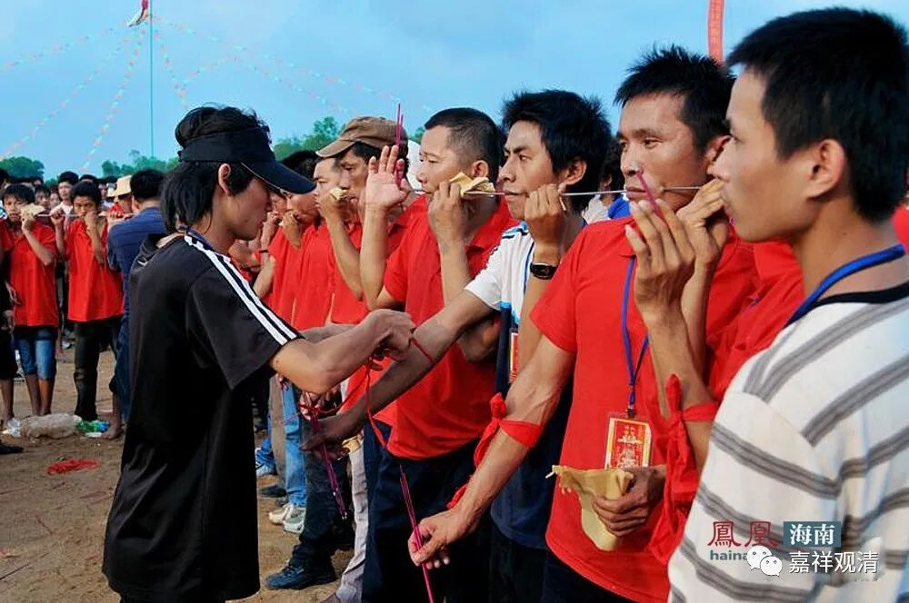

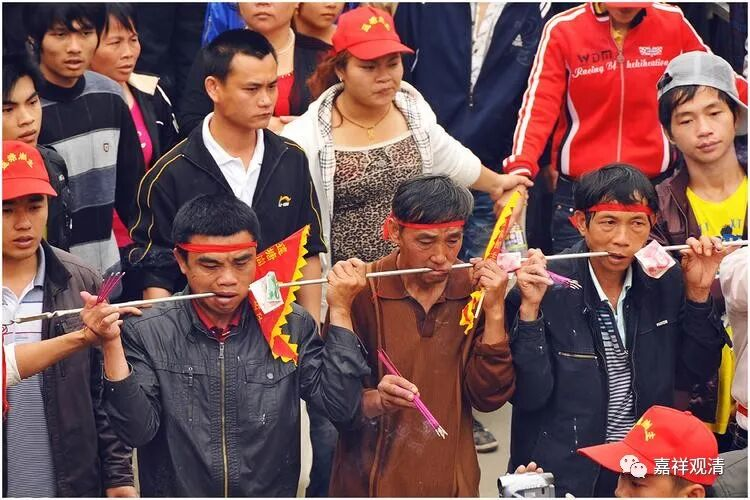

泰国也有，好像“强度”也更峻烈！——

看着有点吓人……

世界很大，烦恼的表现形式也很多……

我们这种胆子小的、怕疼的要老实

