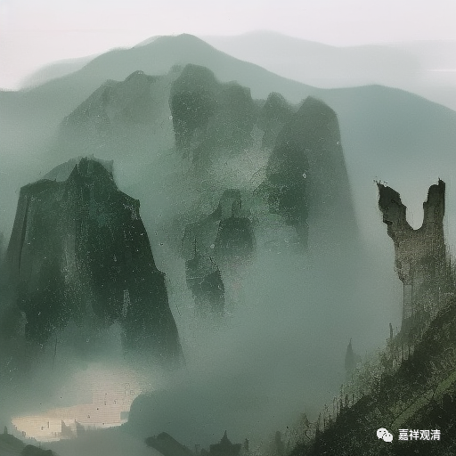

**一**

** “所谓荒诞，是指非理性和非弄清楚不可的愿望之间的冲突，弄个水落石出的呼唤响彻人心的最深处。荒诞取决于人，不多不少也取决于这个世界。荒诞是目前人与世界唯一的联系，把两者拴在一起。”**

被戳中了，找到出处，说是出自加缪的《西西弗神话》。管他写的是什么，我找到了中心词——荒诞！

** 二**

我们周围不断演绎着荒诞，最后发现荒诞也许就是我们自己。

佛教本身标榜理性，大量的非文盲的教徒也号称自己在“追求智慧”，天天念着《智慧圆满之诀窍》（《般若波罗蜜多心经》），可是，理性的“智慧窍诀”似乎一直被用来实践着非理性，它在世上的主要用途是被用来——“保佑”。

一帮自以为“天下唯我（们）在修行”的人，每天念着“法门无量誓愿学”，指责着“非我族类”的人说：“你们每天骗佛两次，却不肯学习！”他们的意思是：其他的佛教徒虽然每天两遍在念着“法门无量誓愿学”却不愿意学习。但当我真正走近他（她）们，问道“什么是皈依”“什么是法宝”的时候，却一样地张口结舌，但你告诉ta可以在ta师公的某本集子的讲义里找到答案的时候，学了十几年“啥啥宗”的ta突然骄傲地笑对你说：“嘿嘿，我没学过”……（这个“镜头”无比之** 荒诞**！）

——你这么可以这么毫无惭愧？！

“我（唯一的）老师没讲过的我不学！”

——那你不是在批评别人“法门无量不愿学”吗？

……（指出皇帝没穿衣服的你，我们不欢迎！）

** 三**

荒诞取决于人，也不多不少取决于世界。荒诞是目前人与世界唯一的联系，把两者拴在一起。

** 四**

荒诞——

这个词，我找了三天……

** 五**

我很害怕，我怕最终我是他们，弟子也是他们……如果那样的话，绝嗣就是幸运的。

我不“催生”了。。。。。。（我用的不是省略号）

