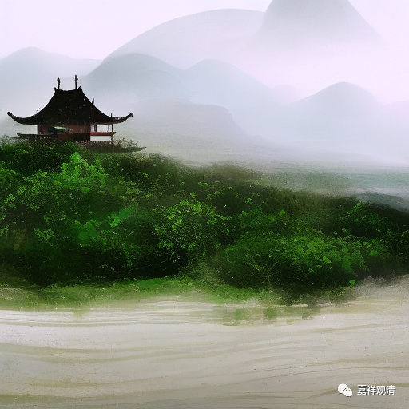

**微课堂佛教史 426·1

在中国的禅宗史当中，排名第一的居士是庞居士——庞蕴，第二个大概就要轮得上张商英了。我们看看，接下去是不是安排专门讲一下张商英。庞居士是唐代的，不过他没做官。

那么，圆悟克勤禅师就学习了很多佛教经典方面的内容，这和之前的好几位大法师都是一样的，所以你们看，这些著名的大禅师都是学过不少经典的。然后呢，他突然之间生了一场大病——我不知道他生的是什么病，是心脏病还是别的什么病，总之他觉得自己快要死了。突然之间就想到：“我以前学的这些东西，好像不怎么管用啊，好像临死的时候用不上啊。”于是，幡然醒悟：“哎哟，看样子还有其他东西要学。”那个时候江湖上特别有名的就是禅宗，从此就决定学禅宗了。

所以圆悟克勤禅师是从戒律，从讲说开始，然后走进禅宗里面的。他本身的天资就比较高，世间的文化基础也有一点，因此学起来很快。江湖上的这些大佬们都认为他是一个可造之材，纷纷地肯定他，纷纷地首肯他：“不错啊！你已经开悟了。”大家都肯定他了，很多人都承认他开悟了。

有一次在黄龙慧南禅师的弟子黄檗惟胜禅师那里，黄檗惟胜禅师刺臂出血——我觉得应该不是存心的，应该是手上出血，可能是干活的时候出了点血，就对圆悟克勤禅师说：** “此曹溪一滴也。”**因为一般我们会讲“曹溪一滴水”嘛。

这就是一句开玩笑，意思是说我这血液里面流淌的是曹溪的血，差不多这个意思。很多人都把这句话看作是一种禅机，应该谈不上，也就是禅师之间互相聊天开玩笑的情况。

后来呢，圆悟克勤禅师就** “徒步出蜀”**。前面我们也讲过，这个时候大家好像喜欢到处去参访，喜欢到处跑。他就出了四川，去到湖北，他的主要活动范围就在四川、湖北一带。

圆悟克勤禅师去湖北的时候就到了玉泉山，拜见了云门宗的玉泉承皓禅师。玉泉山这个地方，我们也讲过好几次了，很重要的。我记得我手上有一本《玉泉山志》还是《玉泉寺志》。

后来他又参访大沩山的慕喆禅师，慕是羡慕的“慕”，喆就是两个“吉”，这位禅师是石霜楚圆禅师的徒孙，是临济宗的。你们看，他到各个门下都去接触过。

然后呢，他还参访了黄龙祖心禅师——这位禅师我没有谈过，还有东林常总禅师——我们以后谈张商英的时候也会谈到这位。这两位禅师都是黄龙慧南禅师的弟子，都是临济的。

这些禅师都认为圆悟克勤禅师是一个人物，是一个法器，说什么呢？说：“将来临济宗的一派就归你了，你最厉害了。”就是江湖大佬们都对他挺满意，他也觉得自己挺厉害，知识分子嘛，也比较骄傲。但是，他到底有没有真正开悟呢？

