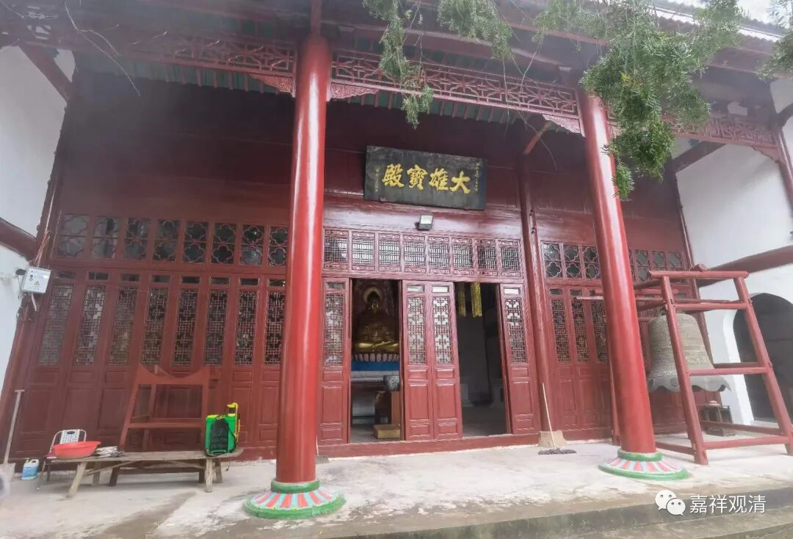
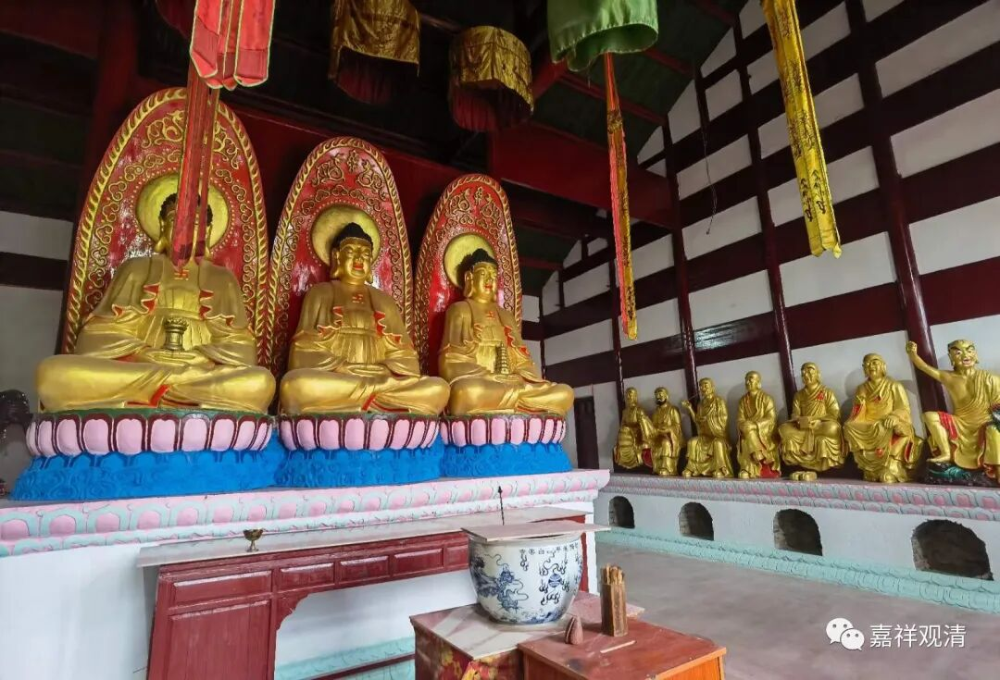
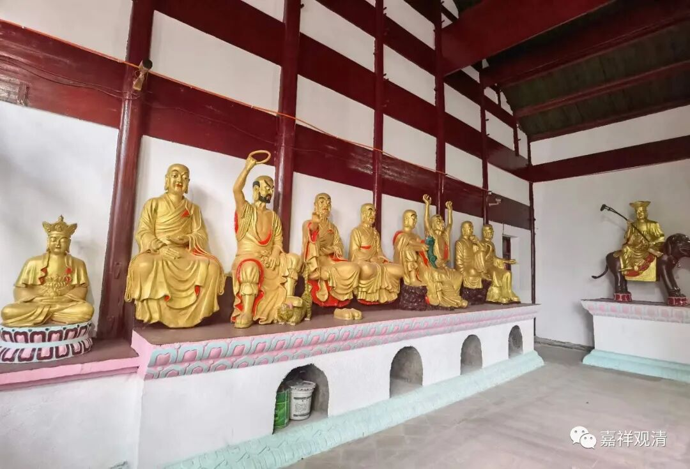
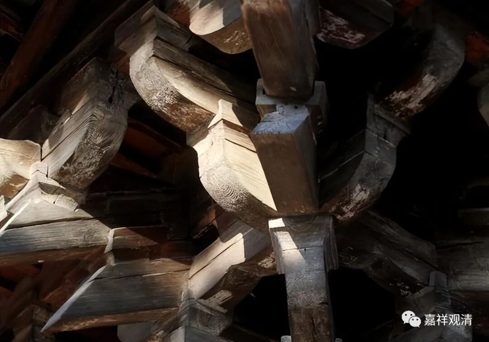
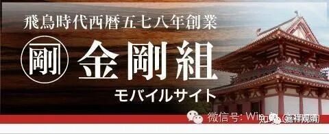
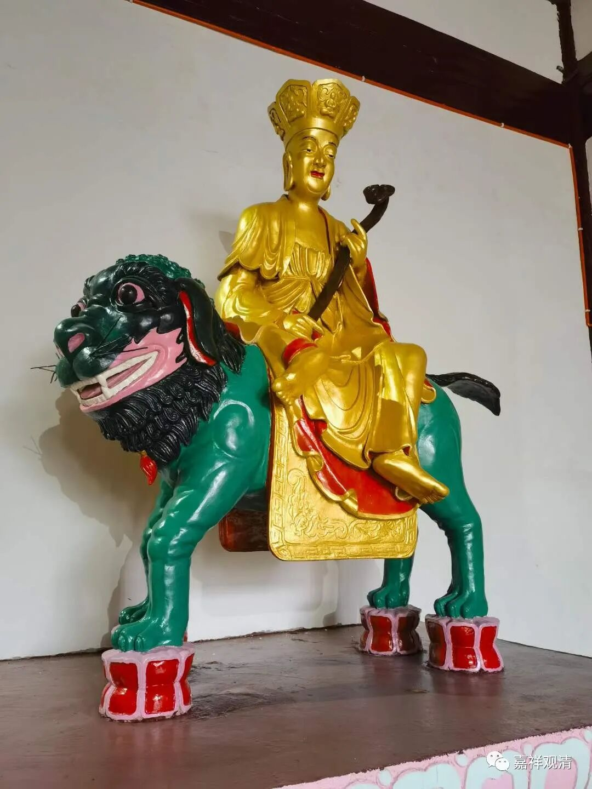

**“大雄宝殿”悖论

庙里大殿的粉刷上漆、佛菩萨罗汉像刷金完成了！

经过半个多月的清洗、打磨和粉刷、描金，白云寺大殿现在已经焕然一新。

老式的寺院最老大难的问题就是在大殿点香烛造成的烟焦油清理问题，定期清洁、过几年大修、粉刷、贴金就是常见的做法了。

这还不算是寺院的“大修”，寺院建筑的“大修”就更复杂了，基本上就是寺院按原样拆解——找古建工人把榫卯结构的建筑“反向操作”令它“从有到无”，整个建筑“化整为零”，拆为原样的木构件。这个时候，该换椽子的换椽子，该换大梁的换大梁……然后再按原样重建，这就不是一般的修修补补了。这样，后来的大殿可能柱子是宋代的，梁有几根是明代的，椽子和瓦片则各个年代的都有……

这样“大修”有一个好处——假如以一个有延续传承的工匠系统一直“承包”此类工程的话，相关建筑结构的核心技术通过这样反复拆建能够一直被熟练掌握，日本就有这样上千年传承的工匠“组”，最有名的是“金刚组”。金刚组不是最老的，但应该是日本这个行业里面最有名的。（前几年听说金刚组倒闭，被一个什么建筑“株式会社”收购了。）

如果去日本的京都、奈良，会看到很多千年古寺，这些寺院大多都辟有“珍宝馆”，经常可以在馆内看到置换下来各个时代的建筑构件。也经常可以看到寺院某处在“大修”，这样的大修甚至可以跨越一二十年。

我们的寺院没那么古老，不用这么折腾了，因为六十年前，原先的古寺已经被一帮年轻人全部拆完了，这让我没有了“文物保护”的压力。现在庙里只有一些碑石柱础之类的老东西还在，几年前还有人给我“爆料”，说在景德镇的文物市场见到过我们白云寺的香炉……噫，俱往矣……

（思考题：

千年古寺的“大雄宝殿”拆建，每次换一个零件，大殿还是“某某寺大殿”吗？

如果不是，“某某寺大殿”呢？

如果说“还是某某寺大雄宝殿”，那等全部零件换完了，还是“某某寺大雄宝殿”吗？

……

乃至，

把换完的零件再起一个大殿，那请问，哪一个是“某某寺大雄宝殿”？）

