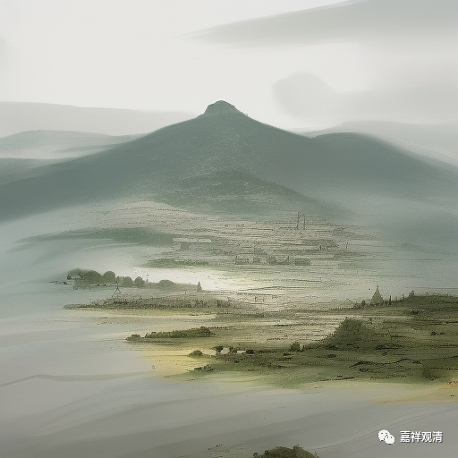

**微课佛教史426·2**

这时候圆悟克勤禅师就碰到了五祖法演禅师。我们前面讲过，五祖法演禅师是临济宗大师级的人物，五祖法演禅师对圆悟克勤并不称许。

那圆悟克勤禅师为什么会去拜见五祖法演禅师呢？因为在大沩山的慕喆禅师门下有一位庆禅师，是管藏经的，对曹洞宗比较了解。他们两位成为了好朋友，圆悟克勤禅师在他这里也学到了不少东西。

有一次，庆禅师就对圆悟克勤禅师讲：“之前你不是在东林常总禅师那里学东西嘛，是吧？江湖上总会有人在背后说话的，他们说什么呢？说东林常总禅师其实水平也就一般。”庆禅师就告诉他，印可你的那位师父其实“他也一般”，意思是：你要考虑有没有真的“见性”。我们在前面也讲到过这样的情况，黄龙慧南禅师也发生过类似的故事，是吧？然后呢，庆禅师就带他去见五祖法演禅师。

到了五祖法演禅师那里，圆悟克勤禅师就觉得自己水平很高，就跟五祖法演禅师抗辩。那五祖法演禅师就对他不满意，觉得水平不够：“这不对的，你现在表现出来的这些东西能管得了生死吗？到你要死的时候，这些都管得上用吗？管不上用，你在这里跟我谈什么？”

圆悟克勤禅师也不买账，反正印可他的大佬多了去了，就这一位不承认有什么呢？他就不当回事，呵呵，和今天的很多人一样，自信足够。

后来他去了金山寺，突然在那里又生病了。生病的时候，他想把功夫提起来，但这个时候功夫好像怎么都提不起来，哪个都没用。圆悟克勤禅师这才想到：“看样子五祖法演禅师是个厉害的人啊！他看出我的问题了。如果我这次不死，我一定要回去见他。”

然后他就没死，病好了，就老老实实回到了五祖法演禅师那里，继续进修。

那今天先讲到这里啊，谢谢大家！

