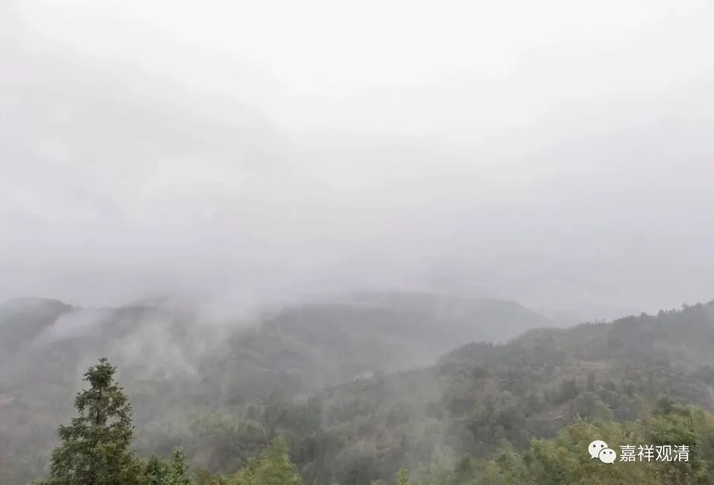
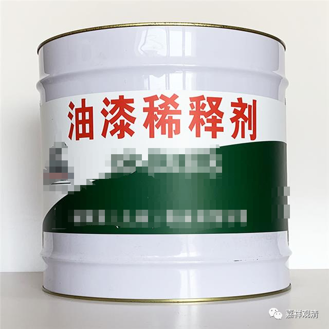
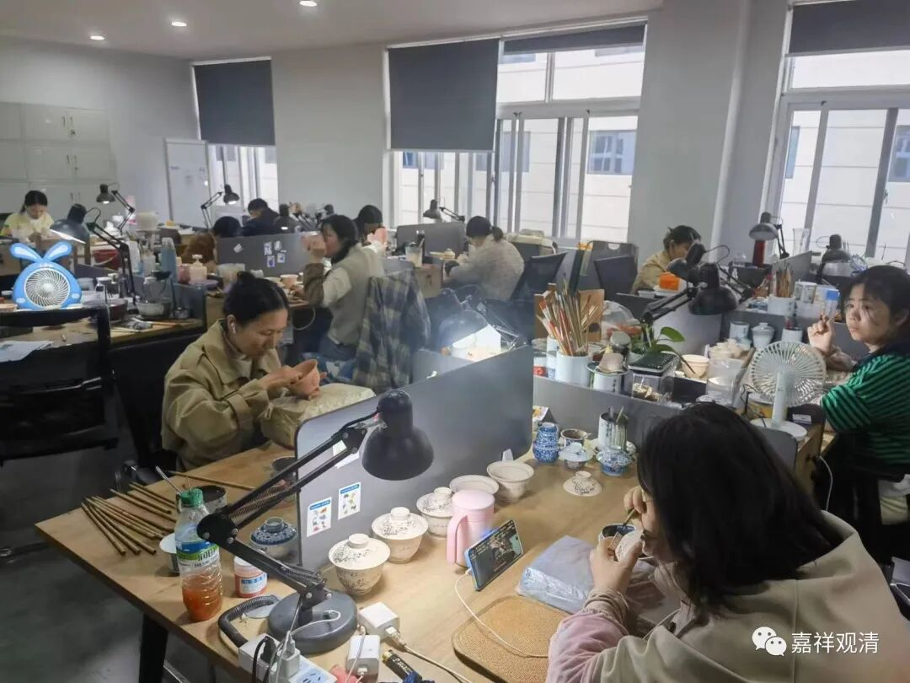
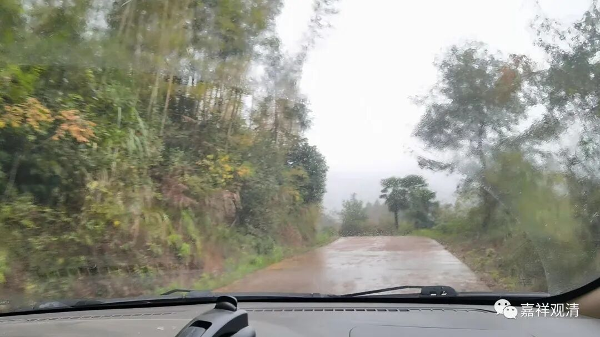

**寺院流水帐**

寺院大殿油漆粉刷、佛像贴金已经完成，今天继续在做后续清理工作。

大殿喷漆的时候由于地板没做好“防护”，地上也被喷上了红色的油漆点点，其实早点预备的话，地上是可以铺上报纸的，那样现在处理起来就比较轻松。（其实我对地上的油漆都没注意到，密度还蛮均匀的。）

上午，庙里现在的几个义工蹲那儿很久才清理了一块瓷砖……智慧的老胡提来之前刷漆时候用工人们用的“稀释剂”，用刷子蘸上就去刷，刷完再用拖把一拖——干净利落，多快好省！其实用汽油也可以擦掉油漆的，庙里正好还有一桶。

粉刷装修大殿的是景德镇W家窑的老板一家（随喜他们功德），他们住在大源水库边上的大源村，那个地方以前只有小路通寺院，前两年中湾村到大源水库的路修通（这条路的风景很好，可以理解为原始森林，我们徒步走过，有一年夏令营在水塘里玩水），可以通车，大家来回都方便了。

现在寺院下山有四条大路，一条是走黄坛，一条走大源水库，一条走侯家岗，一条走经公桥，我刚来的时候，只有一条半大致可以通车。现在的交通情况比以前好多了。

老周说，我们大雄宝殿门口的钟鼓可以往前挪，搞两个亭子分别放钟鼓，我觉得可以考虑。

大殿后面还要起一个檐挑出去，跟老周说了，让他们“照办”（不过他们现在都停工了）。

