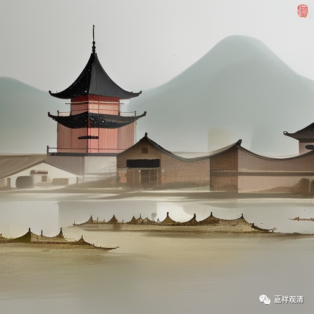

这里的“平等德”，是指“实”法中所有的“地、水、火、风、空、时、方、我、意”九法都具备的性质；“能造德”，是指“实”法中“地、水、火、风、空”五法所具备的性质。“我德”，是指“我、意”二法所具备的性质。

吉藏说“**色是火德，香是地德，味是水德，触是风德，声是空德也** ”**。** 此说与《胜宗十句义论》《胜论经》等皆不同。《胜宗十句义论》说：

“**地云何？谓有色、味、香、触，是为地。

** 水云何？谓有色、味、触，及液、润，是为水。

**火云何？谓有色、触，是为火。

** 风云何？谓唯有触，是为风。

**空云何？谓唯有声，是为空。** ”

若单纯依文字，吉藏之说也没有错，我们来看——

慧月《胜宗十句义论》

吉藏《百论疏》

地

色、触、味、香

香

水

色、触、味、液、润

味

火

色、触

色

风

触

触

空

声

声

吉藏之说失之简略，虽不算错，但容易造成以为是一一对应的误解。

吉藏说“智等有五德，是我德也”，若据《摄句义法论》：

“**我的德是：觉、乐、苦、欲、瞋、勤勇、法、非法、行、数、量、别体、合、离……** ”

“**觉、乐、苦、欲、瞋、勤勇可由意感觉。** ”

若考虑吉藏的十七种说中没有“勤勇”，则吉藏《百论疏》之说和《摄句义法论》是符合的。而《胜宗十句义论》，也略同于《摄句义法论》。《胜宗十句义论》说：

“**我云何？谓是觉、乐、苦、欲、瞋、勤勇、行、法、非法等，和合因缘起智为相，是为我。**

** 意云何？谓是觉、乐、苦、欲、瞋、勤勇、法、非法、行、不和合因缘起智为相、是为意。**”

但《胜论经》（月喜疏）则不然，据《胜论经》说：

“** VS-C3.2.1我、感官、对象接触时，认识的有无是意的相状。**

** VS-U3.2.1我、感官、对象接触时，认识的有无是意的相状。”**

** “VS-C3.2.4‘吸气、呼气、闭眼、睁眼、命、意活动、其他感官的变化、乐、苦、欲、瞋、内在努力’是我的相状。**

** VS-U3.2.4‘吸气、呼气、闭眼、睁眼、命、意活动、其他感官的变化、乐、苦、欲、瞋、内在努力’是我的相状。**”

如此，《胜论经》是说，“觉”是“意”的德，“乐、苦、欲、瞋、勤”是“我”的德。

吉藏此处之说与《胜论经》差别较大，与《胜宗十句义论》《摄句义法论》相近。

另外，可以看出吉藏所传的胜论宗义比较精炼，比较符合“独立圈外人”对相关学科理解的常态。

