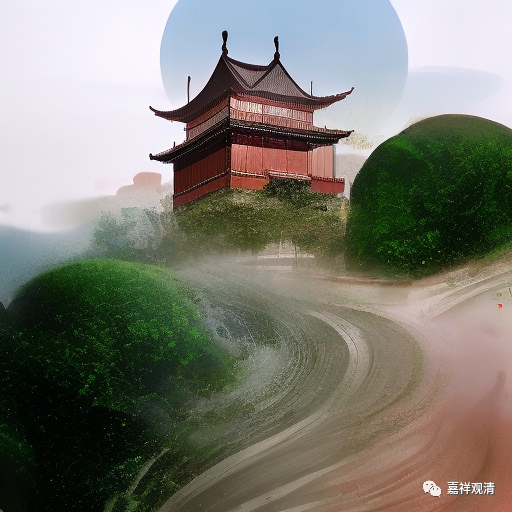

**微课堂佛教史428·1

圆悟克勤禅师就问：“刚才说‘只要檀郎认得声’，既然是认得声，为什么又说他不对呢？”檀郎已经认得声了，怎么还不对呢？

五祖法演禅师就说：** “如何是祖师西来意？庭前柏树子。”**这也是一个公案，是赵州祖师的公案。就是有人问什么是祖师西来意，赵州禅师答“庭前柏树子”。

认得声只是“认得声”，其实，小姐的一举一动一颦一笑都在你檀郎身上啊！就像你问“祖师西来意”，我的一举一动都在引导你，又何处、何时不是在教学中呢？！

说圆悟克勤禅师当下大悟，就出去了，然后正好看到鸡飞到栏杆上在叫：** “此岂不是声？”**“只要檀郎认得声”，是不是这个呢？或者说这个不是吗？

然后** “袖香，入室通所得。”**我们以前讲过这个“香”，在这里又出现了。袖香，就是袖子里边装了香。我们前面讲过“直裰”，是吧？就是有点像海青，比大褂的袖子再长一点，再宽一点。那么，他在袖子里面装了香，就“入室通所得”。这个时候就是比较正式的，把自己所知道的所了解的东西都讲一讲，如果师父同意的话，就出来点一枝香供养，也就算得法了，是吧？

然后圆悟克勤禅师又呈上一首偈子，这个偈子也是一首风流的偈子，很有趣。

** “金鸭香销锦锈帏，笙歌丛里醉扶归。

**少年一段风流事，只许佳人独自知。”

他是从一首小艳诗开始，最后又呈上一首小艳诗结束。

五祖法演禅师这下就认可了，印证了。五祖法演禅师说：** “佛祖大事，非小根劣器所能造诣，”**一般的人是没有这个能力的。** “吾助汝喜。”**你能够得到今天这样的结果，我很高兴。于是五祖法演禅师就开始在江湖上帮他传名。

中国的这些师父们真的有这个情况哦，就是把别人带一带，带一带自己徒弟，也算是加持吧（以前有个说法，叫“扶上马，再送一程”，现在有些好的师父也是这样，帮弟子传名声，介绍人脉）。五祖法演禅师就向江湖上传播：** “我侍者参得禅也。”**我的侍者悟禅了。

这个时候在五祖法演禅师的门下有三个大弟子：佛鉴慧勤禅师，佛眼清远禅师和圆悟克勤禅师。

那么，这个时候到圆悟克勤禅师底有没有悟呢？其实还差一点——这个檀郎还有点木讷。

……

