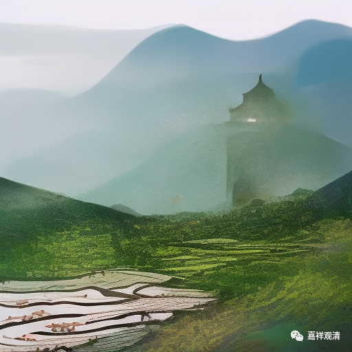

**微课堂佛教史 429·1

我们继续佛教禅宗史，现在讲到圆悟克勤禅师。

上次讲了圆悟克勤禅师经历了几次大悟，是吧？最后一次是抓住师父的棍子：“好，我明白你了，你还在玩我啊。”差不多这个意思吧。最后他的师父五祖法演禅师就哈哈大笑而去，从此就让他分座讲法。

那么，五祖法演禅师门下有三位杰出的弟子——圆悟克勤禅师、佛眼清远禅师、佛鉴慧勤禅师。这三位禅师被称为“三佛”，是因为皇帝赐给他们的号，一个叫“佛果”克勤，一个叫“佛眼”清远，一个叫“佛鉴”慧勤。所以他们三位被称为五祖法演禅师门下的“三佛”，这些名字都是皇帝赐的。

圆悟克勤禅师呢，皇帝先是给他赐了“佛果”禅师的号，后来又给他赐了“圆悟”禅师的号——圆满的开悟，是吧？“圆悟”禅师。所以，既可以叫他“佛果克勤”，也可以叫他“圆悟克勤”。你要是叫他“昭觉克勤”，也可以的，他前后两次待在昭觉寺。

有一天，“三佛”——佛果克勤禅师、佛眼清远禅师、佛鉴慧勤禅师，和他们的师父五祖法演禅师在一起。这个时候是晚上，他们从山上回方丈，灯已经灭了。法演禅师在昏暗之中说：“来，你们每个人道一句。”就是让每个人说一句。

慧勤禅师说什么呢？** “彩凤舞丹霄。”**清远禅师说：** “铁蛇横古路。”**我也不知道他们讲的是什么，反正一个是“彩凤”，一个是“铁蛇”——也差不多算龙，一个是“舞丹霄”，一个是“横古路”。圆悟克勤禅师呢，还是很老实，他说：** “看脚下。”**别叨叨了，看脚下吧，晚上天黑，老老实实走路吧。

五祖法演禅师就说：** “灭吾宗者，乃克勤尔。”**这个“灭吾宗者”，我们在前面有讲过一个类似的故事，这里的“灭吾宗者”的意思是肯定或者夸奖圆悟克勤禅师。“灭吾宗者”，从文字上看起来，好像是“消灭我”的意思，但是实际的意思是什么呢？消灭我——你比我厉害。

“灭吾宗者”，我们之前讲过“见于师齐，减师半德；见过于师，方堪传授”，也是类似的。你超过我了，就叫“灭吾宗者”，以后我没戏了，就看你的了，是这个意思。这个不是批评，不会看的人会认为这是批评，其实这是夸奖的。

