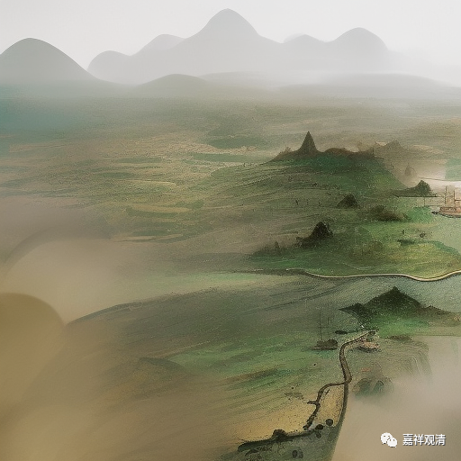

**微课佛教史429·2**

过了一段时间，圆悟克勤禅师就回四川去看他老妈，他以前是学儒家的嘛，讲孝道，回家看老妈。江湖上就有人说：** “道西行矣。”**我们禅宗的将来就看西边了。“道西行”，就是我们的这一套，或者说是我们当中最厉害的人往西走了，去了蜀地了，去了成都了。

这个时候成都的领导叫郭知章，以前做过翰林的大官，就请圆悟克勤禅师开法，在六祖山。我不知道六祖山在哪里，你们当中有成都人吗？知道六祖山在哪里吗？我不知道，反正说是在成都。

后来呢，圆悟克勤禅师又去了昭觉寺，这个寺院在禅宗的后期属于大丛林，圆悟克勤禅师就在昭觉寺待了八年。大家如果有兴趣的话，可以去找一下昭觉寺的寺志，那里面肯定有一些记载。（程度还有个文殊院也很有名，上次我在拍卖场还看到了好像是解放前文殊院印的经，但是我没买。）圆悟克勤禅师在昭觉寺待了八年就告退了，辞职了。

圆悟克勤禅师离开昭觉寺以后，出峡南，可能到了湖南、湖北这一带。这个时候张商英在荆南，以道学自居。“道学”，怎么说呢……还是儒家？很难说这个“道学”到底是什么意思，因为张商英这个时候基本上已经是佛教的在士大夫阶层当中的一个代言人了，名气非常响。上次我们也讲到，张商英在此之前已经被某位大佬证明开悟了，然后这一次也比较重要，就是他和圆悟克勤禅师的会面。

两个人会面后聊的什么内容呢？聊华严（这里的“华严”指的是“华严宗”而不是《华严经》）。我们说过圆悟克勤禅师之前也学过华严的，就和张商英聊华严，谈“理无碍、事无碍、理事无碍、事事无碍”。张商英觉得禅宗好像是在“理事无碍”的境界当中，圆悟克勤禅师的意思是最终要到达“事事无碍”的境界，才是真正的禅宗。大家如果有兴趣的话可以去看看华严的“四无碍”。不知道后面我们会不会讲华严宗。

张商英说禅宗在“理事无碍”的境界里，意思是在判教里面，禅宗要低华严宗一级，因为华严宗把自己摆在“事事无碍”的境界里；圆悟克勤的意思是，华严和禅宗都已经到达了“事事无碍”的境界，并没有高低之分——其实后来的华严总和禅宗都基本遵循这一思路。

然后，张商英在和克勤禅师经过一番论议以后，觉得他讲的有道理，就很认可圆悟克勤禅师。

