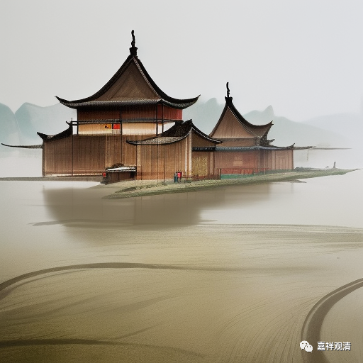

**关于“老、少”与“时”**

关于吉藏又补充胜论宗义说：

“** 求那非止有十七。如法、非法、功用、长、短、老、少等皆是求那，此十七为本也。**”

之前我解释说“老、少”可能为“量”等，这个解释应有误，现在我觉得依胜论师的理解，“老、少”应该可以属于“时”的特征。

“时”是胜论师的九“实”法之一，胜论师对“时”的定义是：

《胜论经》：

** “彼时、此时、同时、异时、快、慢是时的相状。”**

《胜宗十句义论》：

** “彼、此、具、不具、迟、速诠缘因是为时。”**

意思是说，“时间”，是通过相对的“这时、那时”、“同时、不同时”、“快、慢”这些言说（诠）才被认识（缘）的存在。

月喜疏中解释道：

** 其中，与指示方向的“彼”相结合，在年幼者中产生“彼（时）”的认识；与指示方向的“此”相结合，在年长者中产生“此（时）”的认识；根据看见的黑发等、皱纹与白发等特征，在年幼者中产生“此（时）”的认识、在年长者中产生“彼（时）”的认识；就是时间。**

意思似乎是说：如同“方向”上的“彼、此”，在时间上则表现为“长、幼”；或，以外色（黑白发）等特征，表现为时间上的“彼、此”即“长、幼”。

如果以这个思路，则吉藏所说的“老、少”可称为“德”（求那、性质），应是“时间”（陀罗骠、实体）的性质。

