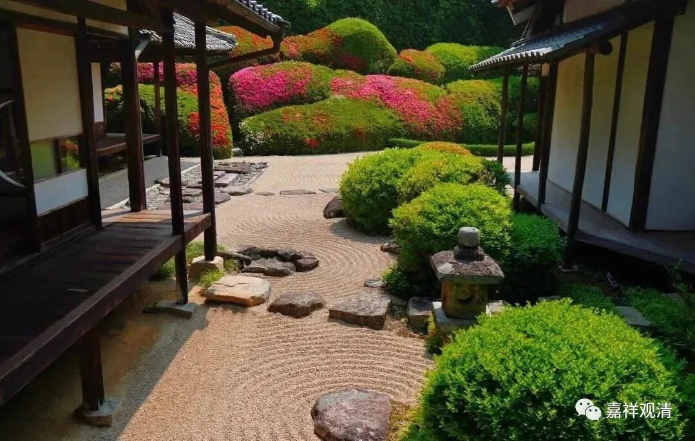

网络快问快答（没有复杂考证，不纠结细节、不罗嗦、不纠结行文逻辑的“三不一没有”网络问答）：

问：师父，我们车上有人在讲中国唯识在宋明就断了，后来清末民初才从日本回传，是这样的吗？

释观清:

大方向他那么说基本接近事实了，细节上需要补充……

关于“宋明就断了”，这要看怎么说。北宋、辽、金时期应该还有大部头的唯识章疏在印刷、整理，也有唯识系的人物在教学，但唯识系统的没落已经是事实，经济实力和人才储备都在低位，传承的人物不出名。

这一时期，还有不少禅宗大师是靠唯识进行教理启蒙的。

明代中后期整个中国佛教都基本没什么可谈的了，也不仅限于唯识。

“清末民初唯识从日本回传”这基本是事实，不过和一般理解的“传承回传”稍有差别，其实是唯识系重要（失传或者接近失传的）经典的回传，代表就是基大师（窥基）的《成唯识论述记》和《因明大疏》。

明代，《成唯识论述记》《因明大疏》等在国内已经基本失传，明代搞唯识的人和相关著述不是没有，而是质量差，不值得深究。明代唯识的书我都不碰，懒得翻。

前几年唯识论坛上还有台湾学者发表关于明代某僧人的唯识注疏的研究，我和某师二脸不屑，我们说：对这种犄角旮旯不入流的章疏作研究有价值吗？（冷门倒是绝对冷门了。）

今天的日本唯识宗其实也早就被真宗、密宗洗过了，唯识、俱舍方面的教学实力还不如真宗。但“唯识宗”作为官方认可的宗教法人还活着，比如奈良的法隆寺。

其实从另一个方面来说，所谓的唯识章疏从日本回流，还有日本方面负面的原因。

明治维新，没收寺产田地，大量寺院收入归零，都快活不下去了，于是纷纷卖珍宝、卖书，市面上《大藏经》等（包括唯识章疏）中文佛教典籍“价格便宜量又足”，大量清末民国赴日留学生和清末造反逃去日本的人（都是文化人）就收了一堆回来。很多先前在中国国内已经失传的或者接近失传的《大藏经》都是那个时候买回来的，今天很多博物馆馆藏的宋版的《大藏经》都是这一时期回购、回流的。

问：嗯，这段历史就对上了。当年戊戌六君子都是从日本学佛教的

释观清:

你看日本唯识宗的寺院，供的佛像基本都密宗化了。

其实日本今天几乎所有寺院都密宗化了

摩利支天，大黑天这些造像到处都是，连大日如来、阿弥陀佛的像都多表现为密宗造像的形式……

