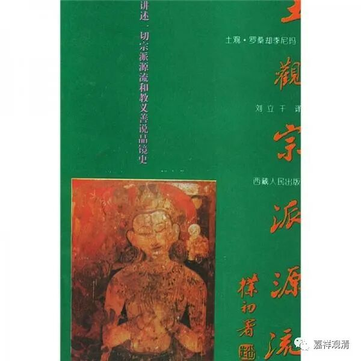
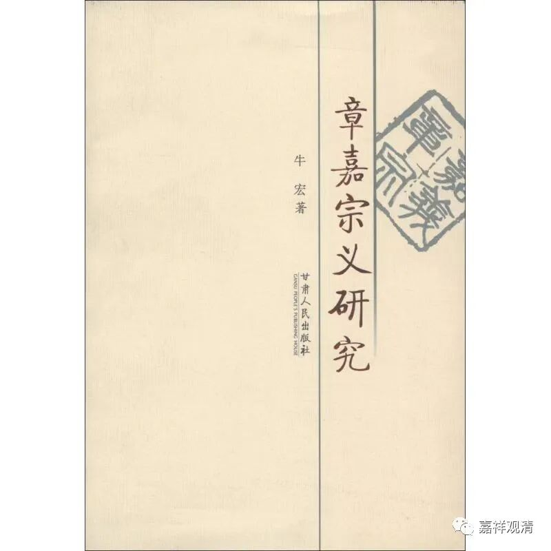

**“快问快答”之“什么是宗义书”**

问：能不能介绍一下什么是“宗义书”？

释观清：“宗义书”有可以叫“宗派论”，就是佛教里面一类介绍各宗派教义的纲要书，其实有点类似于今天的“佛教思想（哲学）史”或者“印度思想（哲学、宗教）史”，有的只谈佛教内部的宗派，有的还包括其他宗教哲学派别的介绍。一般我们谈的“宗义书”大致理解为GL的教材或者教参的那一类。

GL的《宗义书》大致有四个系统：

1、法幢吉祥贤（1469～1544）的《宗义建立》；

2、二世嘉木样·宝无畏王（1728～1791）的《宗义宝鬘》；

3、卓尼·扎巴协珠（1675～1748）的《宗义》；

4、福称（1478～1554）的《宗派建立》。

这四本是GL系统纲要性的“宗义书”，篇幅适中。是作为三大寺各学院的教材使用的。

目前这几本都已经有了至少是稿本的译本，前两本各自都已经有好几个译本了。

GL系统里还有一些篇幅比较大的宗义书，比如一世嘉木样·妙音笑金刚（语自在精进1648～1721）的《大宗义》、三世章嘉·若贝多杰（1717～1786）《章嘉宗义》和土观·善慧法日（1737～1802）的《宗镜源流》（成书于1801）。这三本篇幅很大，学术源头上也很接近，可以理解为是同一个教研室出来的。

《土观宗派源流》有全译本，法尊法师有节译本《四宗要义》，《章嘉宗义》和妙音笑金刚的《大宗义》都有节译本。

除此以外，其他宗派也有一批站在各自立场创作的“宗义书”，也有不少已经有汉译本了，这就不是我的知识收集的范围了。

