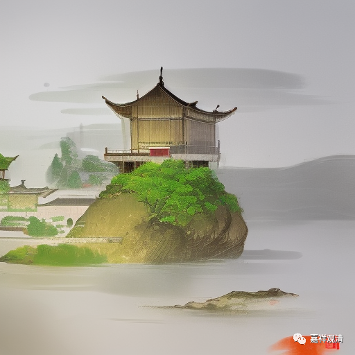

**微课佛教史430·2**

比如说，讲唯识，讲中观，士大夫们真的没办法入门，根本没机会。天台的教理也是独立的，也要学很多东西，我们前两天讲过“六即佛”——理即、名字即、观行即、相似即、分证即、究竟即……还有很多新的东西要学。但华严宗相对来说就比较容易一点，特别是那个“四无碍”，禅宗和华严一直在谈——“理无碍，事无碍，理事无碍，事事无碍”。一般的士大夫哪怕仅仅知道这几个名词，也能说上两句。

特别是后世受到极力追捧的李长者，他以易理入佛理，注解《华严经》……这让儒生、名士们都集体兴奋了——“佛教教理我不懂，但《易经》我懂啊！终于有我说话的机会了！”所以张商英、李纲都来谈“华严”，其实你仔细看一下，他们只是在谈大易而已，加一点“法、报、化三身”“文殊、普贤”“法界、唯心”之类的空泛名词……如果你把这些名词抽掉，就只剩易学了。

在宋代的时候，禅宗的很多人确实兼学华严，这是一个时代的流行趋势。一直到了近现代，也有这个“教在华严，行在禅宗”情况，比如在哈同花园搞“华严大学”的应慈法师。

禅宗的很多人都兼学华严。就是在教下的四宗（三论、法相、华严、天台）当中，会弘扬华严比较多一点，或者说宋以后禅宗的人几乎没有涉及其他三派的。

到了近现代，由禅宗人士兼宏的华严，其实连成体系的华严宗都很难谈得上，只是有“部分”华严宗的背景，有时候甚至是单纯地诵念《华严经》，因为“华严”的部头太大了，要好好学的话，真的要花太大的精力——明中晚期以后渣渣般质地的中国佛教教理背景早就支撑不起什么“教下”了。

我们也提到过，在华严宗和禅宗的历史上，有好几位祖师是重合的，是吧？像华严的清凉澄观法师，在禅宗当中也有一支香火在；圭峰宗密禅师也是具有华严和禅宗两方面的传承。现在讲的宋代著名的圆悟克勤禅师（1063-1135），对华严也是颇能活学活用，用来和士大夫交往——这是一种“双向奔赴”，很难说是单纯的谁迎合谁。

刚学到一个词，“前理解”（《唐代僧人前理解研究》），用这个名词来说：圆悟克勤们对“华严”的“前理解”是“禅”，张商英、李纲们对“华严”的“前理解”是《易》，双方在“华严”上找到了共同话题。再拿今天的流行的一个论坛形式来说，这就是——“千年之前的儒佛对话”。

“华严，你的禅，我的易。”

