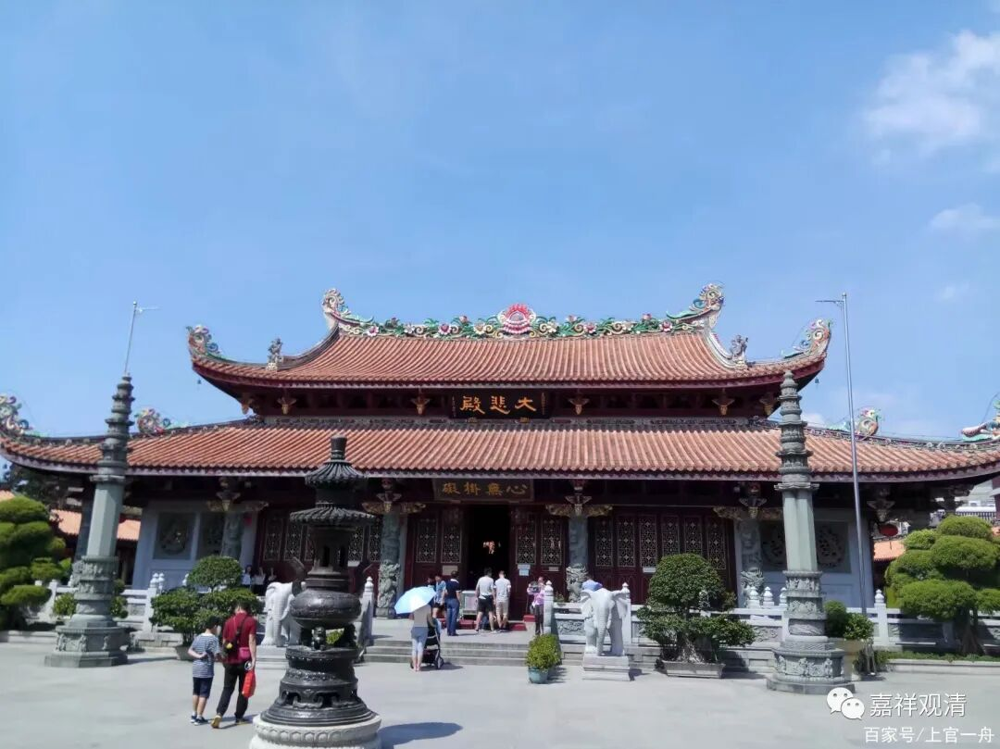

**泉州开元寺**

** 全国已知曾有八十六座（唐）开元寺**

全国很多地方有开元寺，泉州有开元寺，福州有开元寺，潮州也有开元寺——这个我好像比较熟。

在去泉州的路上，我这么正在数的时候，在一旁的石雕厂老板补充说：“还有扬州，扬州也有开元寺。”

我说：“扬州我很熟啊，扬州没有开元寺，至少现在不叫开元寺……”

石雕兄弟坚持说：“有，我在那里干过活儿……”

“呃……”

我的辩论习气刚一冒头，就被我的理智压下去了——作为知识的来源，“间接的推理”和“直观的经验”比起来，从源头上就输了一波……算他赢吧，这波我完全没有胜算。（回来一查，扬州确实还有开元寺，现在是3A级景区，在江都区大桥镇。嗯，下次我去看看。）

潮州开元寺

据聂顺新《唐代佛教官寺制度研究》，各种可考的唐代开元寺有八十五，分布于唐代疆域所及的85处。若加安西开元寺（即唐安西都护府的开元寺，安西都护府，贞观二十一年后设在龟兹，即今库车。以上见《高昌回鹘时期的安西开元寺》。），则已知的唐开元寺有八十六所。

据慧超《往五天竺国传》记载，开元十五年（727），慧超返回时，此时安西有两所汉僧主持的寺院是龙兴寺和大云寺。

检《唐会要·卷四十八·议释教下》（宋·王溥）：

“** 天授元年（690）十月二十九日，两京及天下诸州，各置大云寺一所。至开元二十六年（738）六月一日，并改为开元寺。**”

《唐会要·卷五十·杂记》:

“〔开元〕** 二十六年六月一日，敕每州各以郭下定形胜观、寺，改以‘开元’为额。**”

则“大云寺”改“开元寺”在开元二十六年（安西悬远，改名之事当在二十六年以后），慧超所录之安西大云寺，应即此后之“安西开元寺”。

……

