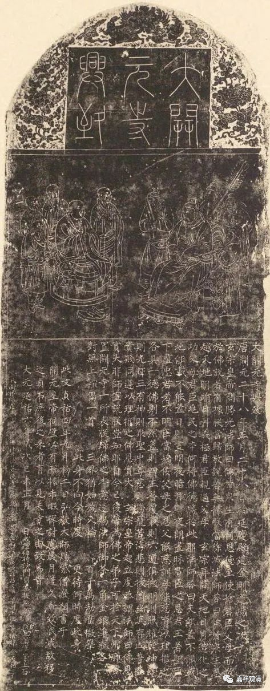

福州开元寺

**“开元寺”寺名的来历辩正**

昨天说了史籍明确可考的“开元寺”有八十六（我估计不止），很多人说完全没想到，其实有记载，当年名为开元寺的寺院在唐代有三千两百……哇，我也没想到。

各地的开元寺的缘起年代，今天存有两说：

一、开元二十六年说

据《唐会要·卷四十八·议释教下》：

“天授元年十月二十九日。两京及天下诸州。各置大云寺一所。至开元二十六年六月一日。并改为开元寺。”

《唐会要》卷五十“杂记”条记载:

“〔开元〕二十六年六月一日，敕每州各以郭下定形胜观、寺，改以‘开元’为额。”

佛教史籍中也有很多——

《佛祖统纪》：

“（开元）二十六年。勅天下諸郡立龍興、開元二寺……

二十七年。勅天下僧道，遇國忌就龍興寺行道散齋，千秋節祝壽就開元寺。”

《釋氏稽古略》卷三

“開元二十六年。詔天下州郡各建一大寺。以紀年為號。額曰開元寺。”

……不多引了

二、开元二十八年说

此说主要因为——《大开元寺兴致碑》。

《大开元寺兴致碑》，元延祐六年（1319年）刻，上书：

“开元二十八年正月二十八日，于延庆殿建金刚道场之次，玄宗皇帝问胜光法师曰……可于天下州府各置开元寺一所，表朕归佛之本意……”

其实此碑所载很不可信，以上所述事件，几乎相当于道听途说——乃“弘教大师澄润”书于玄宗庙里的，碑文后面接着就说：

“此文贞佑四年九月初二日弘教大师赐紫僧澄润书于开元皇帝祠壁，必有所据，未暇探讨……”

此“弘教大师赐紫僧澄润”不知来历，所记之“胜光法师”不知来历，题壁之文也不知来历，整个《大开元寺兴致碑》都不知所谓，不可引为信史！

现在很多地方的开元寺都引这条“史料”作证明，失查！其实都没去读过《大开元寺兴致碑》的碑文！

