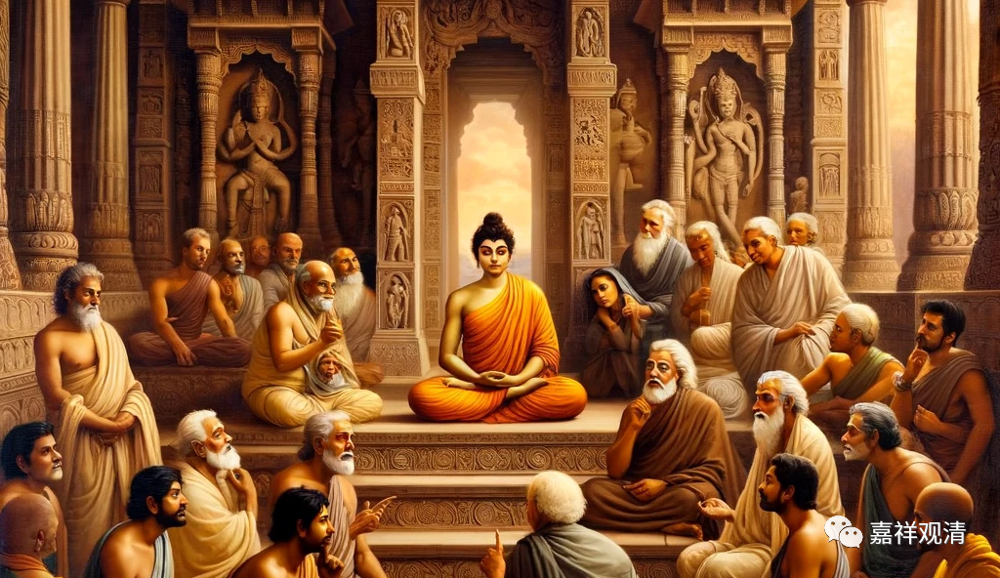

**快问快答：外道宗师的差别**

问：宗义书里提到的外道宗派，有什么差别？

释观清：讲到印度的宗派，有四组概念，很接近而略有差别。（首先，佛教自称内道，非佛教的那些称为外道，区分内外是一个常规操作，本身没有道德褒贬在里面。）

1、六师外道：所谓“六师”，是指下列六人：(1)阿耆多翅舍钦婆罗，顺世派的始祖。(2)波拘陀迦旃延：提倡七要素说之思想家。(3)布兰迦叶。(4)末伽梨瞿舍梨。(5)萨若毘耶梨弗，有说此即是舍利弗、目犍连原先的导师。(6)尼干陀若提子：耆那教实际开创者，被称为“大雄”。这六位都略早于佛陀时代，在佛经里大量出现他们的名称。

2、六派哲学：这是印度婆罗门教的正统流派，数论派、胜论派、弥曼差派、吠檀多派、正理派、瑜伽派。“六派哲学”作为一个整体概念的形成很晚，有些派别要到公元二世纪甚至五、六世纪才基本定型。后期，瑜伽派和数论派合流，正理派和胜论派合流，形成“数论-瑜伽派”“胜论-正理派”。

3、沙门思潮：佛教、耆那教、顺世论、生活派（六师外道里有几家属于生活派）这都属于反婆罗门教的“沙门思潮”的一员。沙门思潮产生的年代大约与佛教同时而略早。

4、宗义里经常提到的五六家：数论派（金发仙）、胜论师（鸺鹠仙）、耆那教（裸形外道）、正理派、顺世论。

提到数论和胜论，一是因为他们和大乘佛教中观、唯识派的主要发生、发展的年代重合，互相都是好对手；二是因为这两派分别代表了婆罗门教传统中主张“（自性）一、异”“因中有果、因中无果”的两端，所以经常成为讨论、研究时虚拟的对象。

提到耆那教，是因为他和佛教大致一起发生、一同发展，很多教义也很接近，是发展路上长期的“对手”。

提到正理派，是因为它是佛教因明学的背景和对手，佛教因明宗师陈那有《因明入正理论》。

提到顺世论，是因为他代表了不承认前后世的一种极端倾向。

——因为都是佛教发展“路上”的对手，所以佛教内部在谈到印度宗教哲学的时候一般都会点到他们。

