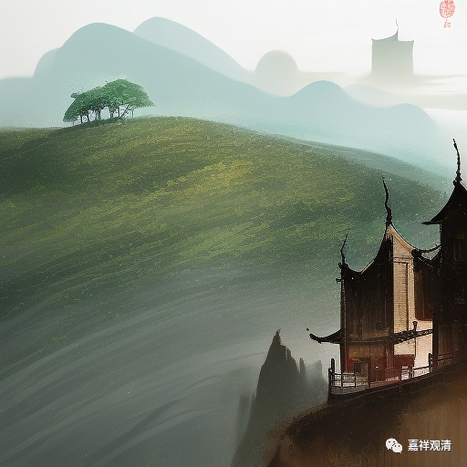

**微课佛教史431·3**

有一次，张商英遇到了另外一位名僧，叫兜率从悦禅师，他是真净克文禅师的弟子，临济宗的，真净克文禅师的师父就是黄龙慧南禅师（黄龙慧南——真净克文——兜率从悦）。见到兜率从悦禅师以后，张商英觉得兜率从悦禅师的水平确实挺高，互相有机智问答，但是兜率从悦禅师对张商英的见地不认可。

我们前面讲过，东林常聪禅师是印可了张商英的，但是兜率从悦禅师并不印可。兜率从悦禅师的悟境确实应该比东林常聪禅师要高，如果看传记的话也可以看得出来，他是经过了几番的捶打，差不多也接近三次大悟，经过了数位禅师的调教，所以他在跟张商英交往的时候就秉持了不卑不亢的态度，上来就表示对张商英不认可。

张商英当然不高兴了，还特地写了几句诗：** “不向庐山寻落处，象王鼻孔谩辽天。”**“庐山”，指的就是东林常聪禅师。张商英的意思是说兜率从悦禅师就是“象王鼻孔”，太傲慢了，“不向庐山寻落处”，就是指兜率从悦禅师不承认东林常聪禅师。

兜率从悦禅师就说张商英对佛法和禅宗的理解有问题。但是，张商英对和尚还是比较客气的，就很给面子地说：“您的文章还是不错的。”

反过来，兜率从悦禅师反而是不给面子，或者说就是怼人。（所以，张商英脾气那么大，是不是跟学禅宗有关呢？不知道哦。）兜率从悦禅师真的一点都没给张商英面子，说：“您在我面前讲禅宗，就像我在您面前谈文章。”意思是说，双方在别人的专业里都是业余，都别太自信，没得谈。

后来兜率从悦禅师就问张商英：“你学禅宗，是不是一点疑问都没有了呢？还是有点问题？”呵呵，怎么会没有问题呢……最后兜率从悦禅师就用了点手段，用了点禅门的方法，确实把张商英给提点了一下，向上拔了一下。

前面不是说东林常聪禅师是印可了张商英嘛，但是从此以后，张商英自认为是继承了谁的法门呢？他自认为是继承了兜率从悦禅师的门下。就是他之前也被其他人印可过，但是最后认可的师父是兜率从悦禅师。

这以后，张商英被牵入了王安石和司马光的党争，因为他是王安石的党人，跟王安石的关系比较好。不过，他的脾气真的不好，好像王安石这拨人的气质都比较急，脾气都比较大，王安石是一个，张商英也是一个。因为张商英的问题，其他禅宗的人跟他关系比较好的，也是被牵涉到党争当中，被贬、被夺戒牒等等都有。

今天先讲到这里，明天继续，谢谢大家！

