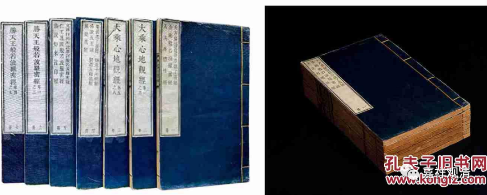
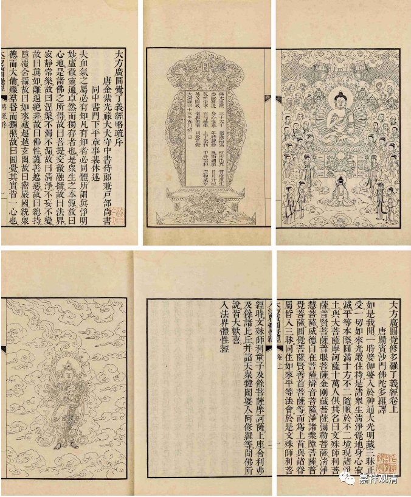
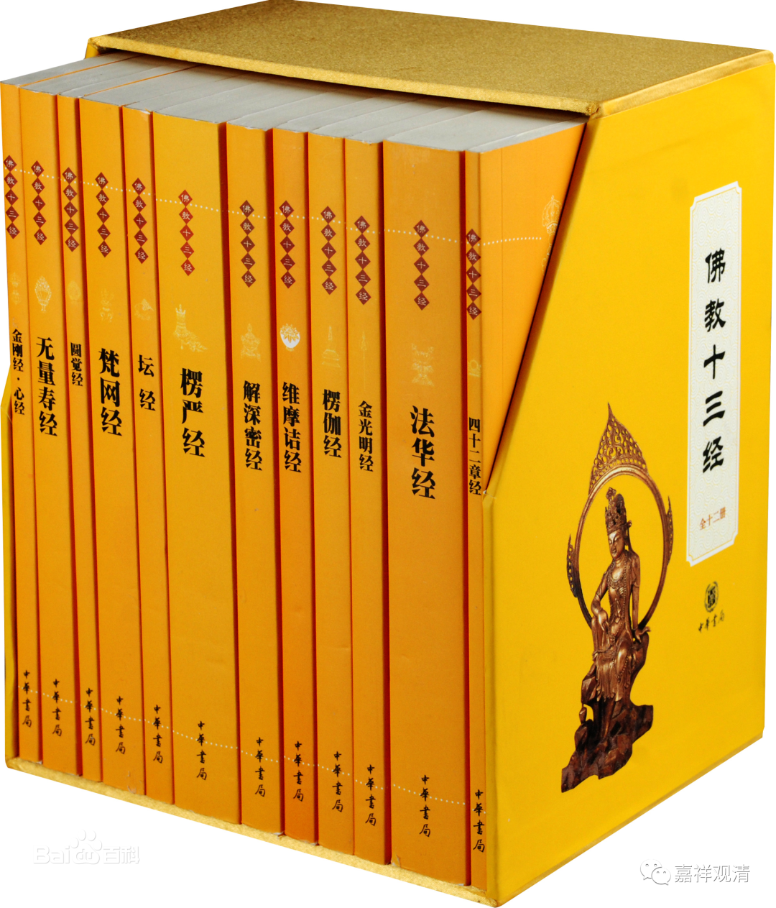
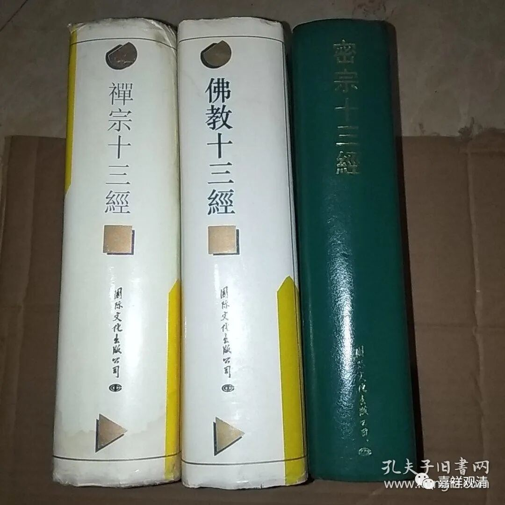

**聊一件拍品**

YL秋拍，这次有一件《佛教十三经同函》的清宫内府原装精刻本。

介绍里，因为“十三经”一词比较敏感，认为是专门编辑的，类似后期佛教仿儒家的《十三经注疏》而编纂了不同版本的《十三经》，比如《半亩园丛书》中有同治年间吴坤修编的《新编释氏十三经》，现在还有《禅宗十三经》等等。

仔细研究，发现此内府本《佛教十三经》其实没有什么特别的编纂思路，有常用的如《金刚经》《圆觉经》，也有极罕见的如《菴提遮了義經》，虽然可以泛泛地说这些经典和福报、智慧相关，但并没有很明确地“非此不可”的编纂思路。

其实对照清内府的另一个精刻版本——《二十八经同函》，就可以看出，《十三经同函》很明确就是《二十八经同函》中按册抽出来的我们来对照一下。先看十三经同函——

1、《大方广圆觉修多了义经》、《金刚般若波罗蜜经》、《入法界体性经》（以上第一册）；

2、3、《大乘心地观经》八卷（以上第二、第三册）；

4、《菴提遮了義經》、《辯意子所问经》、《佛说五王经》、《賢者五福德經》、《无量义经》（第四册）；

5、《文殊师利所说摩诃般若波罗蜜经》、《仁王护国般若波罗蜜经》、《佛说如來智印經》（第五册）；

6、7、《胜天王般若波罗蜜经》七卷（第六、七册）。

再看《二十八经同函》——

1.思益梵天所问经四卷；2.佛说贤首经一卷；3.佛说白衣金幡二婆罗门缘起经三卷；4.佛说魔逆经一卷；5.大明仁孝皇后梦感佛说第一稀有大功德经二卷；6.妙法莲华经七卷；7.大乘本生心地观经八卷；8.佛说长者女菴提遮师子吼了义经一卷；9.佛说辨意长者子所问经一卷；10.佛说五王经一卷；11.佛说贤者五福德经；12.无量义经一卷；13.胜天王般若波罗密经七卷；14.善住意天子所问经三卷；15.文殊师利所说摩诃般若波罗密经一卷；16.仁王护国般若波罗密经二卷；17.佛说如来智印经一卷；18.大佛顶如来密因修证了义诸菩萨万行首楞严经十卷；19.大方广圆觉修多罗了义经二卷；20.金刚般若波罗密经一卷；21.入法界体性经一卷；22.维摩诘所说经三卷；23.解深密经五卷；24.持世经四卷；25.佛说如来不思议秘密金刚手经二十卷；26.楞伽阿跋多罗宝经四卷；27.大乘瑜伽金刚性海曼殊室利千臂千钵大教王经十卷；28.大般涅槃经四十卷后分二卷。

（红色是我标出来的两件内府本相同的部分。）

很明显，七册的《十三经同函》就是按“册”从《二十八经同函》里抽出来的七册，以我对佛经的了解，无论是《二十八经同函》还是《十三经同函》，都没有明确的编纂思路——《二十八经同函》中甚至还出现了《梦感功德经》这种明确的伪经，说明肯定不是高手编纂的，也不可能是雍正亲定的选本（《梦感经》这本经后来被从《龙藏》里抽出毁版了。甚至有可能，这种《十三经同函》就是对抽出《梦感功德经》的一个“追加”行为——反正要抽一本，索性就重新组一个“丛书”。）

随便聊两句，抛砖引玉了……

