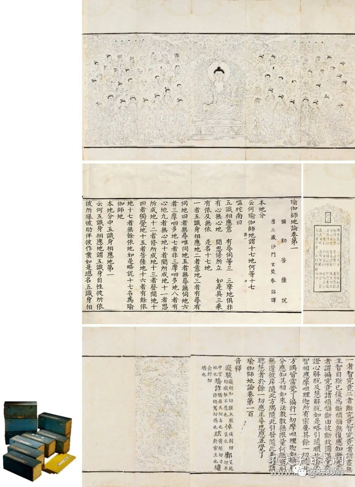
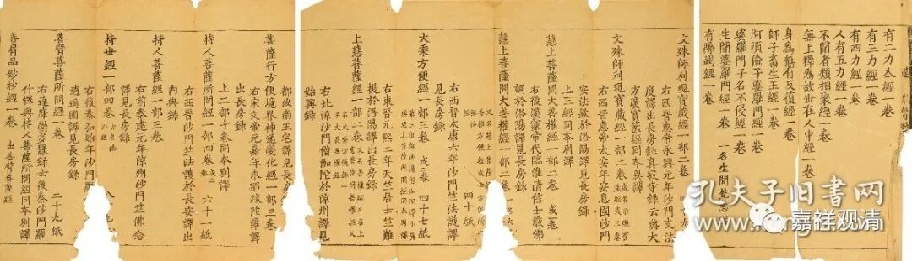
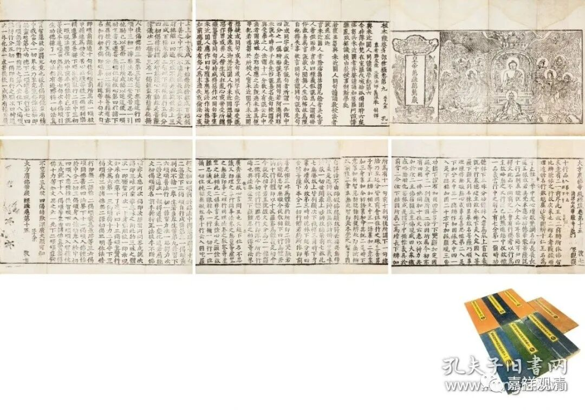
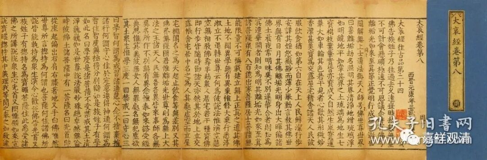

年底各拍卖行的秋拍比较集中啊。下周wxys也有古籍碑帖专场。

我只看佛教有关的——

这件是清·龙藏的《瑜伽师地论》，一百卷十函全，每函第一卷前面都带版画。一百卷完整的《瑜伽师地论》，很难得。

这件《众经目录》，九折，残页。目录介绍说是宋刻宋印，不过我看着怎么像是明代的《永乐南藏》的样子。

这是永乐南藏的《根本萨婆多部律摄》六卷 《大方广佛华严经疏》一卷。

我看各种藏经里，律部（如这里的《根本萨婆多部律摄》）和经录（如上面的《众经目录》）在各个拍场都出现比较多，呵呵，可能是阅读的人少，比较容易保存吧。对了，阿毗达摩类的藏经出现也比较多（比如上面的《瑜伽师地论》），也是一般学佛的人不看的内容，唉。

《根本萨婆多部律摄》和《大方广佛华严经疏》并不在一函里面，目录说是“一函七册”，其实不妥，前者《根本萨婆多部律摄》在“孔”字函，后者《大方广佛华严经疏》在“牧”字函，不知道为什么放在一起算一函（应该不可能有原装的函套），其实可以拆为两件的嘛。

永乐南藏，始刻于明成祖永乐十年，完成于永乐十五年，版存南京，比较容易请印，存世比较多，这一件应该是清代刊印的。永乐南藏经版毁于太平天国。

《大哀经》，这也是永乐南藏本。上面那件是白纸，这件是竹纸。

……

