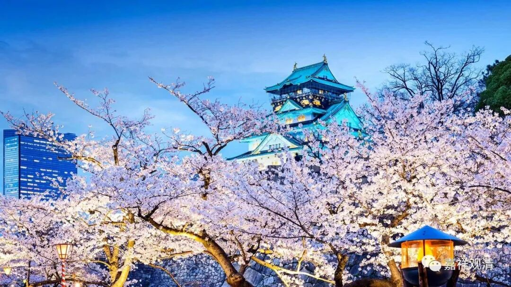

**微课佛教史432·3**

不过这个时候圆悟克勤禅师已经出四川了，到了开封——哦，我们还是先说回来吧，别讲到圆悟克勤禅师去了。在时间上我不是很确定，但是看起来在张商英和大慧宗杲禅师见面的时候，两个人聊得挺高兴，大慧宗杲禅师也挺佩服或者承认张商英的，应该说这个时候大慧宗杲禅师还没有“开悟”“开窍”，如果我判断没错的话。

我目前还没有就这几个事情去核查历史上的时间点，从前后的关系来判断，在这个时间点大慧宗杲禅师应该是没开悟。他在和张商英聊天的时候，甚至还捧了张商英几把，说“你的见解跟你的师父兜率从悦禅师非常像”——哈哈，这其实有点拍马屁。

大慧宗杲禅师也是文人出身，他了解的江湖传闻、学过的内容也比较多，然后就聊了一聊兜率从悦禅师的悟境，就把张商英的师父——兜率从悦禅师的悟境和张商英的认识相提并论。张商英当然很高兴，但是我估计也正因为这样，张商英并没有因为小朋友夸他就觉得小朋友已经开悟了，并没有。

相对来说，大慧宗杲禅师应该算是一个后生了。张商英一方面是赞叹的：“被你这几句话一说，我才领会了我师父的真面目。”也不知道他这句话真的假的。但同时呢，我们刚才已经讲了，他认为大慧宗杲禅师“末后一句”还是差一点，最后还欠一招。当然，这一招到底“欠”多少我们不知道，但还是欠的。所以张商英就专门推荐他到自己以前的好朋友圆悟克勤禅师那里去学习。

张商英去世的时候，他的做法也非常的禅宗。当时禅宗的人在过世之前都要留个偈子，他在过世之前也是如此——** “口占遗表，命子弟书之”**，就是让周围的人写下来。这个“遗表”肯定是给皇帝的。

然后他再写了一个偈子，是什么呢？

** “幻质朝章八十一，沤生沤灭无人识，**

** 撞破虚空归去来，铁牛入海无消息。”**

这个偈子说完，就圆寂了。这个做派也跟当时禅师的做派是一致的。当然，当时也有其他的禅师刻意不写遗偈的。

后来禅宗传到日本，影响了日本人的做派，很多战国大名临死前也来首遗偈——

丰臣秀吉：身如露落露消逝；世若梦中梦繁华。

武田信玄：一身肌骨归天地，不沾点尘自风流。

织田信长：人生五十年，如梦亦如幻；一期生死者，岂有长不灭。

……

这成了当时的“流行”。

……关于张商英，今天我们就先讲到这里吧。

