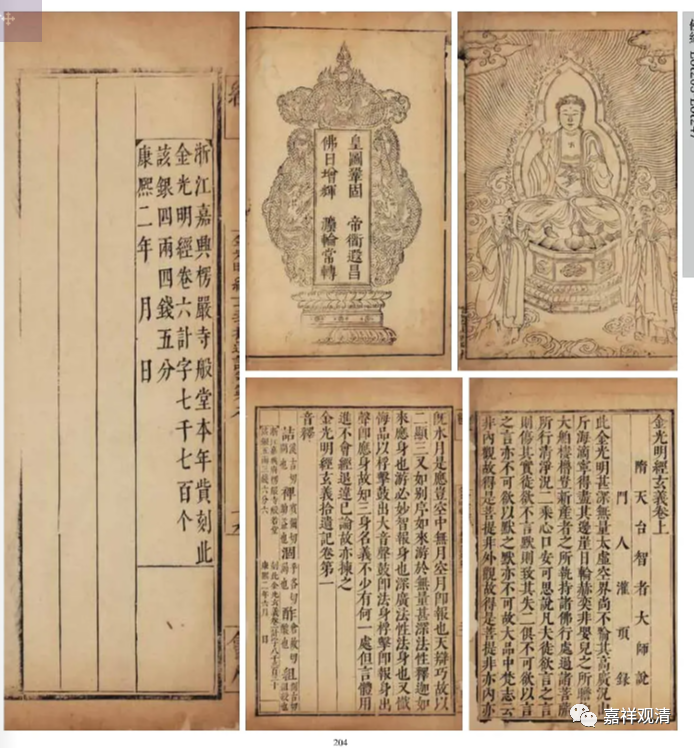

**从一册《嘉兴藏》本谈起**

这是《嘉兴藏》的《金光明经玄义》和《金光明经玄义拾遗记》，我已经见过他不下五次了。这回简单聊一聊它吧。

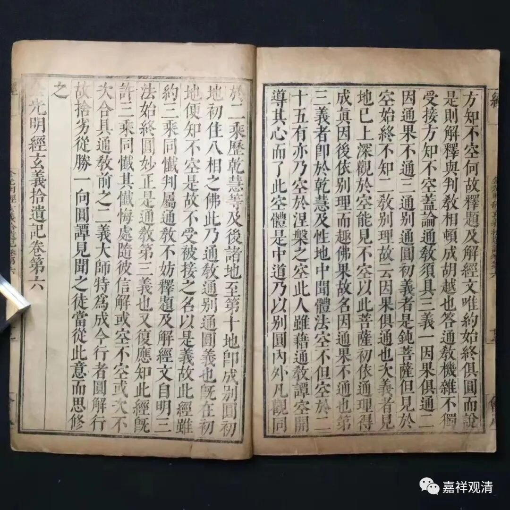

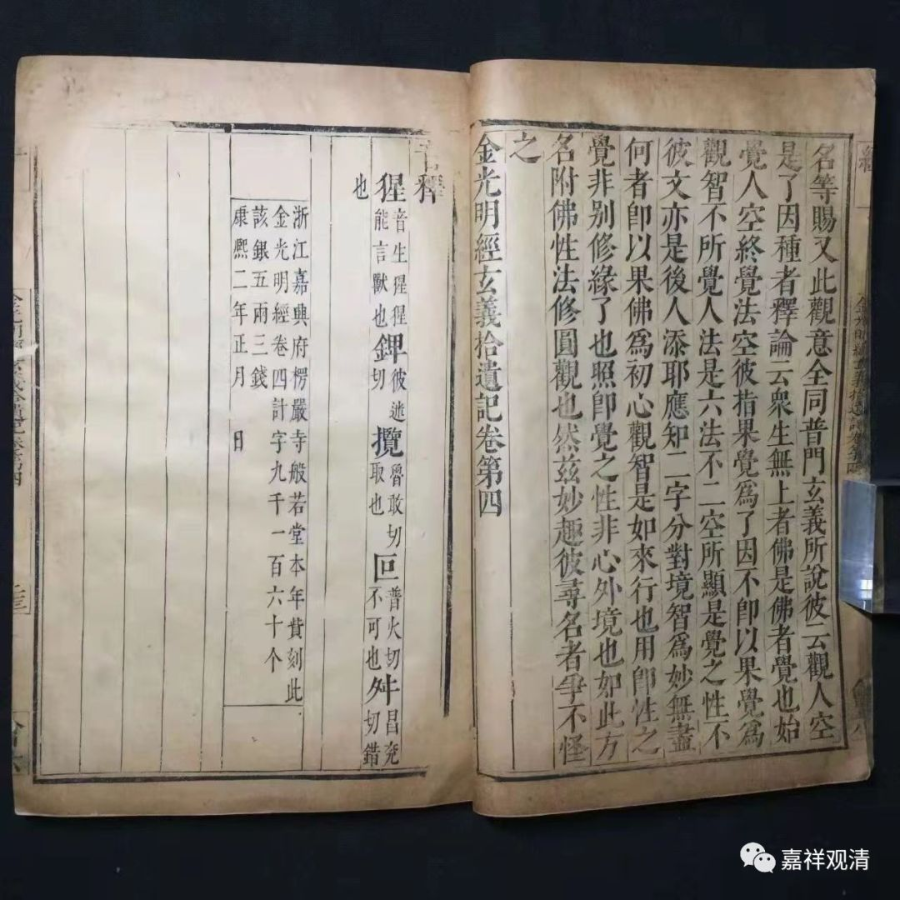

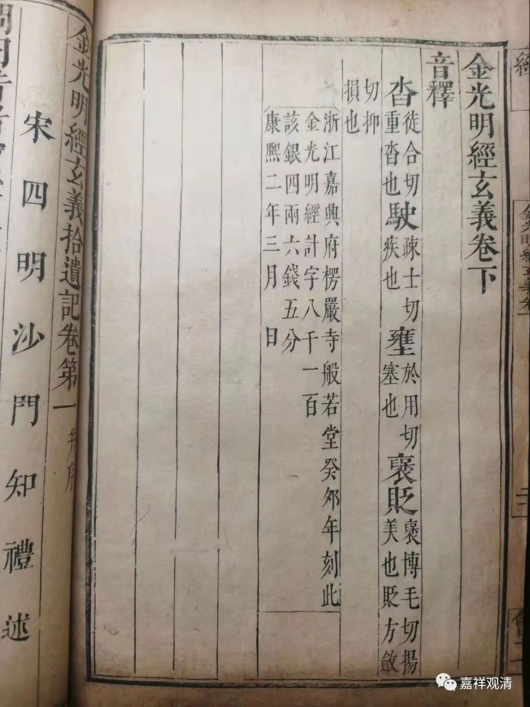

以上是我见过的拍品，应该是同一件。

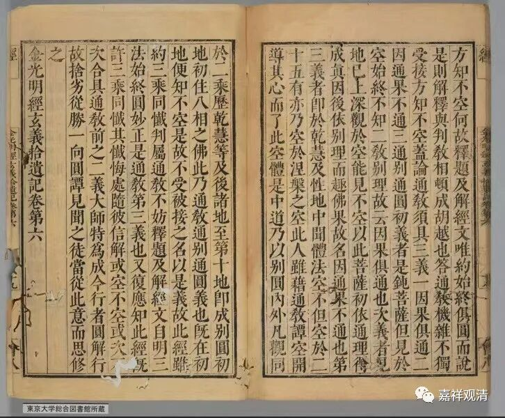

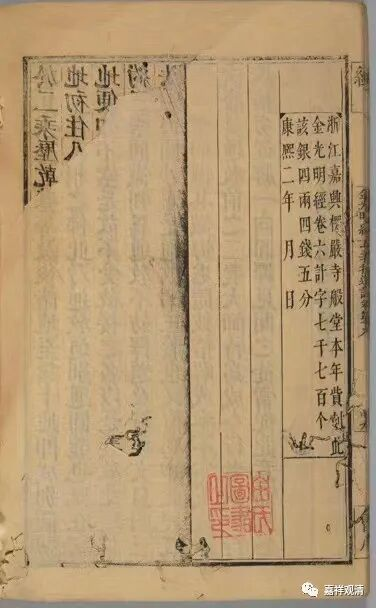

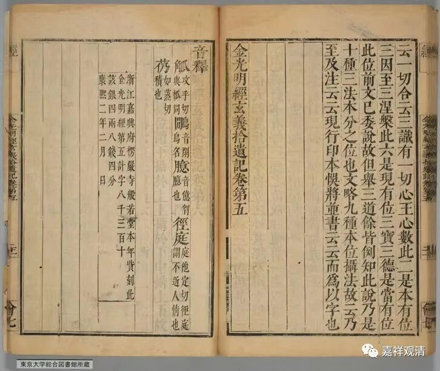

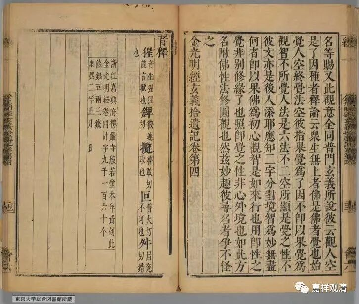

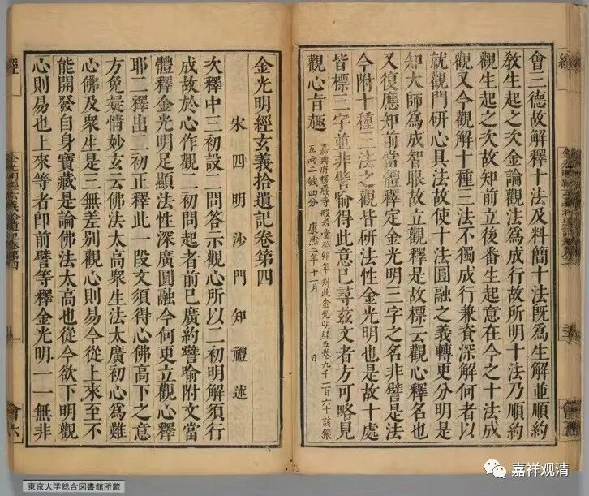

这是日本东京大学综合图书馆所藏的《嘉兴藏》本。

这一册方册《嘉兴藏》的《金光明经玄义》和《金光明经玄义拾遗记》，是《嘉兴藏》刊刻最后期完成的——嘉兴藏的刊刻，主要的刊刻地点，前期在五台山妙德庵，后转至余杭径山寺，最后集中在嘉兴楞严寺（也有其他寺院“承包”分别刊刻的），此一册的刊刻即于康熙二年在嘉兴楞严寺完成。日本《大正藏》取《嘉兴藏》做校勘而谓之“明藏”，实际《嘉兴藏》有大量完成于清代者。

后期的《嘉兴藏》（《续藏》《又续藏》）的刊刻，其主事者能力不强，考订不严，这一册便可作为代表。比如《金光明经玄义》和《金光明经玄义拾遗记》都算是“本土论疏”，是给《金光明经》做的《疏释》和再《疏释》，但本册一律都标做“经”（看左上角和右上角，“经”）——

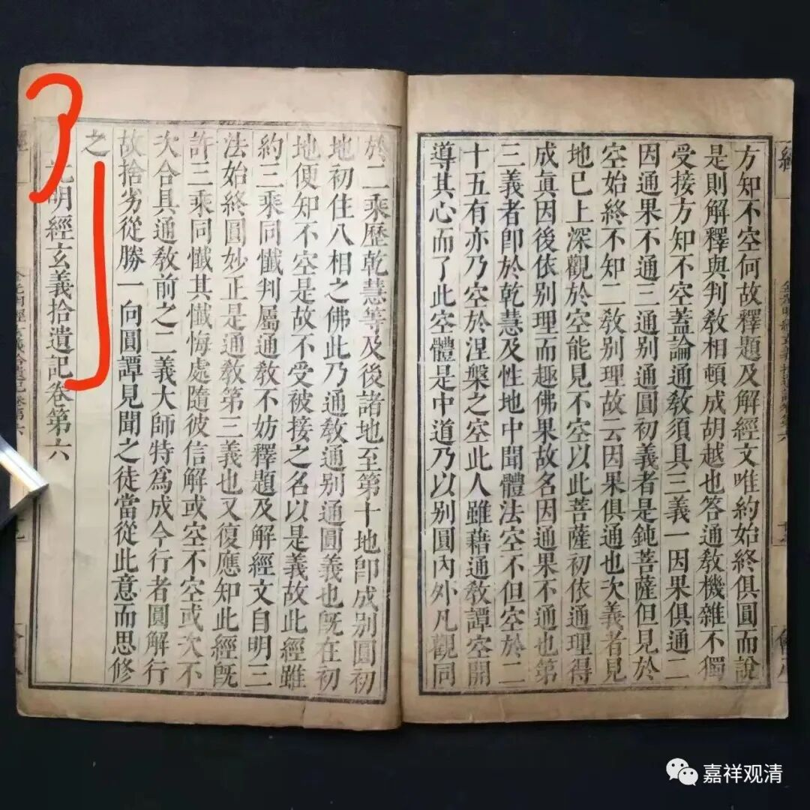

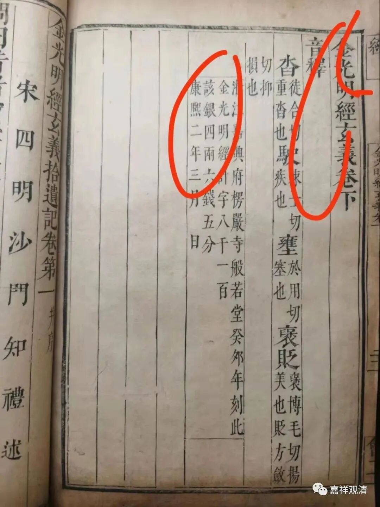

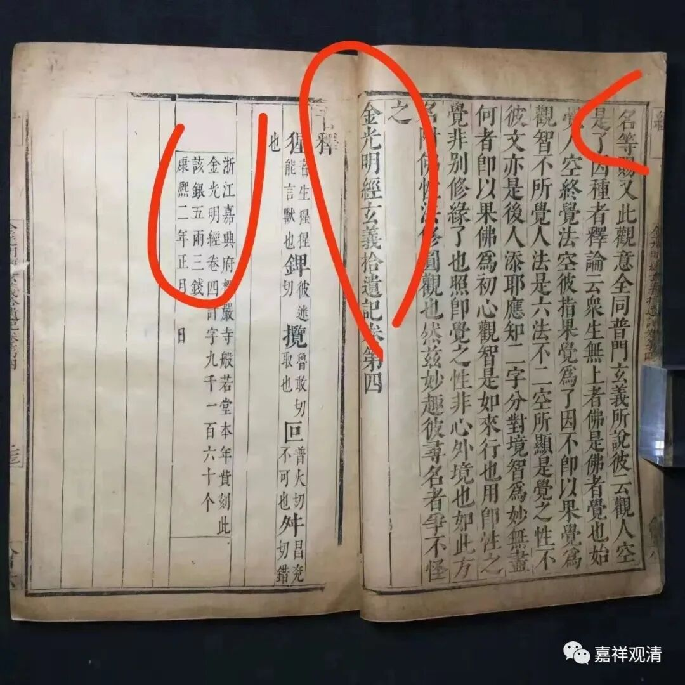

同时，《金光明经玄义》和《金光明经玄义拾遗记》的每一卷卷后的题记也再次错误，把“《金光明经玄义》”和“《金光明经玄义拾遗记》”都直接记成了“《金光明经》”（看牌记第二行最初四个字，“金光明经”）——

这些，都说明了当时楞严寺般若堂组织刊刻和校对的人员其佛教经论素养明显不强——这倒是现实地反映了当时中国佛教界积弱的基本教理素养，说的直白点，能继续刊印藏经这种大型文化工程，说明社会稳定、经济繁荣（有钱了），但是教内无堪大用者（没文化）。

