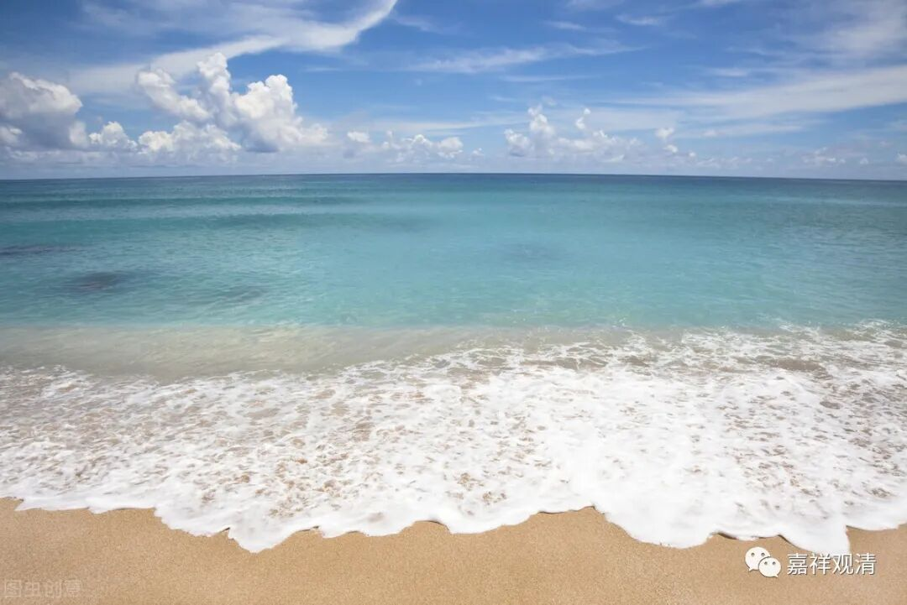

**对于一个修行人而言，在他脚下的，只有水和土。**

** 一**

老师父说，在一次法会上，他对一个在高位者动了气。

朗忍巴大师看见了，并没有马上批评他，只是把他叫到跟前，对他说，“你记住，对于一个修行人而言，在他脚下的，只有水和土。”

只有水和土的位置比你低，其他所有的人都应该摆在你的上面，修行人不应该有傲慢的心。

** 二**

某师说：“现在一代不如一代，我不想教学生、带徒弟了……”

老师父说：“你要是不想教学，那我为什么要教你呀？”

你想轻松，那谁不想呢？

** 三**

某居士说：“快四十了，我年纪也大了，我就学点简单的吧。”

我说：“你们都不想学习，那也不会有好师父在你们面前出现了。”

你都不想努力了，他为什么要出现呢？

** 四**

老师父说：“修行人重要的是向内去对治烦恼，不要去追求外面奇奇怪怪的事。”

施海师父说：“如果天上飞过来一个阿哄，你们会不会去拜？”

修行不是猎奇，业力大过神通。

