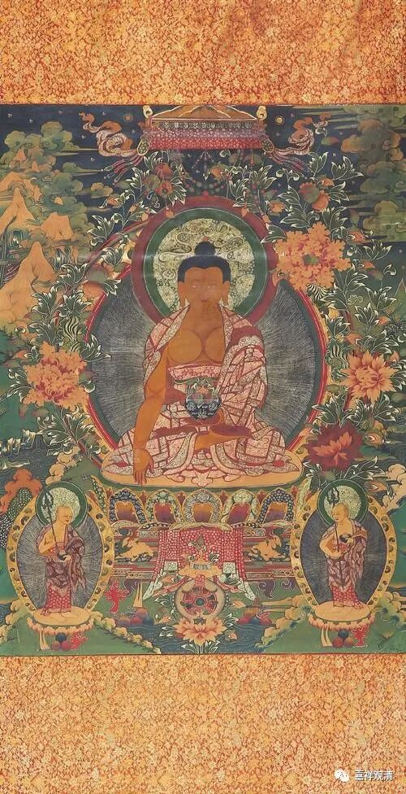
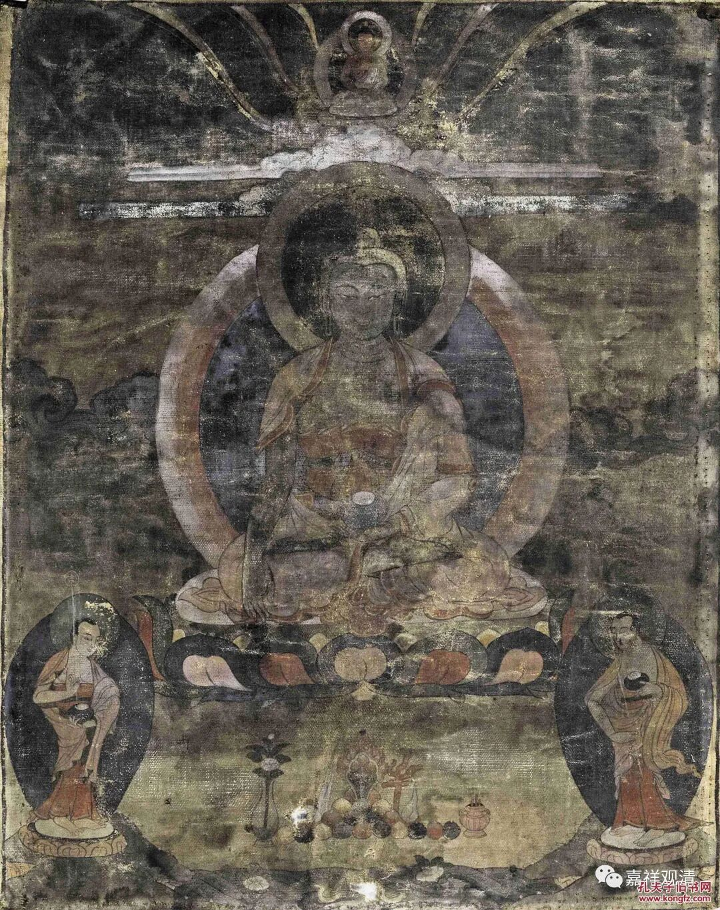
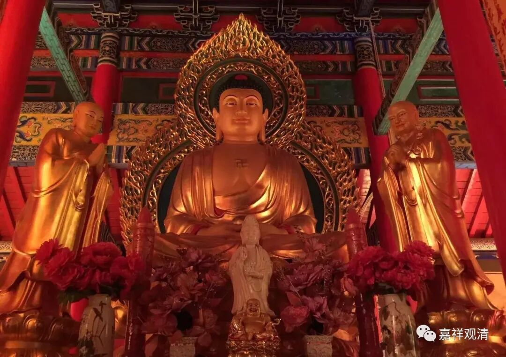
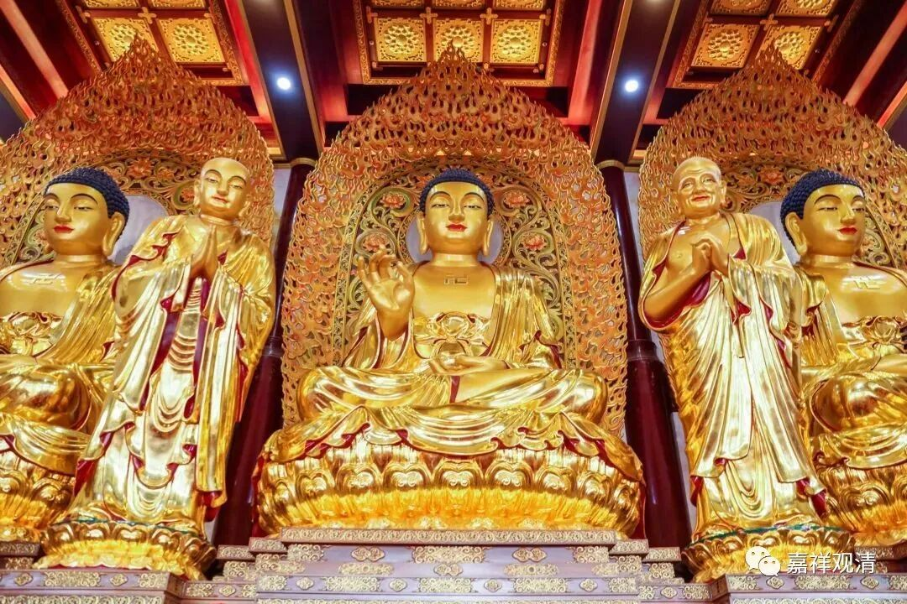
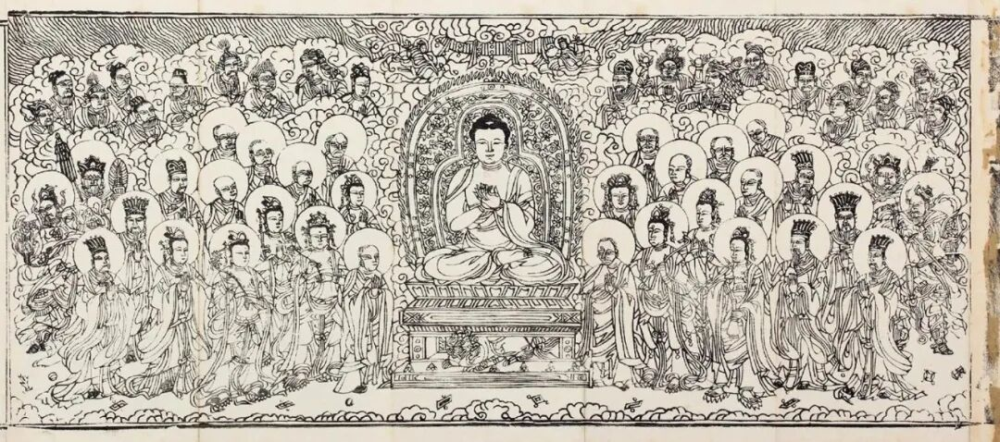
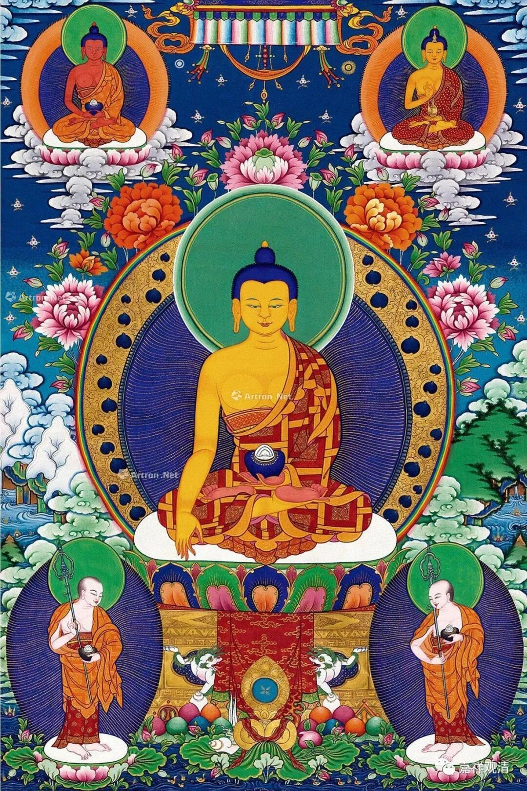
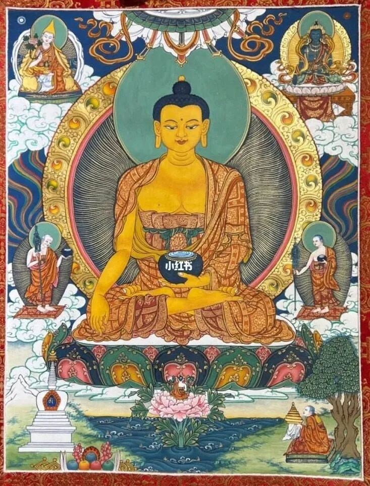

**释迦佛和第一双**

荣宝斋2023秋拍，有很多唐卡。我们来看这一件——

拍品名称为“释迦牟尼佛（唐卡）”，介绍册上说：

“主尊释迦牟尼……右手结触地印，左手平托钵……下方分别是阿难、伽叶尊者……”

简单聊几句。

这一件唐卡拍品，起名“释迦牟尼佛（唐卡）”也不错，若要精确一点，也可以叫“释迦牟尼与第一双（唐卡）”——但这就涉及到这件拍品唐卡的释读。

介绍说“下方分别是阿难、伽叶尊者”，这个解读不对。释迦像“下方”的两位罗汉应是“第一双”——舍利弗和目犍连。

“释迦佛和二弟子像”在汉地确实多表现为“释迦佛和迦叶、阿难”，这是因为汉地在唐宋以后寺院多属于禅宗一脉，而迦叶和阿难则为禅宗追朔的西天初祖和二祖，所以在禅宗寺院多以“释迦、迦叶、阿难”作为“一佛二弟子像”的标准配置，而禅宗的流行也令汉地其余寺院多“拷贝”了这一型。另外，在“释迦、迦叶、阿难”的“一佛二弟子像”中，迦叶都被表现为年老而阿难表现为年轻，因为历史上二人的年龄确实相差比较大。

唐卡类型的“一佛二弟子像”则通常是“释迦佛和第一双（像）”（“释迦佛、舍利弗、目犍连”），这一标准配置是经律里更常见的“标准像”，据佛教经典记载，每个佛都有被称为“第一双”的上首两大弟子，而释迦佛的“第一双”便是舍利弗和目犍连，所以抛开禅宗背景的话，“释迦佛和第一双”才应是更常见的。“第一双”自幼就是一对好友，所以表现在唐卡上也是一对年龄相仿的青年。

另外，介绍说“右手结触地印，左手平托钵”，这里，右手的触地印，又叫降魔印。而左手，可以对应地称为“禅定印”，可以说“右手结触地印，左手禅定印、托钵”。这个形象，是表示释迦成佛的时候魔来质问，此时佛以右手触地，说“……大地为我作证”，所以叫“触地印”、“降魔印”；而此时不离其禅定，故左手以“禅定印”表示。

不过最近Z地收到汉文化影响，也出现了“迦叶、阿难”的二弟子像，这又是一种文化互通了……

