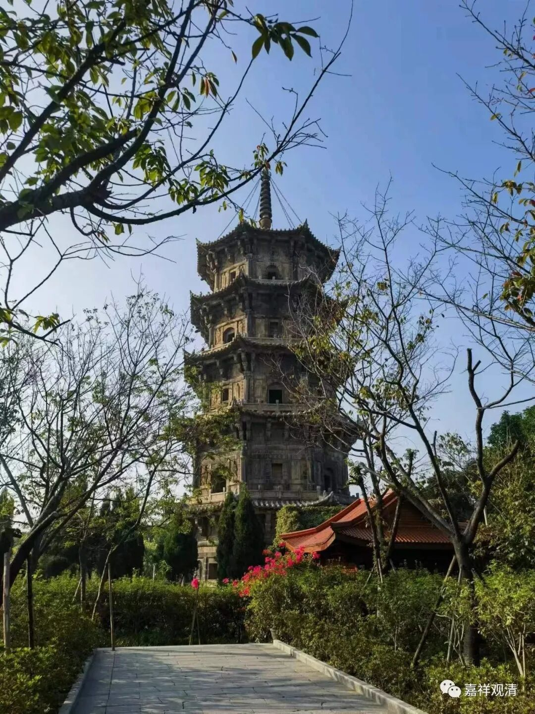
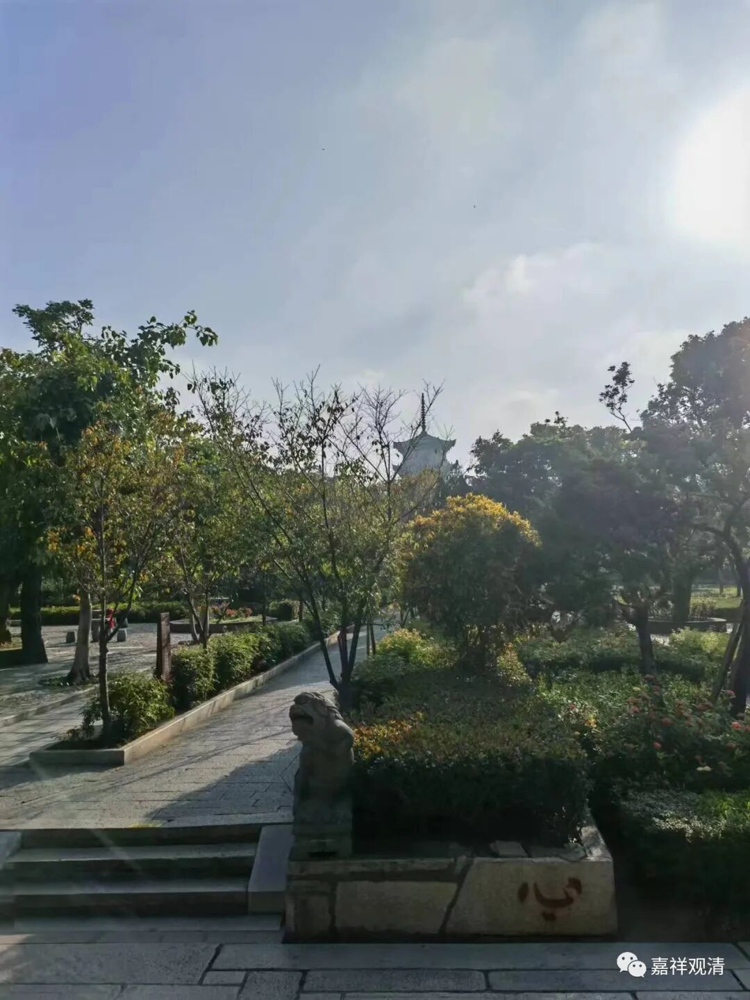
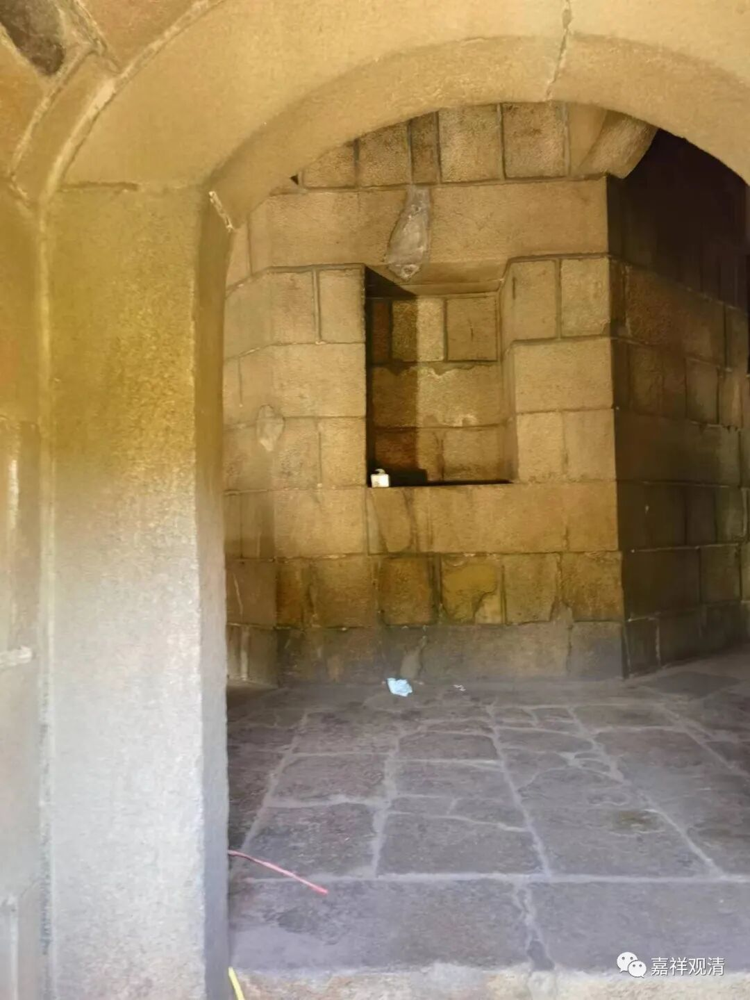
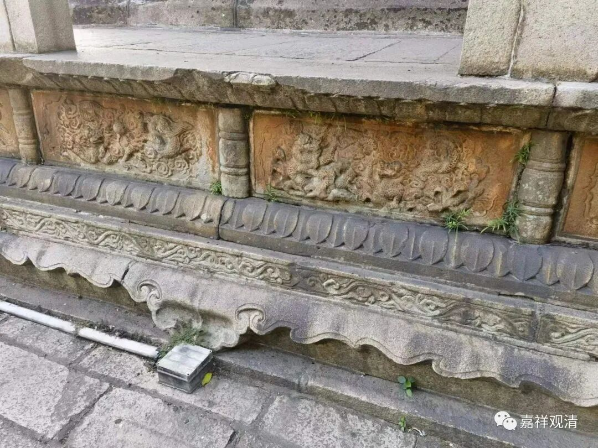
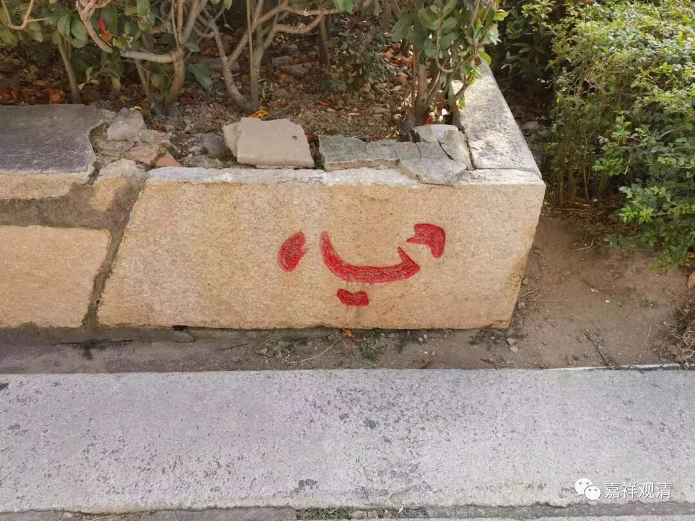
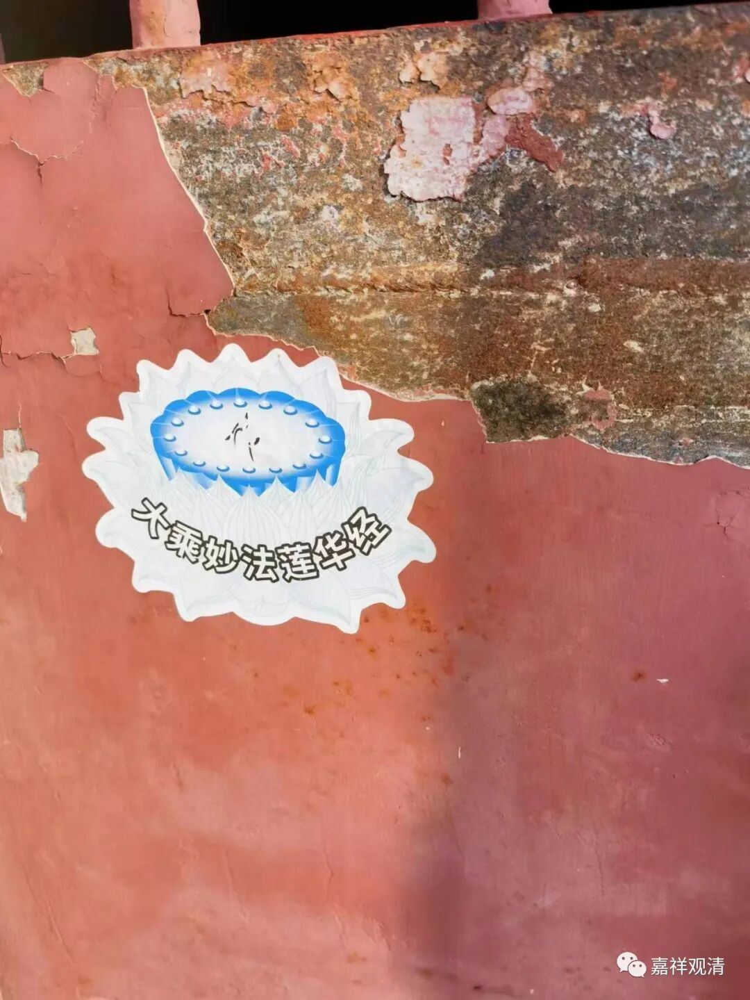

**泉州开元寺西塔——仁寿塔**

原来准备住在开元寺附近，早上跑步过去逛逛，结果发现宾馆定远了。只能吃完早饭打车过去了。

我是从西门进的泉州开元寺。那天好像有个幼儿园集体来参观，门口老师娃娃家长，乌泱乌泱的……

西门进门右手就是开元寺的西塔，有小路可以直接通过去。

泉州开元寺西塔，学名叫仁寿塔，此塔原先是木塔，后来被毁，改作砖塔再毁，王审知治闽时改为石塔。我之前讲禅宗史的时候讲过，佛教在闽粤的传播，唐末五代是一个转折期，此时闽粤的割据政权的上层都比较崇佛，此时的禅宗大师雪峰义存（雪峰寺和小雪峰寺也在福州和泉州）下便因此开出云门、法眼二宗，这也是有当时政治经济背景的。相对中原几十年间朝代更替频繁且大打出手，江东乃至闽粤一带的还算是安静的……

塔现在不能上去，中间的佛龛里都没有佛像了。

有一对小情侣在塔前面仰望，说西塔精巧难得……我就顺着他们探问的眼神就继续说下去——其实只要当地经济发展，政治宽松、上层支持，那经济就往这里聚，钱到了，顶尖的匠人自然会聚过来，这是很容易理解的经济现象。像这种大型工程，只需要几个顶尖的匠人主事，就可以带出一个团队一整批熟练工匠，会带动周围整个产业。事实上，泉州东西石塔建造完以后，整个泉州周边都出现了很多以当地石头为建筑材料的各式建筑，直到今天都是当地民居的一个特色——石头建房。

绕塔三匝（转塔三圈）。有一个刚受完菩萨戒的居士很拘束地给我让着道，呵呵，我说不用过分拘束，但我说了没用。

当地人对西塔比较“疏离”，因为理解为“西方”后，就觉得和死后有关。不过西塔的建造似乎确实和王审知杀了一个和尚有点关系。这个和尚政治敏感度不够，劝守将（王审知的侄子）去中原朝廷讨封——这实在是个送死的主意，一下送走俩——和尚本人和那个“侄子”。王审知信佛而杀了个地方名僧，花大钱造一个塔也有点“补偿”的心理。

西塔边上有个奇怪的石头，但并没放在明显的地方。肯定会有人编点说法……呵呵。我就不编了。

这个最近老是见到，苏州灵岩山也有。这是日莲宗的套路，有个版本的《水浒传》版画里也有它，武松手刃嫂嫂血祭兄长，上首中间牌位上写的就是“南无妙法莲华经”（图我没保存）。还有一个地方也有它，我就不说了。提一个醒吧，腾冲……

