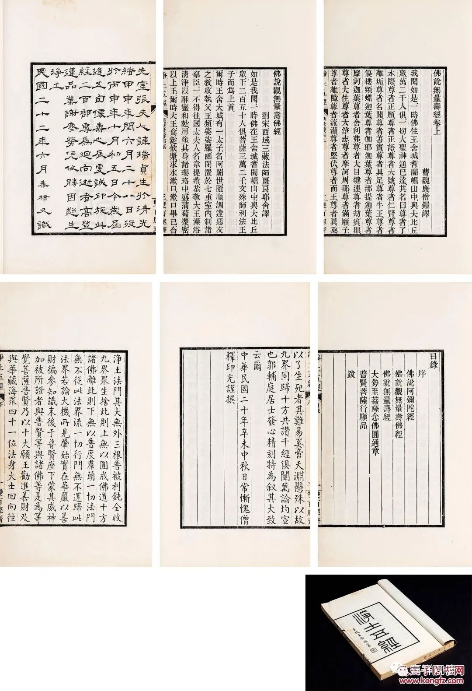
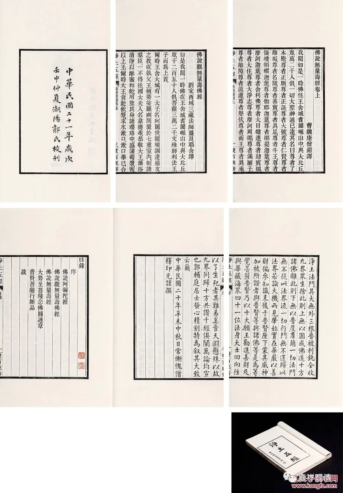

**郭氏双百鹿斋《净土五经》精刻本**

永乐2023秋拍的《净土五经》。

潮阳郭氏（郭泰棣、号辅庭）双百鹿斋精刻本。

郭氏富商之家，祖上业儒。其父郭子彬在上海经商，由烟土而金融，积累了大量财富。有感于资本积累之初的“罪孽深重”，遂不计工本地刊刻佛经赎罪……潮阳郭氏双百鹿斋精刻了许多古籍、佛经。

此《净土五经》民国二十一年校勘，二十二年印刷，有印光法师写于民国二十年的跋文。（郭氏长期寓居上海，当与印光法师有交集。）

按：《净土五经》的形成，写跋文的印光法师就是发端。

最初，康僧铠之译《无量寿经》、鸠摩罗什译之《阿弥陀经》、畺良耶舍译之《佛说观无量寿佛经》被合称为《净土三经》。清末咸丰年间，魏源增《华严经·普贤行愿品》为《净土四经》。同治五年（1866），杨仁山见此《净土四经》辑本“喜出望外”，遂与郑学川等同道集资刻经，当年腊八日成——此为金陵刻经处初创之标志！

民国之初，印光法师在此《净土四经》辑本上再添《楞严经·大势至菩萨念佛圆通章》，遂成《净土五经》之选本。（不过这几个选本都漏了中国最早被翻译的净土经典——《般舟三昧经》。）

郭氏精印此经两百部，此次永乐征集有两部。

