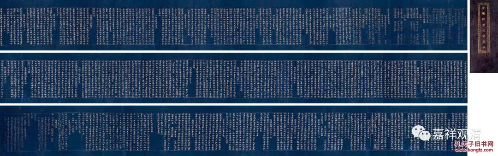
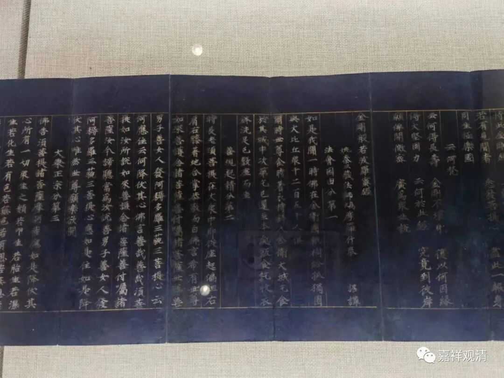
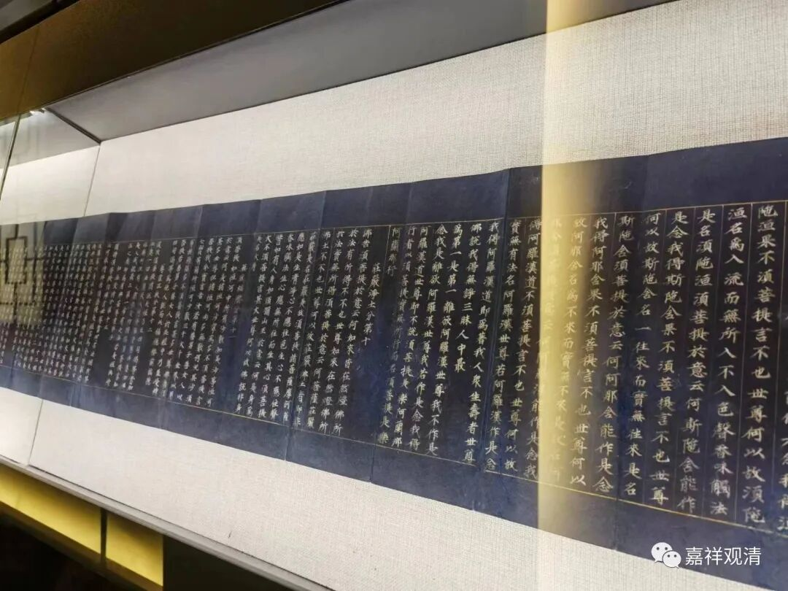
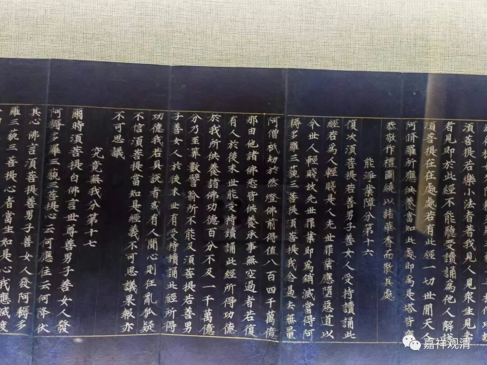
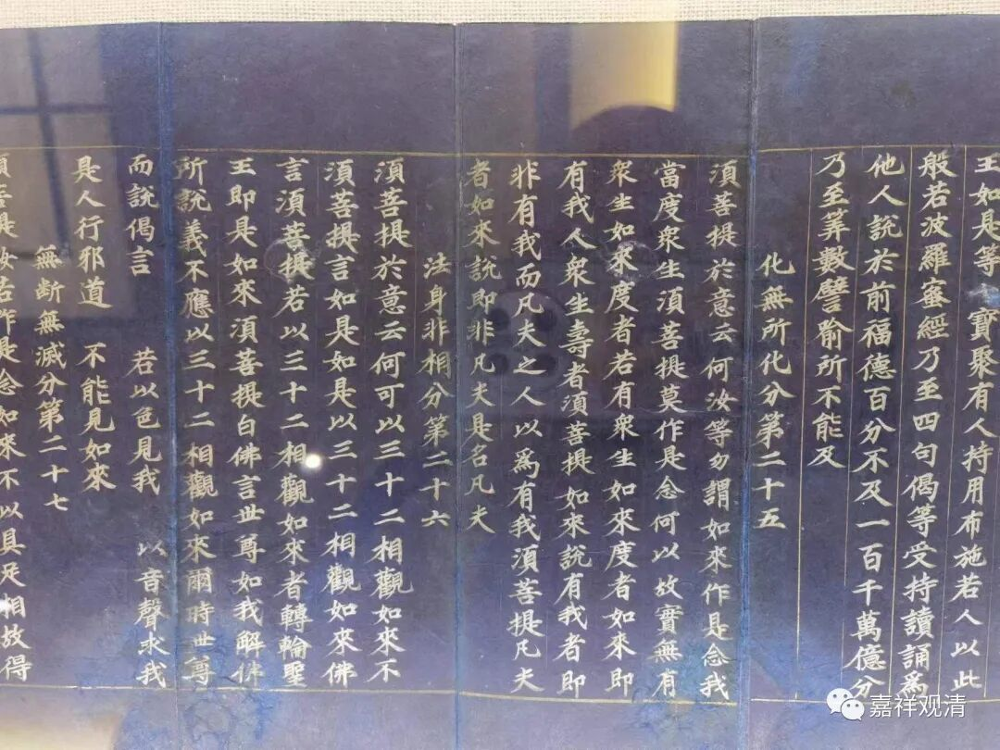
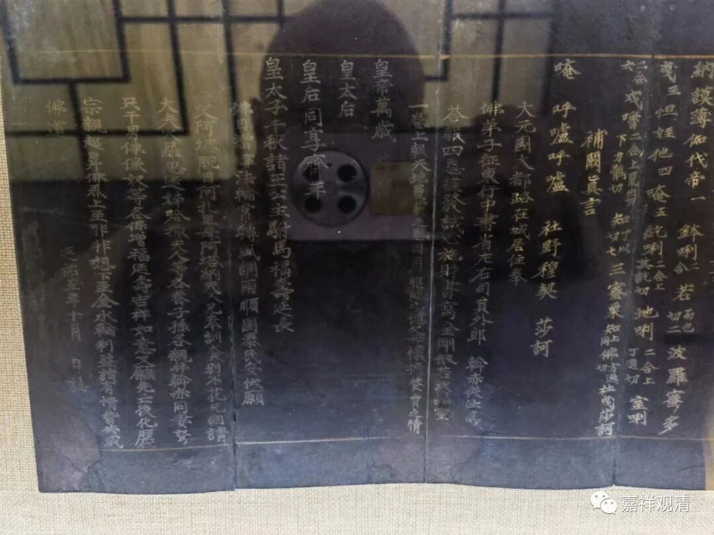

**元延佑五年抄本的《金刚经》**

这是今天永乐秋拍的元延佑五年抄写的《金刚经》。

吕老师看到，很赞叹此件的书法，于是有了下面的文字：

南宋以来写经书法主要承袭大致有三种：

** 一者，敦煌隋唐职业经生写卷体，特点是以隶变而来结体平划宽博典雅静谧，法度森严；**

** 二者，以张即之为代表的文人士大夫写经，特点是源自智永的秀美书风，结构简约，出锋犀利凝练，极具文气和禅意；**

** 三者，以高宗为代表上及黄庭坚写经的写经，特点是运笔顿挫明显，略带行书笔意，结体雍容华贵（也是元代赵孟頫书风的主要来源之一）。**

** 此卷写经有从笔法、结构、作品气息来看综合了以上三种写卷书风优点。在赵孟頫妍美、温润，由熟而略带俗气书风一统天下的元代，此卷特点显著，非常古雅俊秀难得-熟中带生，且 因生而带秀色。**

** 从另一角度，恰恰又深解到了赵孟頫（这位文化艺术通才大居士）一生极力倡导和想达到的复古——“书画贵有古意，若无古意，虽工无益”。**

