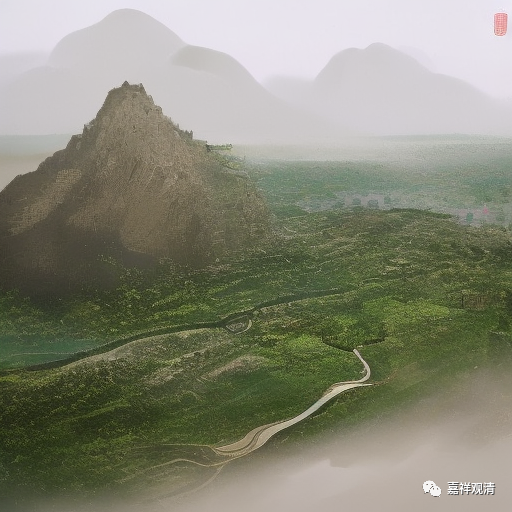

**微课佛教史434·3**

大慧宗杲禅师开悟以后，就在圆悟克勤禅师的门下。这个时候正好是金兵南下，北宋和南宋交替的时候，他们就往南方走了，先去了南京，又去了苏州。再后来，大慧宗杲禅师又去了江西古云门，弟子很多。后来去了福建，应该是类似于我们今天开禅堂。

他的手段相当厉害，弟子当时是五十三人，差不多七七四十九天的时候，** “未五十日”**，应该是七七四十九天的样子，得法者很多，** “得法者一十三人，皆足为一方知识”**。我估计是通过七七四十九天的禅七——因为他说没到五十天，共开悟了十三个人，而且都是一方大德，名气很响——真是手眼通天。

后来大慧宗杲禅师就去了宋以后禅宗的泰山北斗，最重要的地方——径山寺。我们之前讲过，在南宋这个时候，径山寺完全是禅宗的泰山北斗，是最高的第一名山。五山十剎当中，它是作为最高的学府。

径山寺那个时候的人数达到多少呢？我当时去看的时候说径山寺最多的时候有一千五百人，但是现在根据手里的这个记载说，径山寺有两千人，数目相当庞大，是非常大的一个寺院，绝对的大丛林。

大慧宗杲禅师跟当时政治的顶层人物还是有很多的交往，和张九成的关系很好。前面的几位禅师也是如此。但我们可以发现，这一支和主战派的关系都不错，比如李纲、张九成，所以秦桧做宰相的时候，就认为他们是政敌，直接把大慧宗杲禅师给抓了，把他出家的衣服也收掉了，戒牒也收掉了。

这个事情我也很难去判定，但是我们应该认为这是一种政治性的惩罚行为。我还是认为，把他的衣服和戒牒收掉——按理说把衣服收掉就已经很有问题了，在这里可以用皇难来解释，可能问题没那么大。戒牒收掉也就无所谓了，戒牒只是一个凭证嘛。

但是这个惩罚对出家人来说已经到顶级了，然后又发配，先把他搞到湖南去，又给他搞到潮州边上的梅州。过了几年，再把他追回来，又让他去了几个大寺院。这个时候，戒牒应该是重新发了，重新发了戒牒和袈裟。

所以这一段我觉得不应该认为大慧宗杲禅师是还俗了，因为他不是自己还俗的，应该认为这是一种政治性的惩罚，因为他对于秦桧来说，属于政敌这一系的人物，所以给予了惩罚。

后来，大慧宗杲禅师又回到了阿育王寺，最后再次回到了径山寺。他能够东山再起，也是有政治的背景，因为他和后来的孝宗在还没有登位的时候，就互相拜见。后来的政治环境就改善了很多，在孝宗继位以后，就赐他“大慧禅师”或者称他为“大慧宗杲禅师”。

这时候他身体** “抱恙”**，就是身体有点问题，然后就对大家说：“我明天就走了，该写的道别信都写了。”最后大家一定要让他写个遗偈，前面我们讲过其他禅师也都有这个事情。大慧宗杲禅师圆寂之前就写了遗偈，然后撒手去世了，圆寂了。

那么，大慧宗杲禅师的遗偈是什么呢？** “生也只恁么，死也只恁么，有偈与无偈，是甚么热大。”**生也这么，死也这么，就这么生、这么死。“有偈与无偈，是甚么热大”，我也不知道是什么意思（也许是说“是什么来的”，口音记不下来，就变成了“热打”）。他就这样圆寂了。

今天先讲到这里，谢谢大家！

