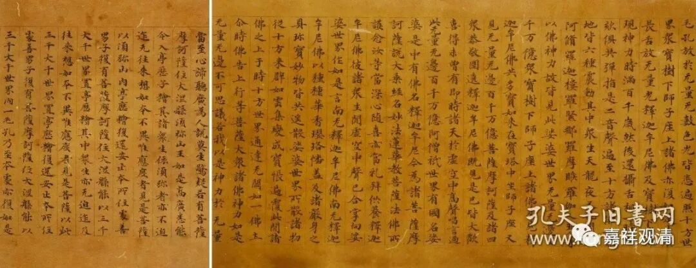
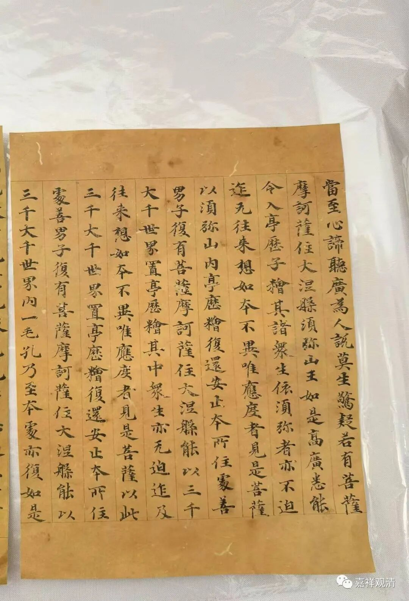
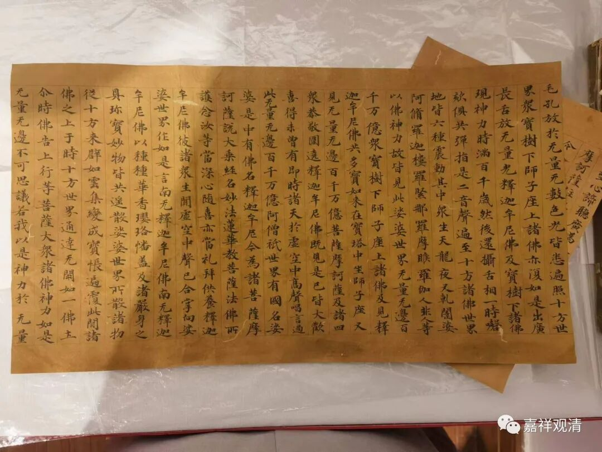
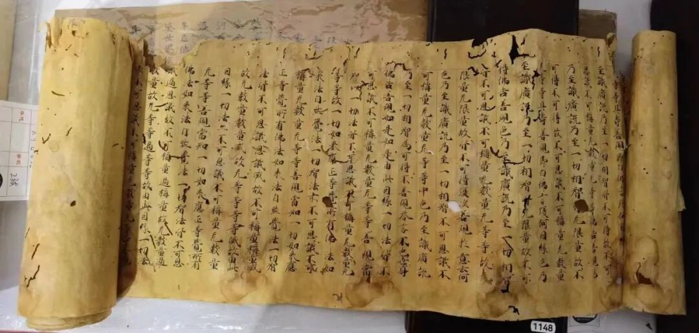
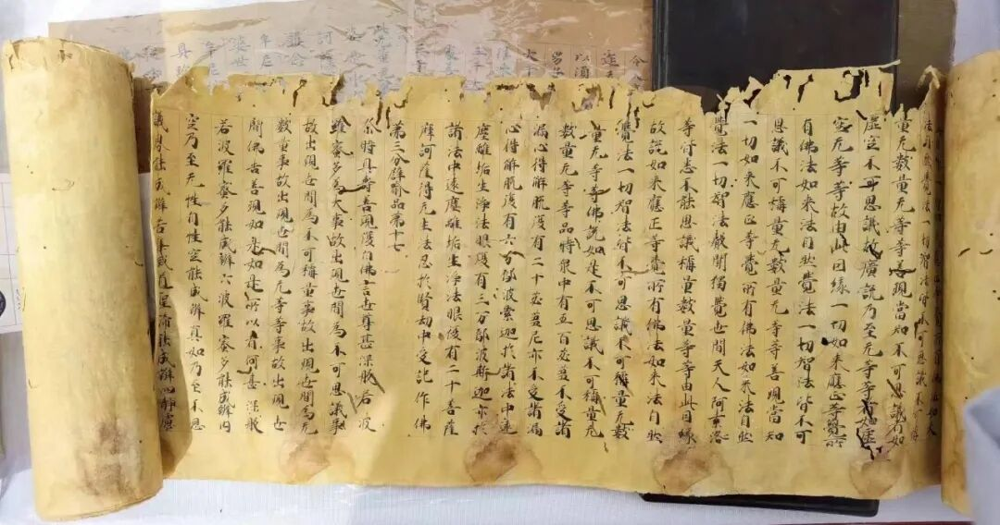
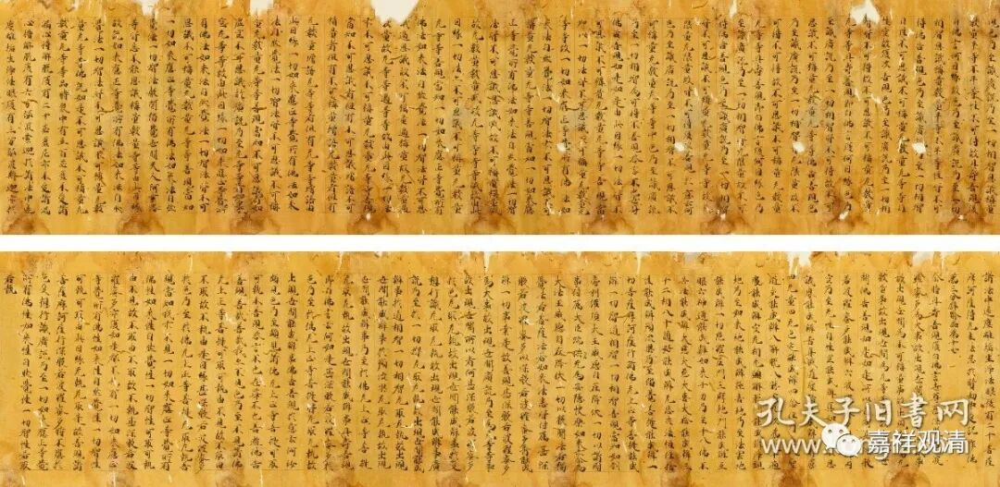
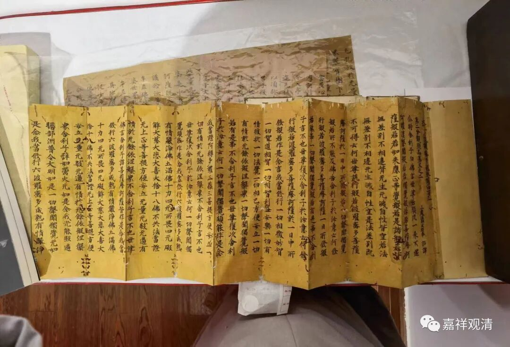
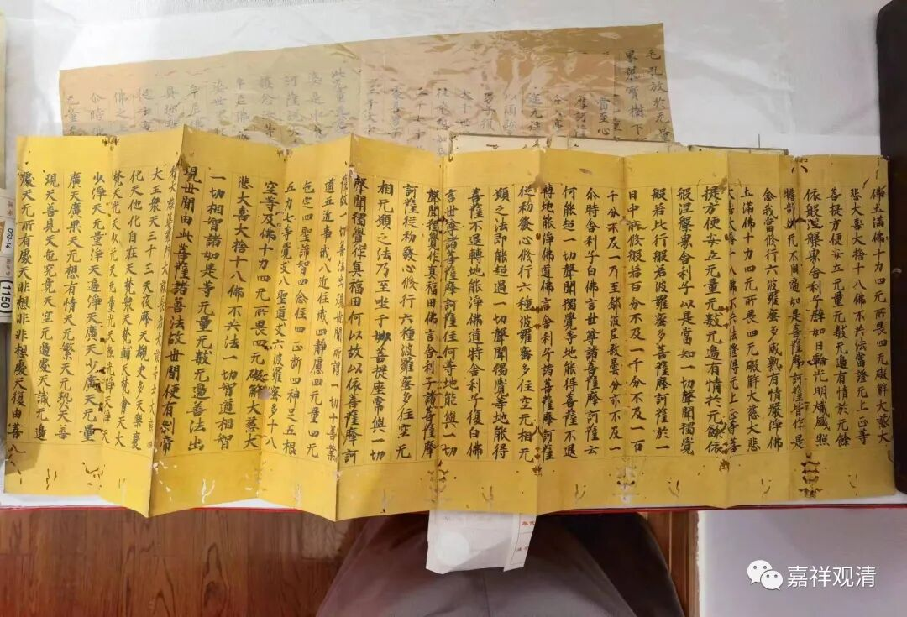
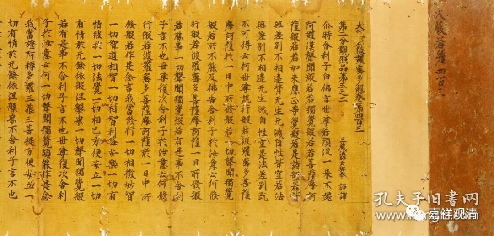

**看几件日本写经**

拍卖会看到的两件天平写经。拍下来发给大家看看。

吕老师看到大赞，说接近隋唐隋唐写经中的精品、力作，可以当字帖。

拍卖行拍的照片，比我的专业多了

日本的天平时期也就是日本文化的奈良时期，指710年～794年日本以平城为京城时期，这一时间段是日本写经的鼎盛时期，大约相当于中国晚唐时期。

这一件是镰仓时期的日本写经，题为建久二年（1191年）。“笔力不及前之天平写经，但趣味很赞”（吕老师语），很日本了。

拍卖行给的照片

吕老师介绍说，日本的书法作品不做过多明显的运笔-起笔、顿笔、行笔、收笔，（肯呢个）更接近自然和他们理解的禅意。同样的，中国画也被他们简化了线、色的内容和动作，弄成了相对轻松的浮世绘（美人画和所谓的禅境山水）。（于是轻浮有余而厚重不足，这倒是很符合观感的说——清案。）

一件也是天平写经，题为“《大般若波罗蜜多心经》第四百三卷”，多了一个“心”字，但原件是正确的，做“《大般若波罗蜜多经》第四百三卷”。“四百三”，就是“四百零三”，是《大般若经》的第二会。

拍卖行拍的照片

这一件是经折装，估计最早是卷轴装，是后改为经折装的。前一件就是卷轴装的样子。

这三件都有写经的标准，每一行都是十七字——这和中国标准写经每一行的字数相同。

