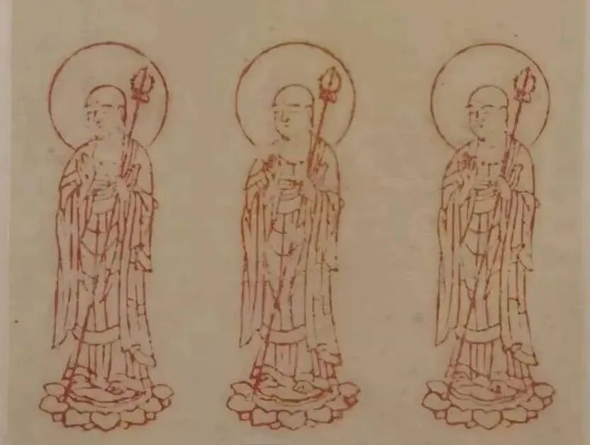
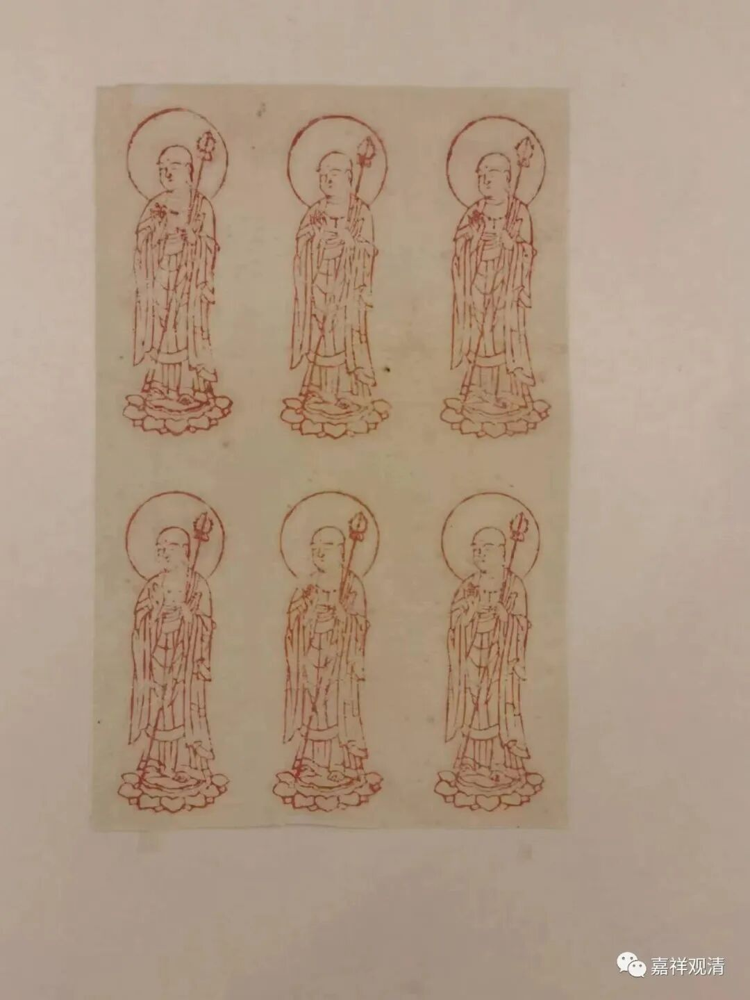
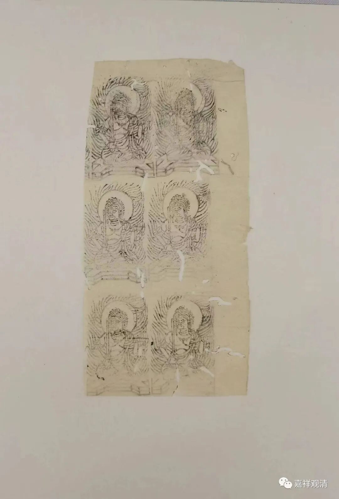
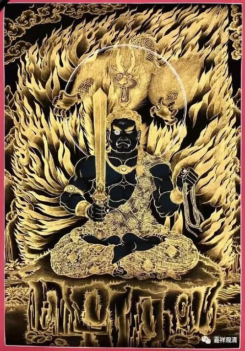
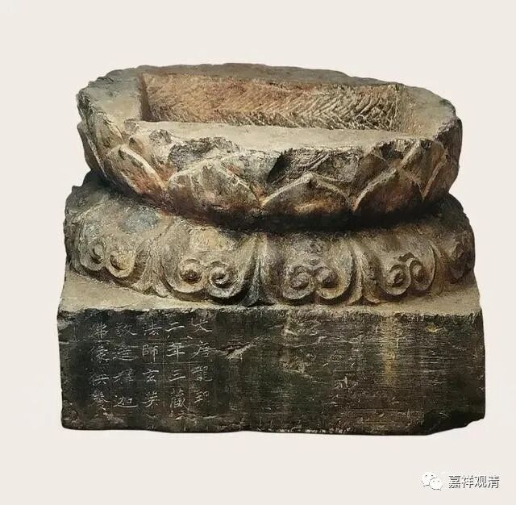

**两件“捺印千佛”**

今天有事，没赶上拍卖行的。就看看照片饱饱眼福吧……

发现两件“捺印千佛”的小品。夹在一堆零页的写经和零页的《大藏经》里面，有点特殊。

这一件是地藏菩萨的比丘相，六尊地藏像。今天看来很标准的样子。可以对照这个——

地藏菩萨像

另一件应该是不动明王像，也是六像，纸上有虫蛀。

不动明王像，对照地可以看这个。

很明显，这两页“捺印千佛”都是在更大的纸张上裁剪下来的。

“捺印千佛”的“千佛”形象不拘，有佛像、菩萨像，还有密教的明王像。

“捺印千佛”，就是佛教徒们用大一点的类似图章、版画的木制的（现在也有橡皮的、铜的、印石的等等）模范去按印在纸上，可以印制很多，以期达到积累功德的效果。敦煌就出土了捺印千佛的图案。说明这一行为由来已久，在唐代就已经在汉地流行。

捺印千佛模范

其实“捺印千佛”就是今天所谓“十万印佛像加行”的前身。《大唐西域记》说胜军大师闭关做泥佛像，玄奘法师好像也做，这种捺印千佛的意思和做泥佛像（擦擦）也类似。

国博展出的玄奘造像底座。

