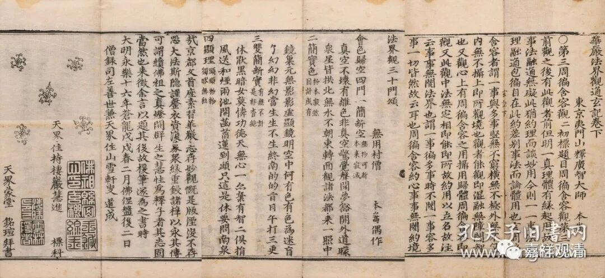

**《法界观通玄记》和广智大师本嵩**

“中国书店”2023秋拍有一件《华严法界观通玄记》卷下。

《华严法界观通玄记》，宋释本嵩集，三卷。此件经首刊印有“东京夷门山释广智大师本嵩集”字样，经末附本嵩所作《法界观三十门颂》。

这件署名很有趣，“释广智大师本嵩”，这个署名方式好像不多见，我可能是第一次看到（当然我看得少），一般都会说“广智大师本嵩”而不在“广智大师”这之前加“释”。

《中华大藏经总目》第二辑注为“元本嵩”，误！第四辑中注为“宋本嵩”，正确。本嵩大师，宋人，约与张商英（1043-1121）同时而略早。本嵩善华严，张商英曾请师出山讲《华严》。

《中华大藏经总目》第四辑说：

“《华严法界观通玄记》三卷（宋本嵩撰，四。当即嘉史函《华严七字经题法界观三十门颂》之本文，同卷另出颂注。）”

注解错。“《华严七字经题法界观三十门颂》”即《中国书店》这件《华严法界观通玄记》的附录，又叫《法界观三十门颂》，也叫《华严法界观通玄记颂》（这个名字其实不太确切，本意是“《华严法界观通玄记》附录的颂”），《法界观三十门颂》有元·琮湛集解的《华严法界观门颂注》，两卷，《嘉兴藏》“史”字函有收录，《永乐北藏》等也有收录。

《中华大藏经总目》第二辑和第四辑的两处错误的原因为：一，以注解人“元·琮湛”的“元”误植颂文原作者“本嵩”；二，以《华严法界观通玄记颂》（实为《法界观三十门颂》）误为《华严法界观通玄记》的本文。

中国书店的拍品介绍里说“此经未收入《大藏经》，因此长期以来被误认为已经散佚”，这里前半句是对的，确实未收入新中国成立前之《大藏经》，但实际佛教的“藏外”经书并不少见，未入藏并不代表散佚，只是有可能散佚而已，“藏逸”不是“散佚”。《藏逸经书标目》中，就说“《华严法界观通玄记》三卷，本嵩法师述，北京有板。”说明虽然藏经里没收但是江湖上还有流通。

