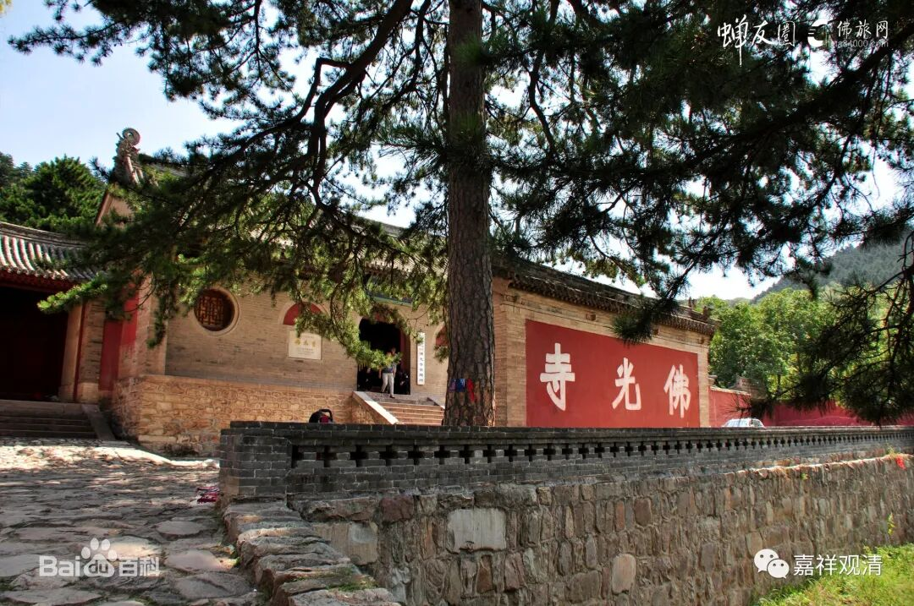

**快问快答·床**

问：请问“不能坐高广大床”，“高广大床”怎么理解？有的说是指凡是高的，大的，比如沙发啊，1.8米的大床啊，都属于高广大床。

回：“不坐高广大床”指豪华的座椅，比如很贵的红木家具。以前的“床”类似今天的椅子，一般不直接指向今天睡觉的床。

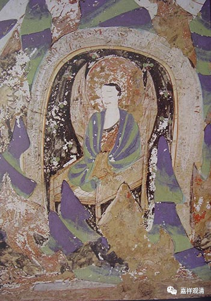

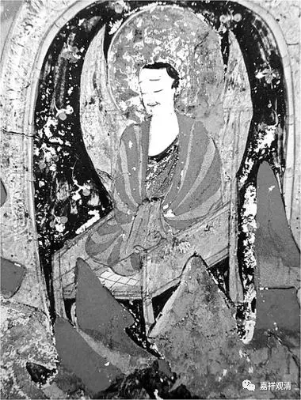

这是敦煌壁画里的的“禅床”，这一张很明显是绳床，就是底面是用绳子做经纬线绷起来的，类似以前的“棕绷”。看黑白图就更明显了。

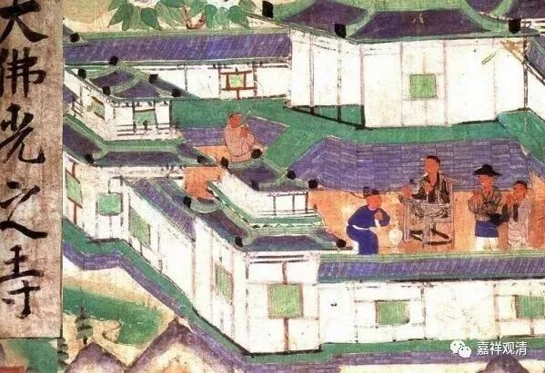

这也是敦煌壁画，山西五台山大佛光寺（今天还在，著名的今天尚存的唐代建筑，梁思成、林徽因找到的），中间的僧人坐在“禅床”上。

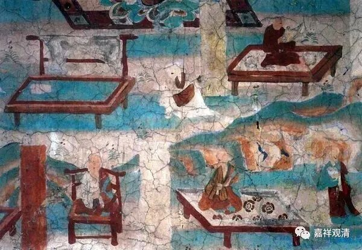

敦煌壁画，还是僧人坐禅床，其余的是四足床。

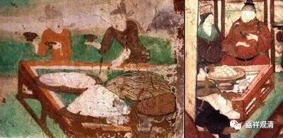

这是敦煌壁画里的“食床”，一大堆食物都放在“食床”上。杜甫《驱竖子摘苍耳》：“登床半生熟”的床就是指的“食床”。

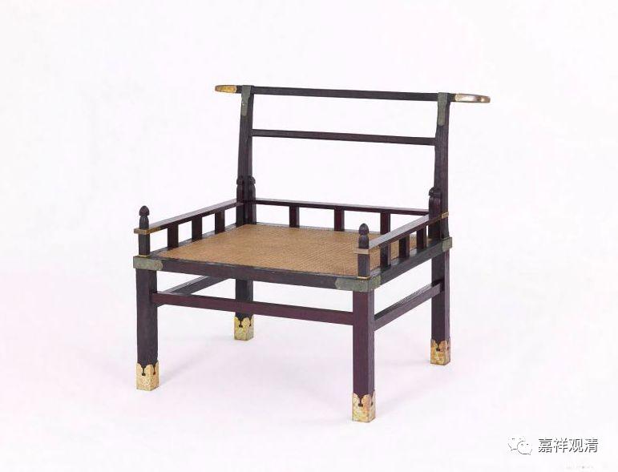

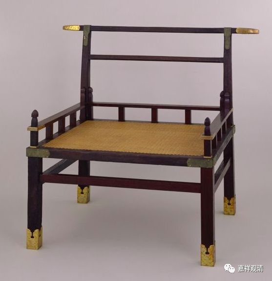

这是日本正仓院的赤漆欟木胡床。实物。

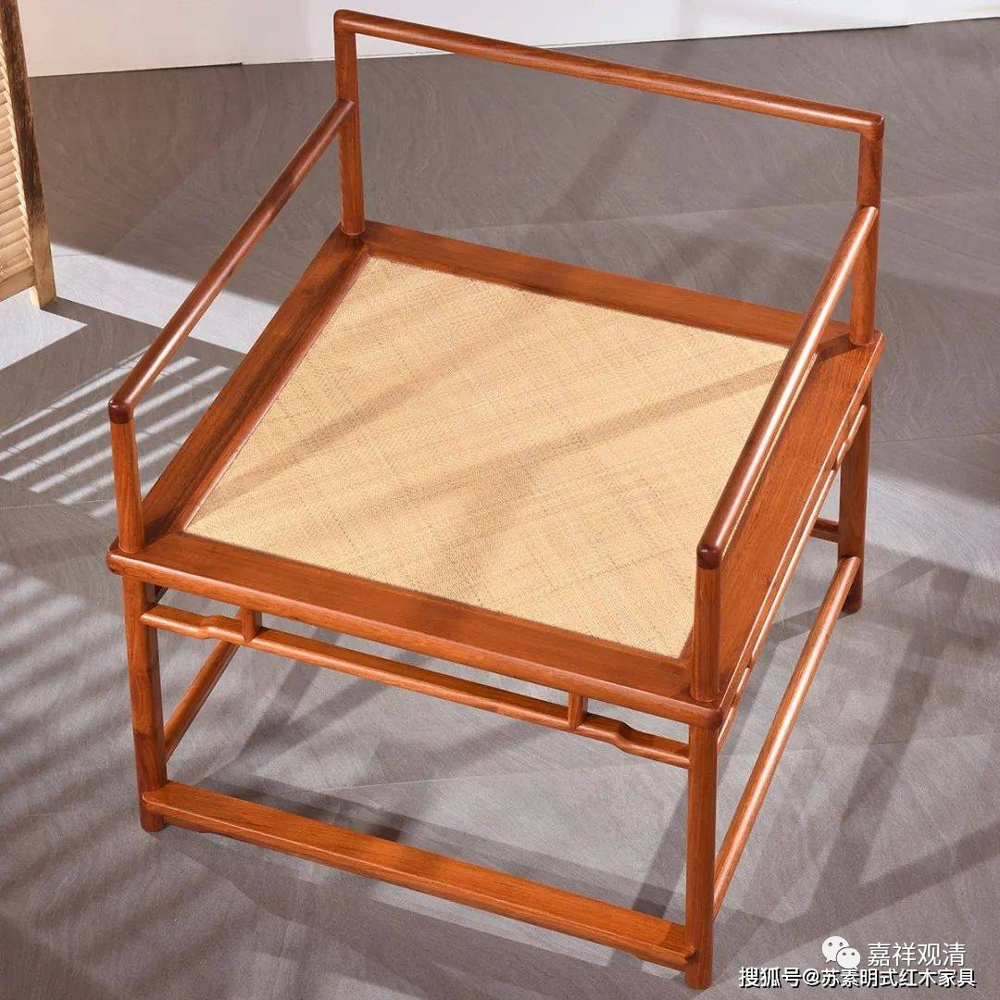

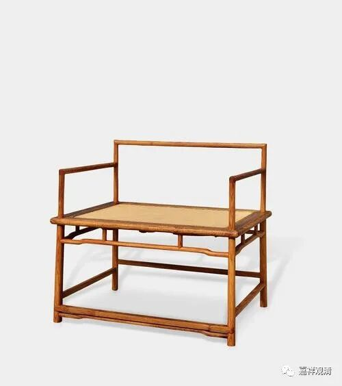

这是今天家具厂做的禅凳，其实就是禅床。

查一下《故训汇纂·牀（床）》，古人说：

“** 《说文·木部》：牀，安身之坐者。……**

** 古人称牀、榻，非特卧具也，多是坐物。《学林》卷四。**”

所以，“高广大床”不是指这个——

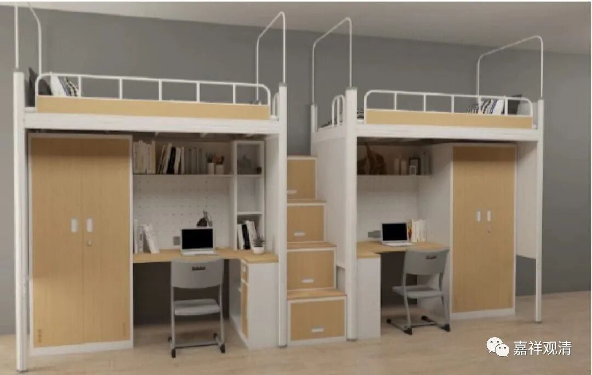

也不是指这个——

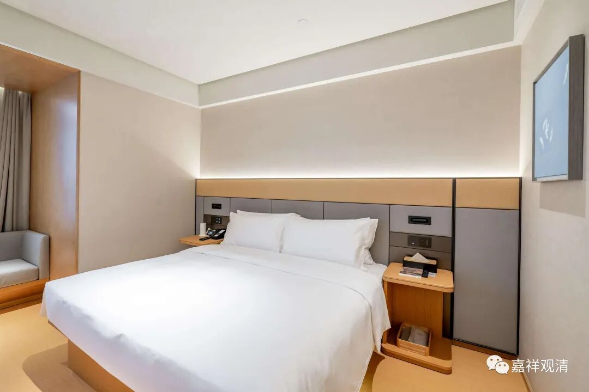

所以尽管睡。哈哈

