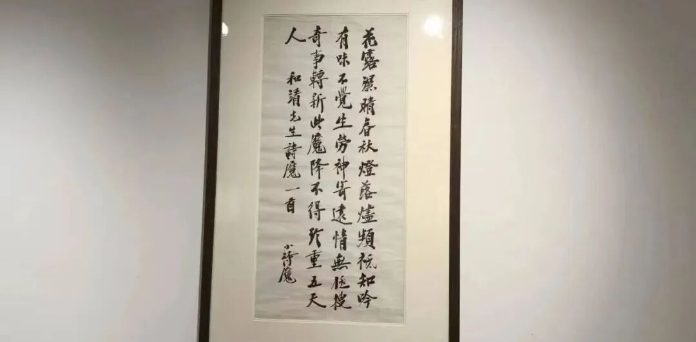
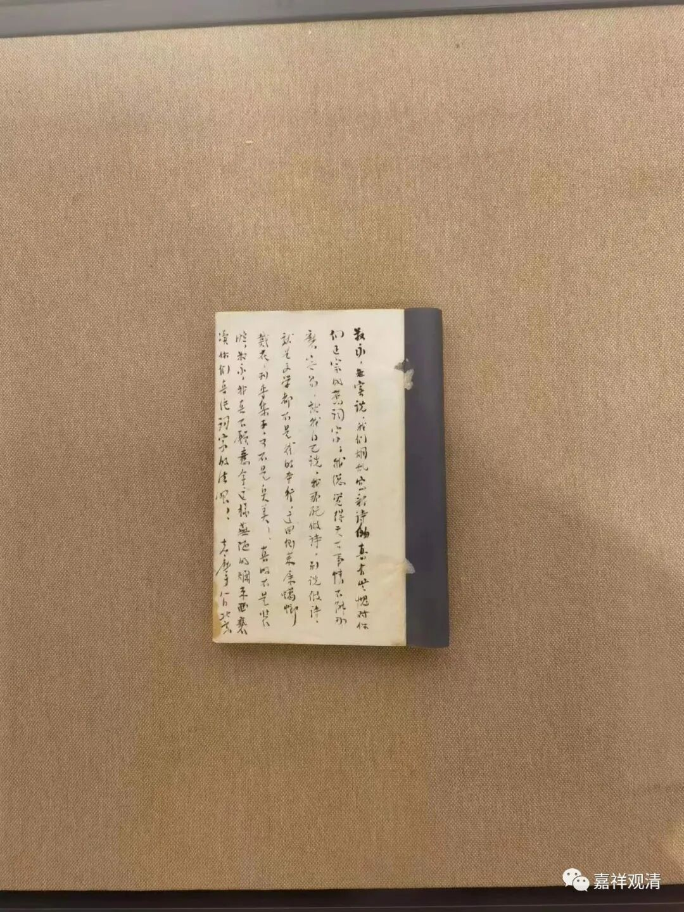
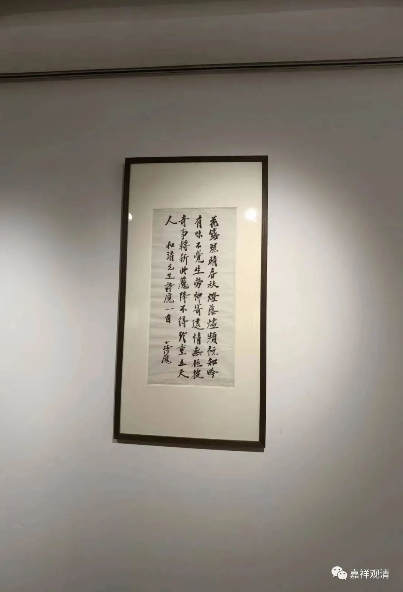

**“小诗魔”徐志摩的书法**

聊两件大家看得懂的（哈哈）——徐志摩的字。

拍卖会预展，有两件徐志摩的东西——

一，这是一件徐志摩的手稿。

这一件书法作品，作品上写的是林逋（968—1028）的《赠张绘秘教九题·诗魔》

“花露湿晴春，秋灯落烬频。

祇缘吟有味，不觉坐劳神。

寄远情无极，搜奇事转新。

此魔降不到，珍重五天人。”

对，这个林逋就是“梅妻鹤子”的那个林逋。

这件书法作品上没有很明确的署名，只署名“小诗魔”，小诗魔是谁？

我给吕老师看，他一眼看上去就认为是郑孝胥的字。对，确实是郑孝胥的字体。

郑孝胥，清末民国是著名的诗人、他的字也是当时最有名的，拿现在的话来说叫“没有之一”，他还是……（那啥啥就不写了。）我的一个老师郑风胡教授是他的孙子，年轻时就干革命了，后来学西医，行医过程里发现神奇的中医遂转学中医，后来援藏，发现高原性心脏病和缺血性心脏病其实是一个机理，遂研究出治疗高原性心脏病的方法……不多说出去了。

郑孝胥的字当时有很多人学，包括蔡元培、胡适、草巨人、徐志摩……徐志摩还专门学书与郑孝胥，秉持弟子礼。

又，徐志摩崇拜的拜伦被称为“诗魔”。徐志摩《我所知道的康桥》：“康桥的灵性全在一条河上……上游是有名的拜伦潭——‘Byron’s Pool’当年拜伦常在那里玩的。”拜伦为英国“诗魔”，被称为“中国拜伦”的徐志摩可能被友辈戏称为“小诗魔”（摩、魔又音近），所以他就拿林逋的这首《诗魔》出来写了一幅字送人。（如果让郑孝胥自称“小诗魔”则有点不合拍。）

这件东西传承有序，为任鸿隽后人所藏。

