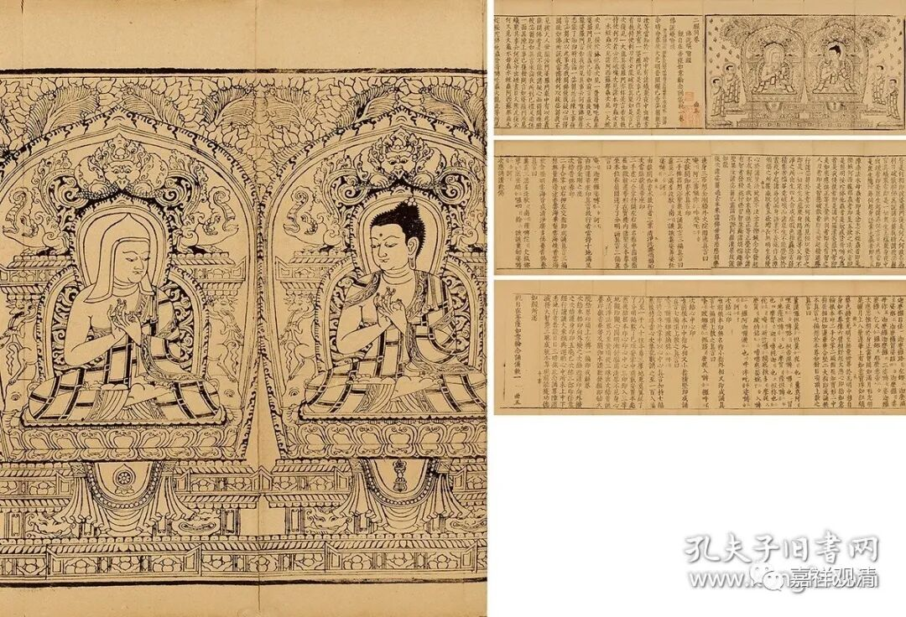
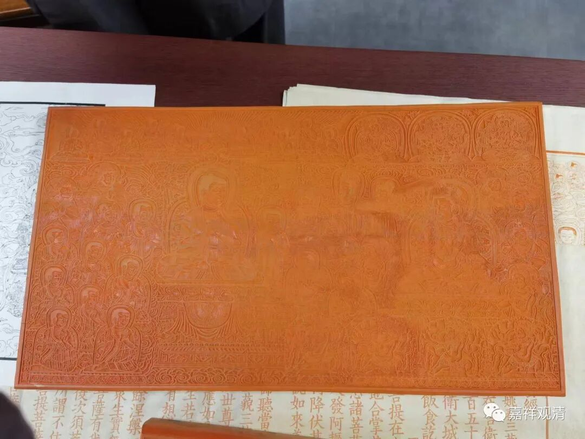
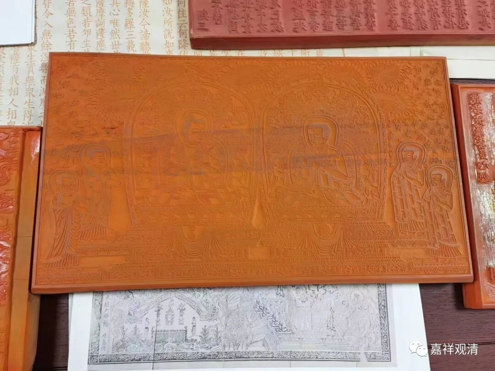
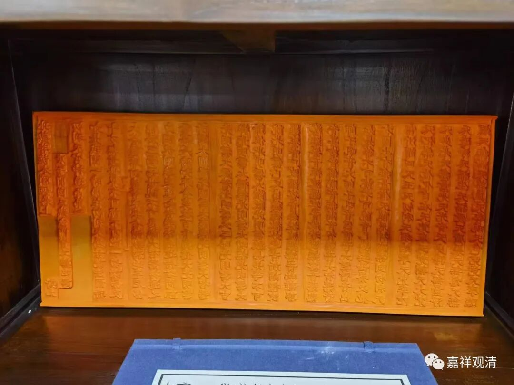
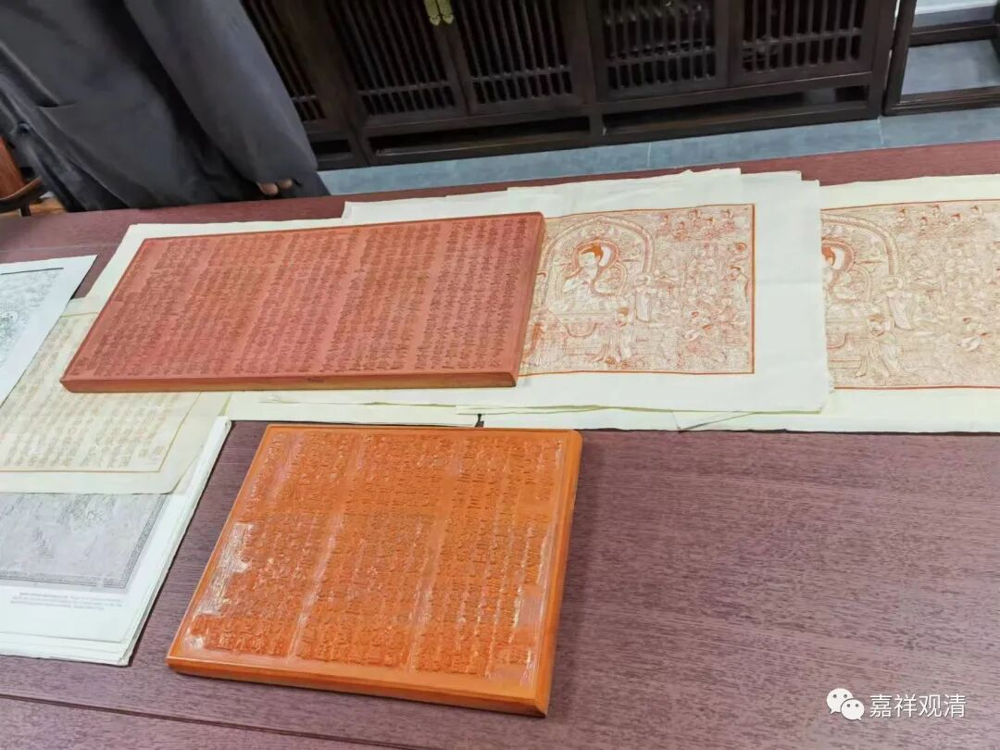
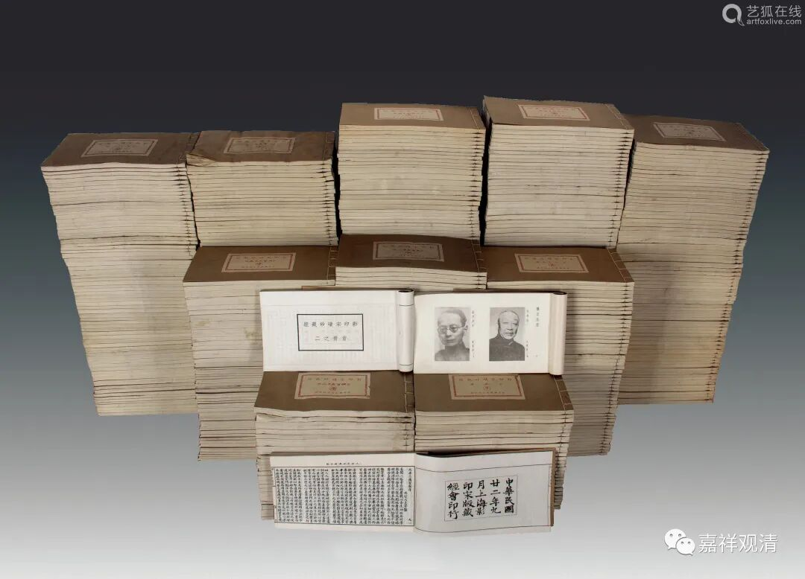
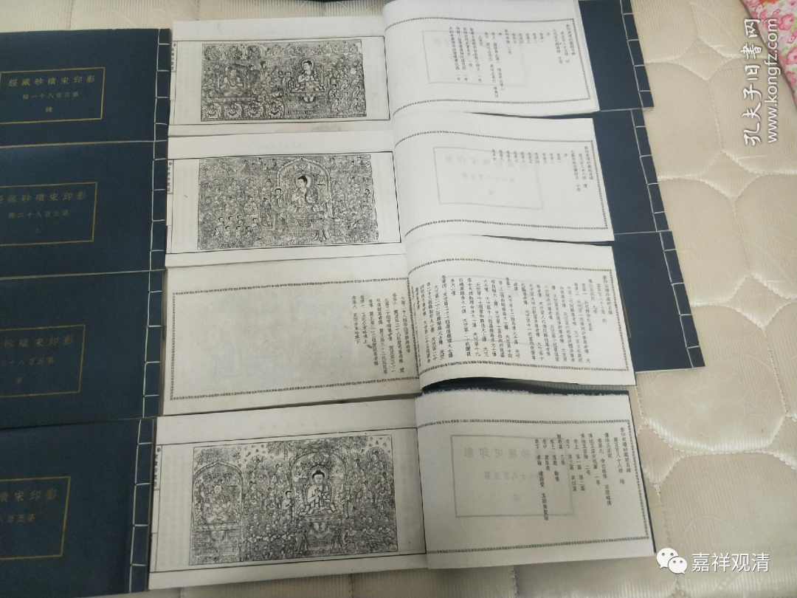
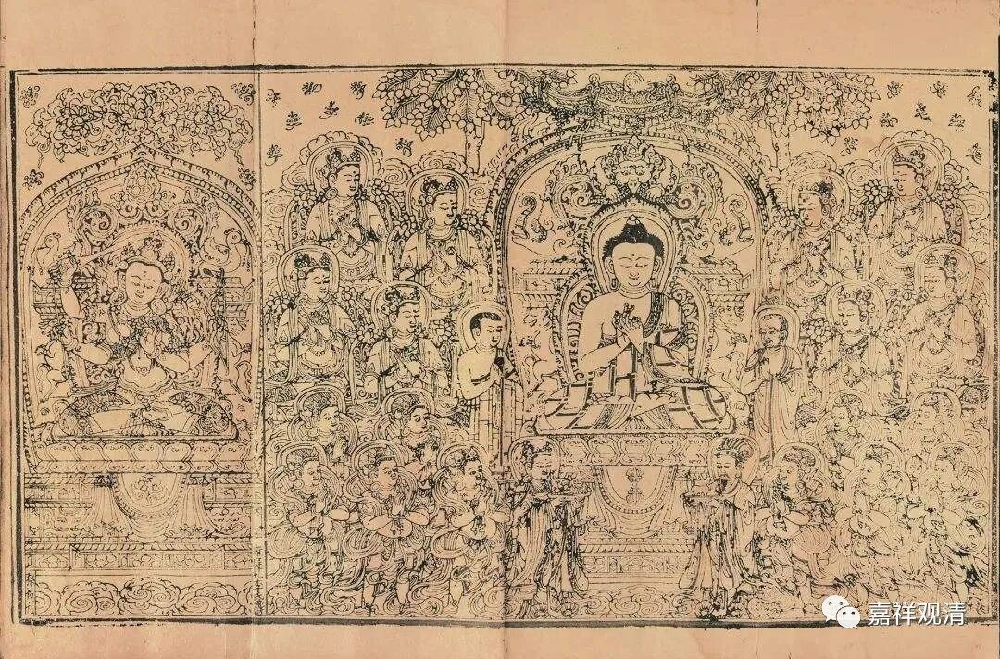
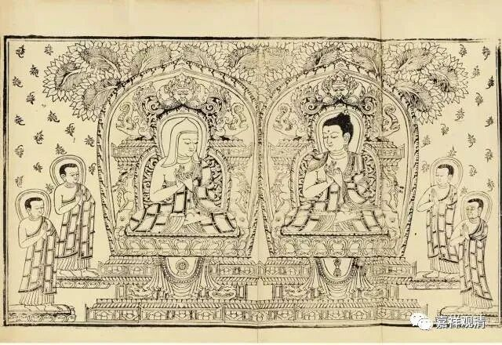
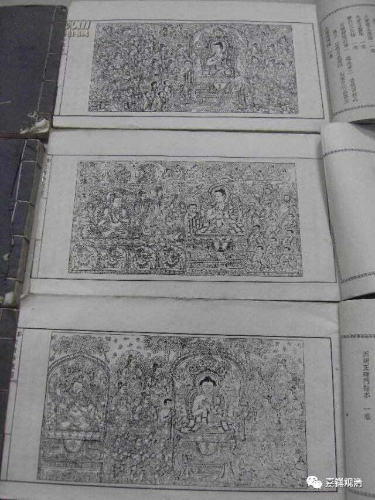

**一件《碛砂藏》零本**

这是泰和嘉成的一件《碛砂藏》“二经同卷”，这里的“二经”是指的《佛说蚁喻经》和《观自在菩萨如意轮念诵仪轨》，千字文编号“曲”，第五本（卷），所以叫“二经同卷”（，还有很多“二经同卷”“五经同卷”，多的可以有十几经“同卷”）。

《碛砂藏》是南宋平江府陈湖碛砂延圣院刊刻的一套藏经。碛砂延圣院，今天因建高速公路而在原址附近异地重建，在今天苏州昆山澄湖。今年四月份去参访了。寺院现在也在重刻部分《碛砂藏》的经本，特别是《碛砂藏》的十几幅版画，已经仿刻完成。

这是今天的碛砂延圣院复制的《碛砂藏》版画。

这是今天的碛砂延圣院复制的《碛砂藏》经版。

苏州地区的寺院最近似乎都有重新刊刻大藏经的项目，我所知的就大概有三四家了，其实实力最强声势最大的是灵岩山寺，它仿刻了两三部藏经（记得有《思溪藏》），也都已经实质启动了。有经济实力的寺院费心认真做点这种文化工程其实挺好。

民国时期发现宋《碛砂藏》以后教内有点小兴奋，很快就影印了一版，是这样的。

现在成套的和零本的在拍卖市场上都有流通。

《碛砂藏》的版画很有特点，很明显地可以看出风格受到了藏传的影响。

有一件《碛砂藏》零本的版画风格和这个系列不同，那应该是其他的佛教版画直接拿过来拼配的。

