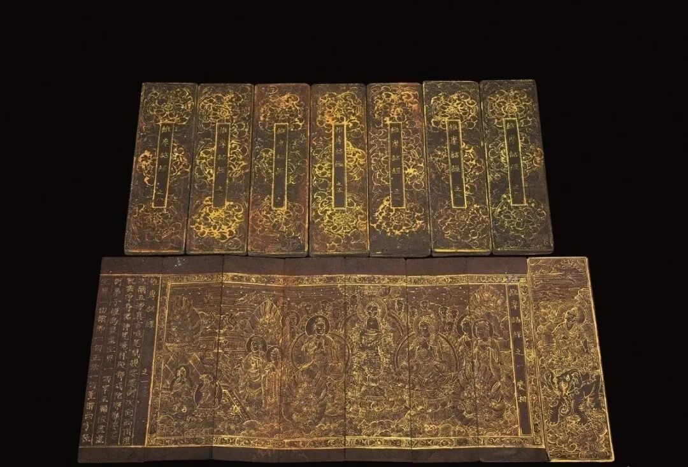

**八卷本的《维摩诘经》**

《维摩诘经》，又作《说维摩诘经》、《说无垢称经》、《维摩诘所说经》，有三译，吴支谦译、姚秦鸠摩罗什译、唐玄奘译。全经十四品，一般支谦译分为两卷，罗什译分为三卷，玄奘译分为六卷。

中国书店这次有一件拍品就是《维摩诘经》双面泥金书写，每册均绘有扉画。卷八尾有题款：“宣光七年丁巳七月日济州牧外兴德寺书字布施”。

“宣光”乃元惠宗之子爱猷识理达腊即位后的年号，前后行用仅约八年，此时北元已被逐出大都，明代史书故意阙而不载。此件为高丽保存北元特殊纪念的实证，是不可多得的珍宝。

对我来说，这件拍品比较特殊的是关于他的分卷，此件《维摩诘经》分八卷，很特殊，前面说到，一般罗什译本是分三卷的。

佛经的很多丛书、单行确实会出现有同一本书分卷不同的情况，比如《大智度论》有七十卷（没见过实物）和一百卷的，《成实论》据敦煌本也见有不同的分卷，另外比如我们常见的《妙法莲华经》，汉地多分为七卷，所以七卷本多见，但日本常见有八卷本罗什译本的《妙法莲华经》，这在拍卖场也见过很多次了。

这次的这种高丽印行宣光七年的八卷本的《维摩诘经》倒是值得一见。

