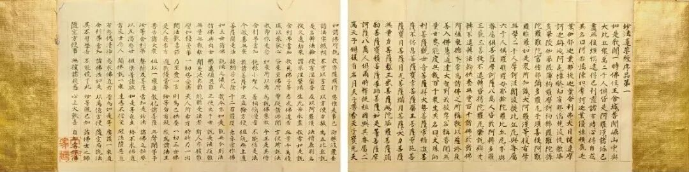
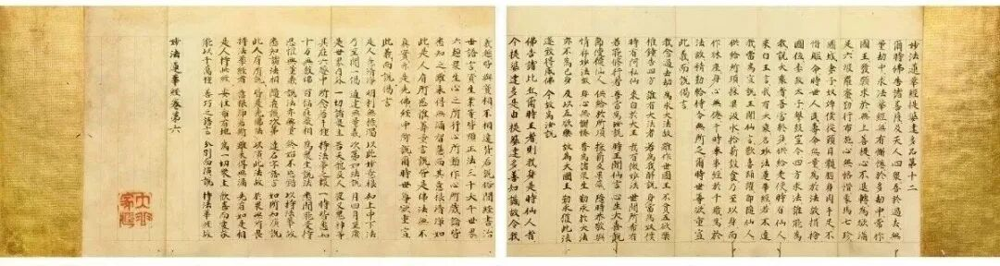
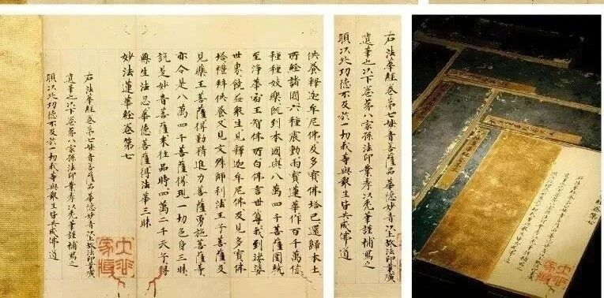

**八卷本《妙法莲华经》写经**

刚谈到日本的八卷本《法华经》，这次“开拍”古籍善本的预展就看到了一件日本八卷本的《妙法莲华经》写经。

《妙法莲华经》七卷、八卷本对照

《法华经》品名

七卷本

八卷本

1

序品第一

第一卷

第一卷

2

方便品第二

3

譬喻品第三

第二卷

第二卷

4

信解品第四

5

药草喻品第五

第三卷

第三卷

6

授记品第六

7

化城喻品第七

8

五百弟子授记品第八

第四卷

第四卷

9

授学无学人记品第九

10

法师品第十

11

见宝塔品第十一

12

提婆达多品第十二

第五卷

13

劝持品第十三

14

安乐行品第十四

第五卷

15

从地涌出品第十五

16

如来寿量品第十六

第六卷

17

分别功德品第十七

18

随喜功德品第十八

第六卷

19

法师功德品第十九

20

常不轻菩萨品第二十

第七卷

21

如来神力品第廿一

22

嘱累品第廿二

23

药王菩萨本事第廿三

24

妙音菩萨品第廿四

第七卷

25

观世音菩萨普门品第廿五

第八卷

26

陀罗尼品第廿六

27

妙庄严王本事品第廿七

28

普贤菩萨劝发品第廿八

简单做一个对照表大家看看。

这是日本江户时代大名书法家大谷永庵（1698-1780）收藏的一件写经。

第七卷后有款识：“右《妙法莲华经》第七，《妙音菩萨品》华德妙音以上，故法印业广/遗笔也，以下卷第八，家孙法印业孝以秃笔谨补写之/愿以此功德，不及于一切，我等与众生。皆共成佛道”。

回向文“不及于一切”是写错了，应该是“普及于一切”。呵呵，“不及于一切”，那经算是白抄了。

