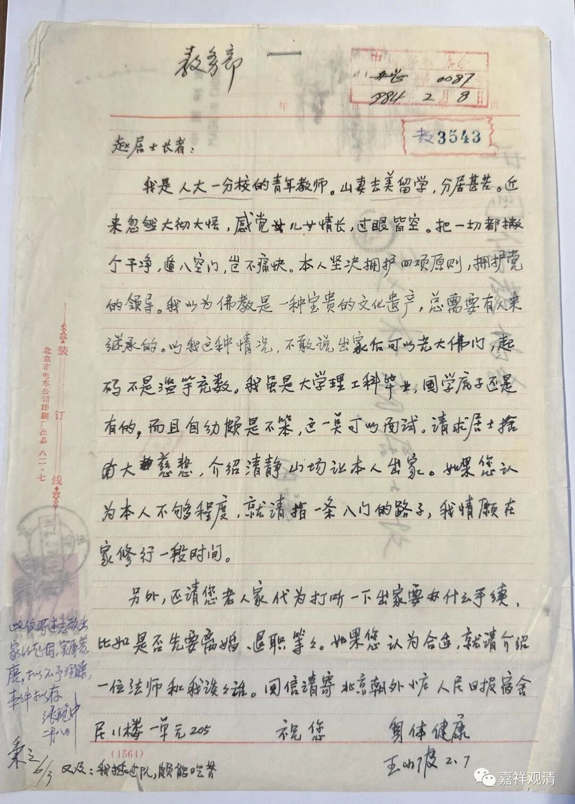
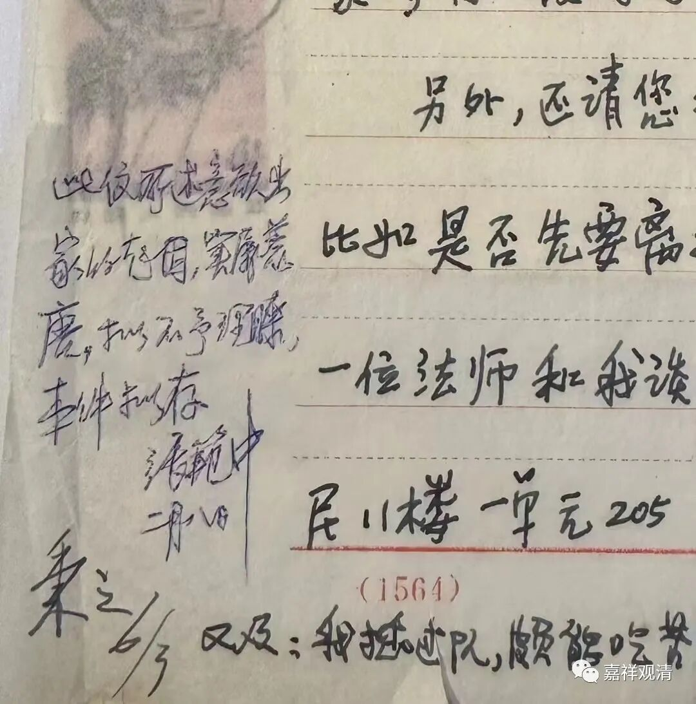
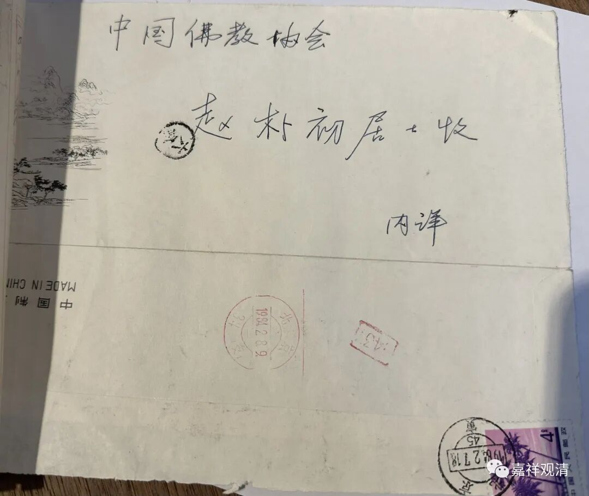

这是今天中贸圣佳预展出现的一件拍品——

王小波（1952-1997）致信赵朴初（1907-2000）——“我老婆出国留学了，我想她。我大彻大悟。我要出家！我能吃苦！”

张范中先生（1913-2011）批：

“此信所述意欲出家的起因，实属荒唐，拟不予理睬，本件拟存。张范中，二月八日。”

（张先生说得有道理，由贪爱而“大彻大悟”而要“出家”，纯属“荒唐”。）

这封信作于1984年2月。

要是王小波真出家了会怎么样？我们猜，应该能长寿，但应该不出名了。会不会有其他“荒唐事”发生，不知道。

王小波和赵朴初先生就不用介绍了。

介绍一下张范中先生。

据中贸圣佳2023秋拍图录的介绍，张先生是湖北松滋人，早年出家，一九三十年代在北京得到周叔迦居士的悉心栽培，曾在中国佛教学院深造。后因为什么原因还俗，参加了中国人民解放军。解放后，受中国佛教协会副会长周叔迦居士招呼回北京，在当时的中国佛学院继续深造，并参与中国佛协工作。八十年代后曾在中国佛教协会教务部及图书馆工作。

这封信在中贸圣佳2023秋拍古籍专场，12月12号上拍。起拍价三万。（哈哈，谁要拍的可以找我，我可以去现场。）

