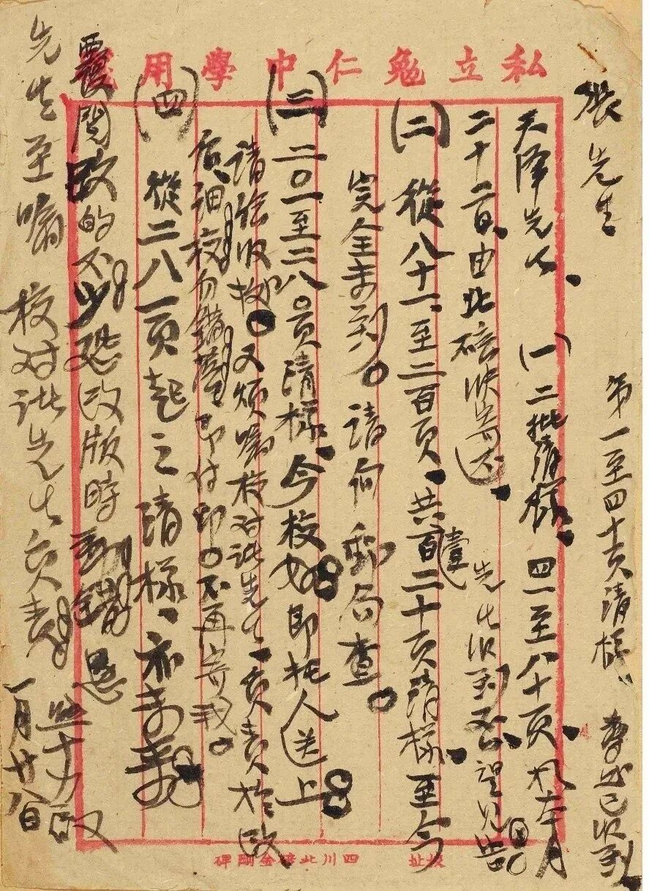
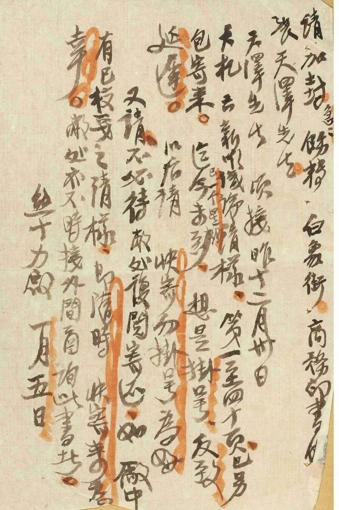
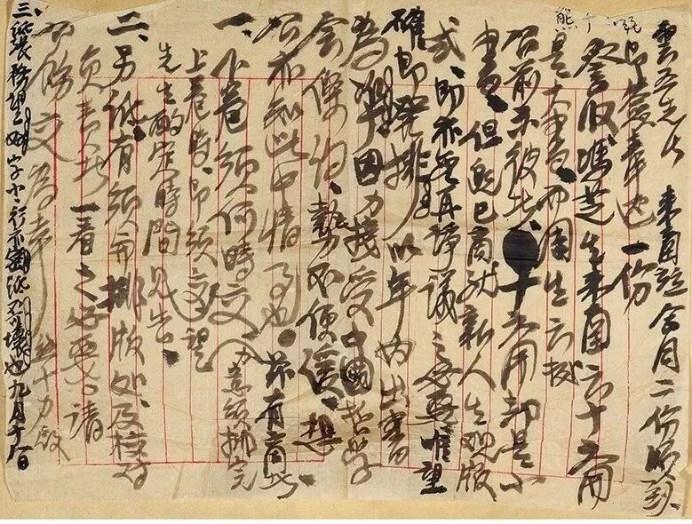
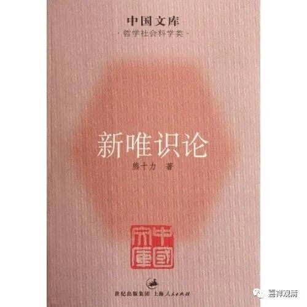

**三件熊十力于商务印书馆的往复信件**

中贸圣佳2023秋拍还有三件熊十力的信件，我挺关注的。

第一件是关于《新唯识论》稿件、清样、出版印行事宜的往来函件：

“张先生，第一至第四十页清样尊处已收到。

天泽先生，

（一）二批清样，四一至八十页于本月二十二日由北碚快寄还。先生收到否？望见告。

（二）从八十一至二百页共壹百二十页清样，至今完全未到，请向邮局查。

（三）二〇一至二八〇页清样，今校好，即托人送上。请给收据。又烦嘱校对诸先生，负责于改后，细校勿错落，即付印。不再寄我。

（四）从二八一页起之清样亦未来，覆阅改的不少，恐改版时动错。恳先生至嘱校对诸先生负责。

熊十力启，一月廿八日。”

“张先生，第一至第四十页清样尊处已收到。”这一句应该是最后补的。

第二件手稿谈的仍旧是关于《新唯识论》的清样问题。时间上应该在前。这一件手稿写于一九四四年一月八日，第一件手稿写于当年的一月廿八日。

“请加封急，饬转白象街商务印书馆张天泽先生。

天泽先生：顷接昨十二月卅日大札云，《新唯识论》清样第一至四十页已另包寄来，迄今已一个星期未到，想是挂号反致延迟。以后请快寄勿挂号为好。

又请不必待敝处复阅寄还。如厂中有已校妥之清样，即随时快寄来为幸。敝处亦不时接外间函询此书者。

熊十力启，一月五日。”

时间上来说，第三封手稿就更早了，写于一九四三年九月十八日，和商务印书馆王云五讨论《新人生观》的出版问题。

“云五先生，来函并合同二份顺到，即签奉送一份。

詧收冯芝生来函云十六开是大书，而周先生云据公前示彼者，十六开却是小书，但既已商就《新人生观》版式，即亦无再争议之必要，唯望确即开排，以年内出书为准。因力接受中国哲学会保约，势不便缓，想公亦知此中情事也。兹有商者：

一、下卷须何时交（力意须排完上卷时，即须交）望先生酌定时间见告。

二、另纸有须与排版处及校对负责者一看之必要。请公饬交为幸。

三、纸张务望好，字小，行亦密，纸不可坏也。

熊十力启，九月十八日。”

这三份往来信件、电报稿的当事人里，熊十力是中国近现代著名哲学家，也说是儒学大师，和马一孚、梁漱溟合称为现代儒学的三大家，是新儒家的代表人物，其中前两件讨论的《新唯识论》是熊十力先生的代表作。

熊十力先生早年参与辛亥革命，后留心阳明心学，在金陵刻经处、支那内学院从欧阳竟无先生进修唯识学数年，后被梁漱溟请往北大（？记得是）授课，讲佛教“唯识论”，最后发展出自己的“新唯识论”哲学体系。弟子中有著名的牟宗三、徐复观。

熊十力是个性情中人，我认为他的“新”唯识论多少有点和内学院同学们赌气的成分，对唯识细节的把握上不无问题，但整体上还是有所见的。从纯印度佛教的观点（方向）来看，熊十力的哲学、“新唯识论”等等是对佛学中国化的改造和受到唯识影响的心学，唯识、法相学在他的哲学里应该是作为底层的知识架构存在的。我最早接触佛教的部分理论是读的熊十力的《存斋随笔》，至今我背的“十二因缘”就是那个版本。

王云五，当年是商务印书馆的老大。很有名，著名的《万有文库》就是他主编的。

冯芝生，就是冯友兰先生，也是新儒家的一个代表人物，冯友兰代表的是“新理学”的方向，熊十力代表的是“新心学”的方向。冯友兰先生的代表作是《中国哲学史》《贞元六书》，解放以后有《中国哲学史新编》。熊十力和冯友兰两位先生的全集我好像都买了。

张天择先生，我还不了解。先空着，慢慢找资料。张天择先生的回信也等稍后整理。

