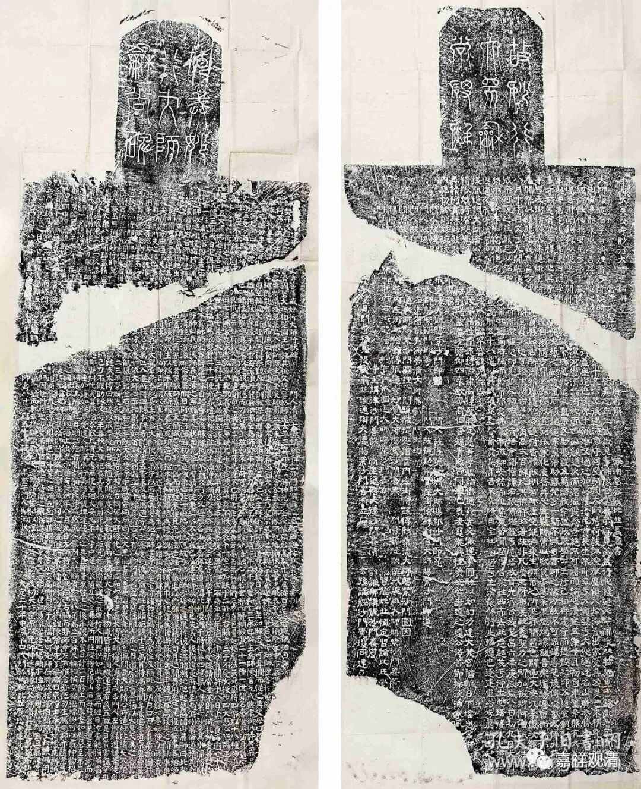

**从《妙行大师碑》看契丹藏雕成年代**

中贸圣佳秋拍中有一件“金妙行大师行状碑”。

此碑刊立于金大定二十年，由契丹国妙行大师第四代门孙讲经比丘觉琼等建造。碑有阴阳两面，正面为“大昊天寺建寺功德主传菩萨戒妙行大师行状碑”，碑阴刻“中都大昊天寺妙行大师碑铭并序”。原碑现藏沈阳市博物馆，《全辽文》（引《满洲金石志》）著录。

妙行大师（1023～1100）姓萧，名志智，字普济，契丹人。他是辽朝国舅、大丞相、追封楚国王萧孝忠的家族成员，二十四岁受具足戒……妙行大师为辽代名僧，曾造《大藏经》一部，应即《契丹藏》。据《大昊天寺建寺功德主传菩萨戒妙行大师行状碑》说：

“……师素蕴大愿，欲营大刹一区，而胜处未获，且先如法造经一藏。止以燕都，随缘诱化，旬月之间，费用充足。凡役匠釐事，各给净□斋戒随酬价□言者莫逆其染□□□，皆护命放生。以糯米胶破亲罗墨，方充印造，白檀木为轴，新罗纸为幖，雲锦为囊，绮绣为巾，织轾霞为绦，斫苏枋为函，用钱三百万。谈笑之间，能事毕□，在持安厝於寺中。”

（按，核对中贸圣佳原碑拓片，《全辽文》录的“亲罗墨”，当作“新罗墨”；“织轾霞”当作“织轻霞”。）

碑文说，妙行大师一直想造一座大的寺院，但没什么特别拿得出手的，就先印行大藏经一套。就单单在辽燕都（今北京），一个月不到就完成化缘三百万钱。此次印制大藏经用料考究，“以糯米胶破亲罗墨……白檀木为轴，新罗纸为幖，云锦为囊，绮绣为巾，织轾霞为绦，斫苏枋为函”。

妙行大师建寺在清宁五年（1059）以后，印行《大藏经》全藏当在此前。而契丹藏（又叫辽藏，）约在辽兴宗（1031～1054）时开雕，此时或已经完成雕造。此前一般以咸雍四年（1068）为契丹藏雕造下限，若参以此碑，或可将上限上推若干年。

（出门参加论坛，在宗志师边上匆匆卷出来这一篇，没有来得及核对其他关于契丹藏的资料文献，算是一个“急救章”，敷衍了今天的文章吧。）

