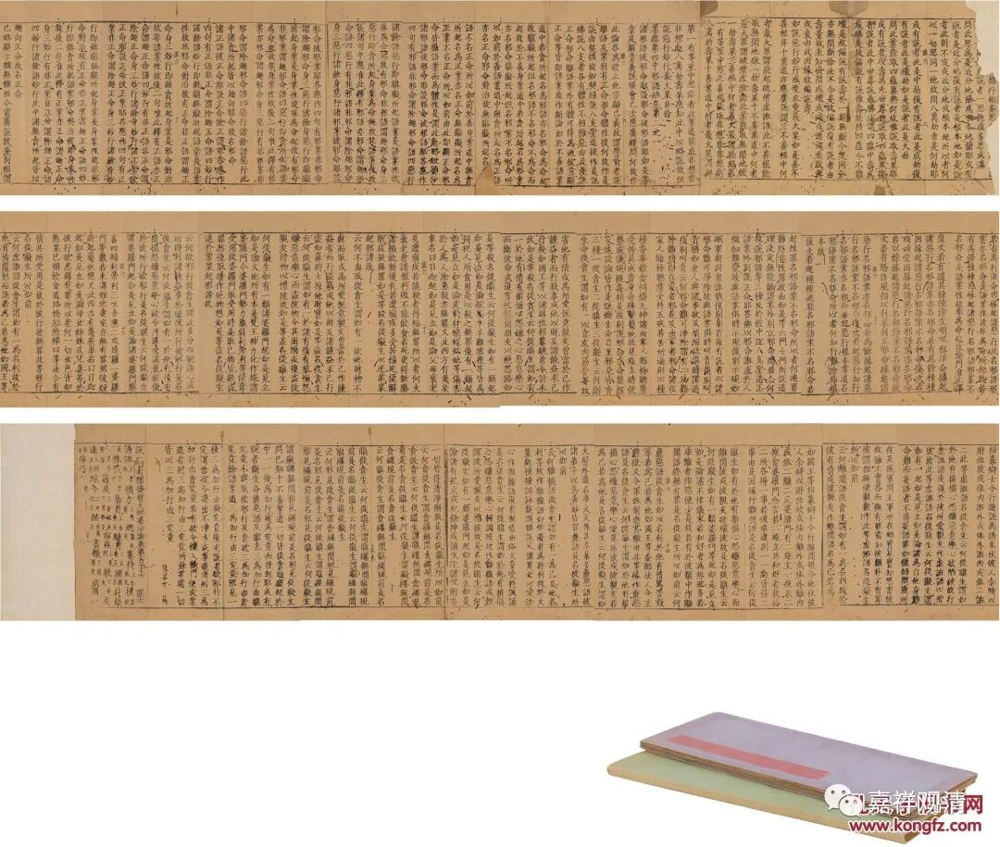

**从一件拍品谈《大毗婆沙论》的全称**

西林印社2023年秋拍下周开拍。我只关注我想关注的佛教典籍……

这是一件元·《普宁藏》的《大毗婆沙论》。

第一眼看上去就是《普宁藏》的样子，卷首有残缺。

《普宁藏》是元“白莲宗”（你懂的）独立雕造的一版大藏经，在《元官藏》发现以前它是已知唯一的元代刻藏。因为由元杭州路余杭县南山大普宁寺雕造而被称为“普宁藏”，《大正藏》的校勘体例里“元”字指的就是这个《普宁藏》，它上承《思溪藏》，版毁于元末战乱。

这一件《大毗婆沙论》是第一百一十六卷，是玄奘法师译本，《大毗婆沙论》先后有三译，玄奘译本为二百卷。“毗婆沙”“婆沙”“鞞婆沙”的意思是“分别说”，就是广说，广说迦旃延腻子的《发智论》，故称为“大毗婆沙”，所以《大毗婆沙论》实际就是《发智论》的广解，而且可以理解为是关于《发智论》（每一段文字）的学术研讨会后的全记录，所以篇幅也就相当夸张了。

这一件《普宁藏》千字文号“匪六”，最后署是“说一切有部发智大毗婆沙论卷第一百一十六”。

清按：

查cbeat录《大正藏》的校勘，《大正藏》在此卷末做“说一切有部发智大毘婆沙论卷第一百一十六”，与西泠印社此件相同，但《大正藏》校勘记里，则说“阿毘达磨【宋】【元】【明】【宫】”，意思是，【宋】《思溪藏》本、【元】《普宁藏》本、【明】《嘉兴藏》本和【宫】宫内本都做“阿毗达摩大毗婆沙论”而非“说一切有部发智大毘婆沙论”，《大正藏》这个和拍卖的这件有点不符的样子。考虑到《普宁藏》的流行短暂，《大毗婆沙论》也不是常见的流通经典，似乎《普宁藏》不应该有不同的版本才对。又考虑到《大正藏》的校勘有一些常见的错漏，有必要有机会去核对一下这几个原版看看。

