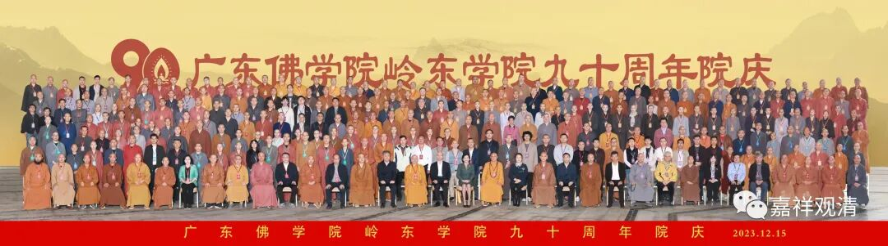
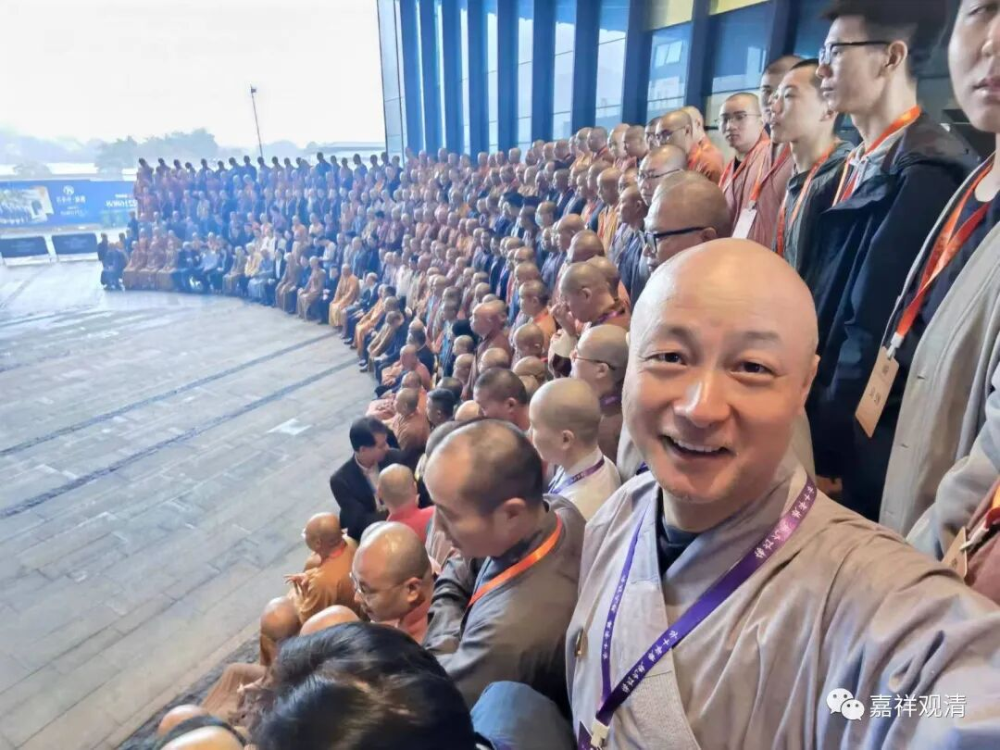
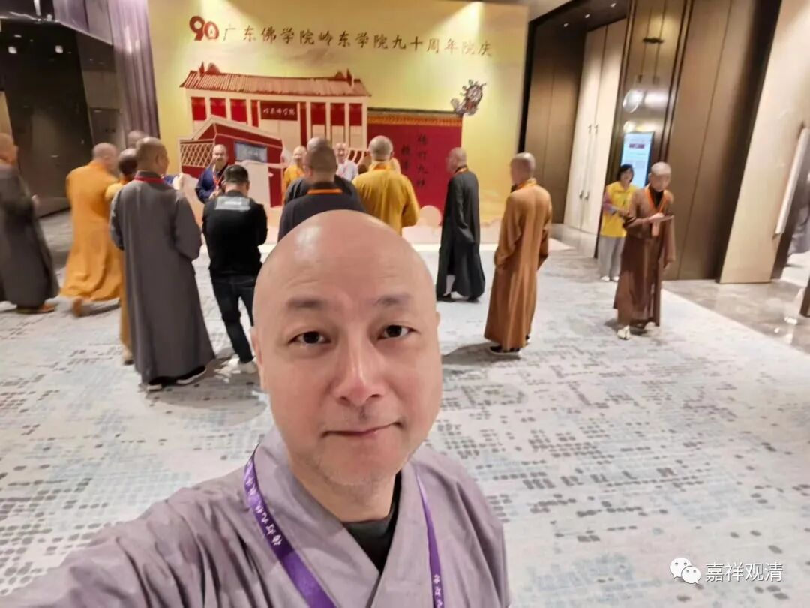
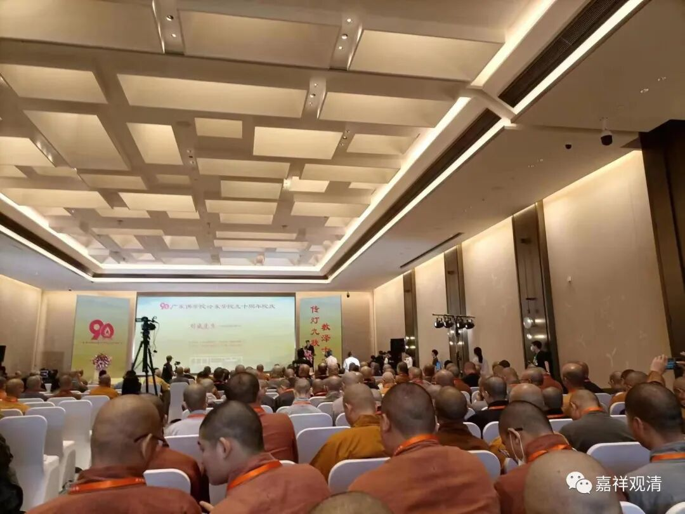
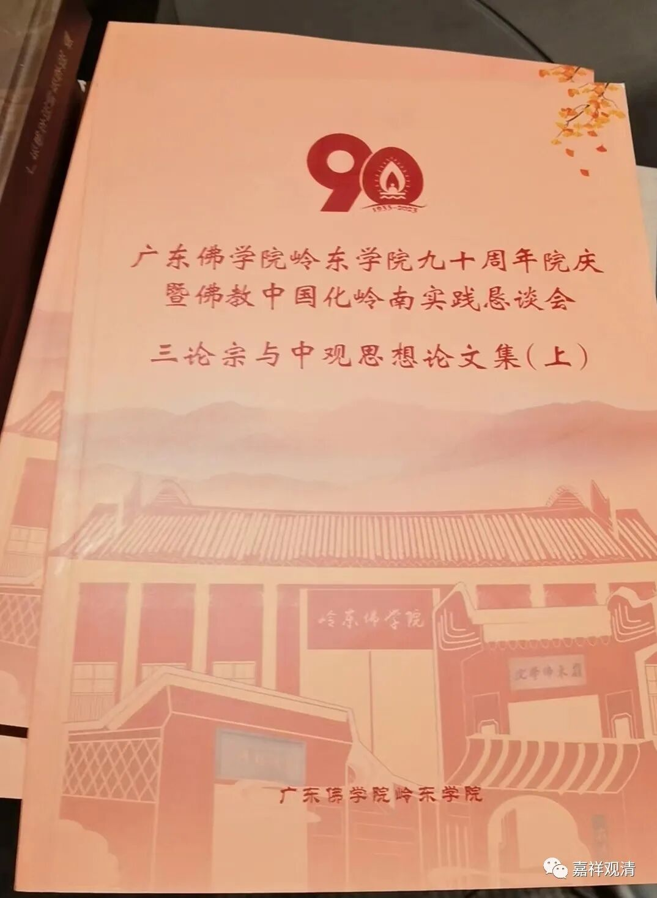
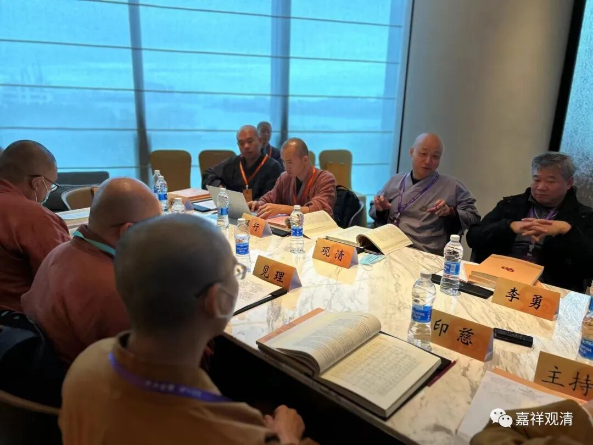
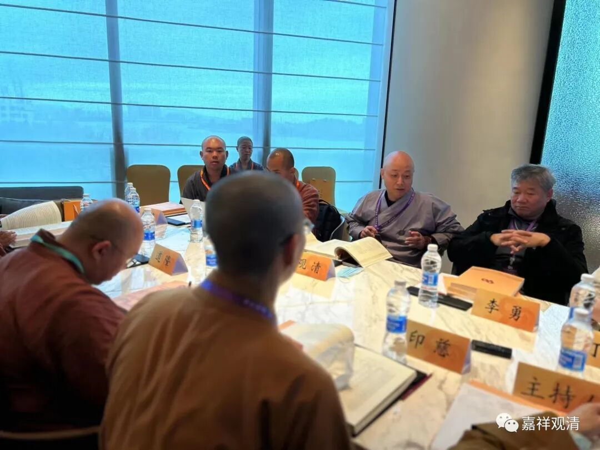
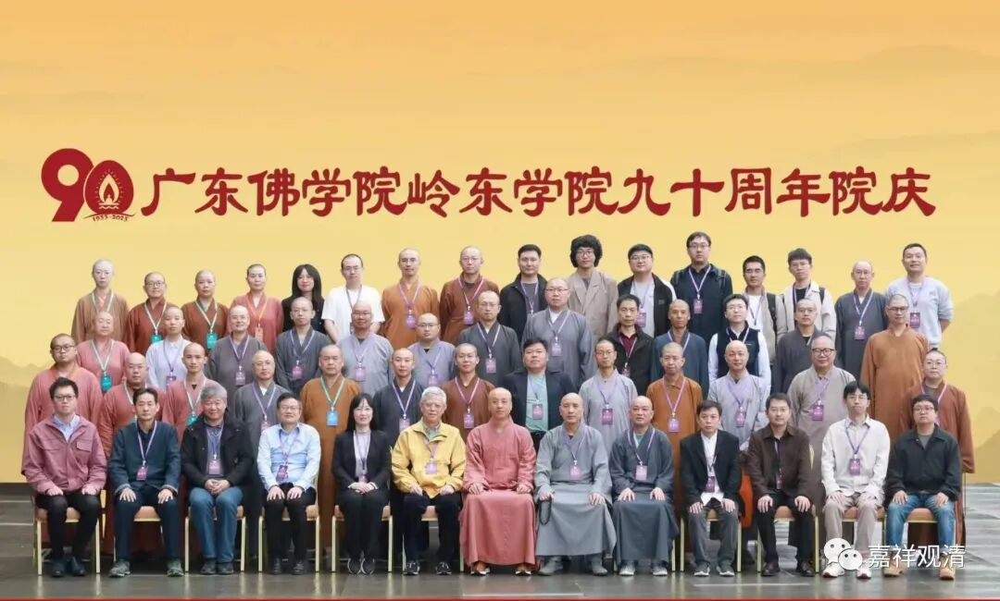

来潮州参加“岭东佛学院九十周年庆”。

为了这次校庆，潮州开元寺和佛学院都准备了很久，可以说“竭尽全力”，所以我跟一些工作人员开玩笑说：“你们这次办得这么好，下一届怎么办？”兄弟回复我说：“那得再隔十年，到百年校庆……”我说：“那时候我就得被徒弟们架出来了……”边上宗志师马上作势上来扶着我的前臂，我顺势身子往下一沉，蹒跚地往大巴那儿挪……

校庆的同时，还有一个学术恳谈会，有“中观学派研究”和“中国佛教教育”两个分会场。我们肯定是去中观研究的那个会场了。

这次恳谈会，看到很多新面孔，感觉潮州开元寺的中观论坛事实上已经变成教学两界中观学人的“娘家”了，这也是开元寺大和尚达诠法师费心费力的结果，也凝聚了全部佛学院、研究生班师生的心血。

说起这里的中观研究生班，就这次恳谈会的呈现来看，是让人们眼前一亮的，较之学界的一般研究生已不逊色，比之其余佛学院同等学力的同学们来说应是颇有胜出。最希望同学们能够继续学习，让我们这批人不至于“一代而亡”。

唉，一代而亡，好凄惨的词～～

