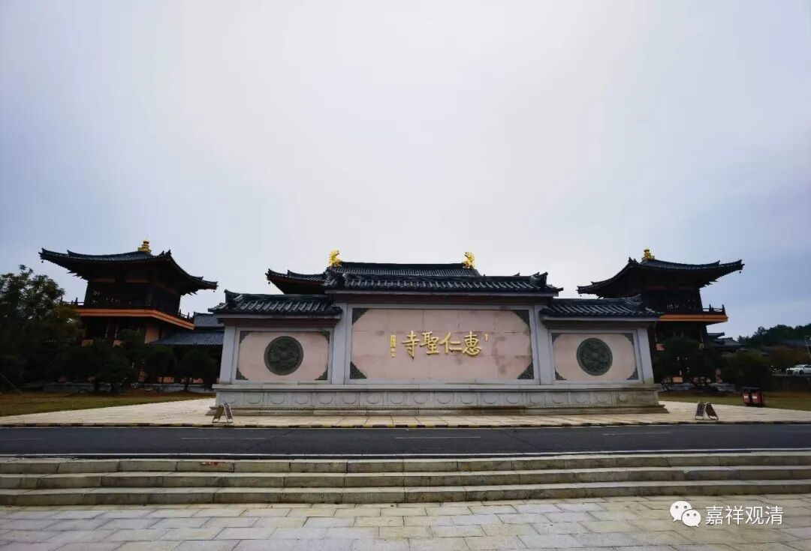

**七年了，又到了惠仁圣寺**

上一次来惠仁圣寺，还是在上一次……

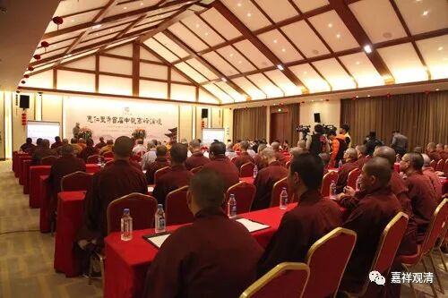

2017年首届中观高峰论坛在惠仁圣寺举办

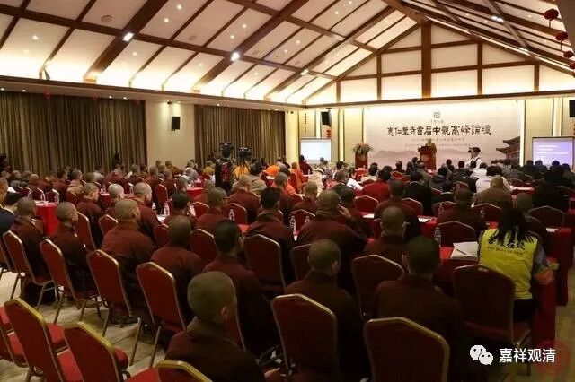

2017年论坛主会场

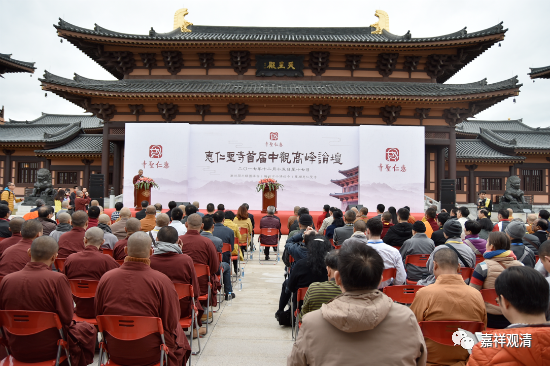

也是年底，看这衣服厚的，还有围脖儿

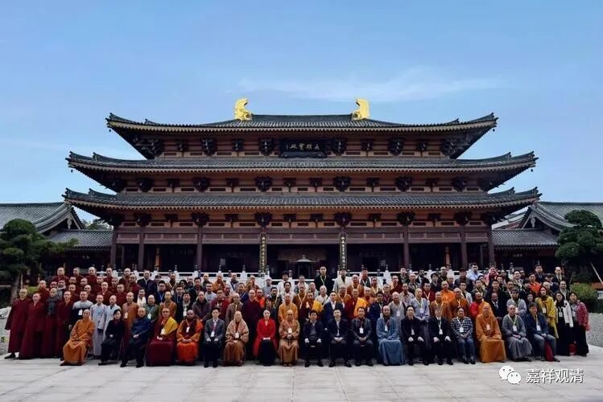

long long ago了都

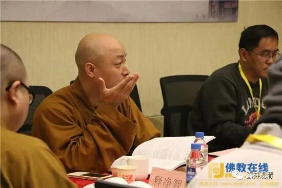

当年，砍人现场，哈哈……

2017年，第一次中观高峰论坛就是在惠仁圣寺开的，那个亮相，应该是惊艳了很多人的。咱中观，也有组织了。（之前，教内中观的、有延续性的论坛一个都没有，唯识论坛则到处都是，有的都快二十届了。）

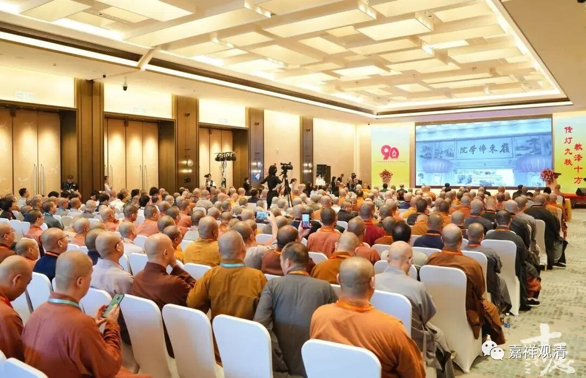

今年，岭东校庆现场

现在2023年，这都六年过去了……

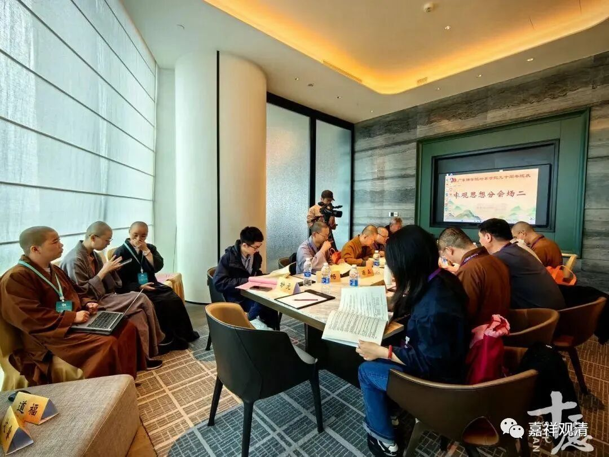

恳谈现场

这次又是因为广东佛学院岭东学院（岭东佛学院）90周年校庆和恳谈会来的，恳谈会延续的就是中观的那啥，是吧。

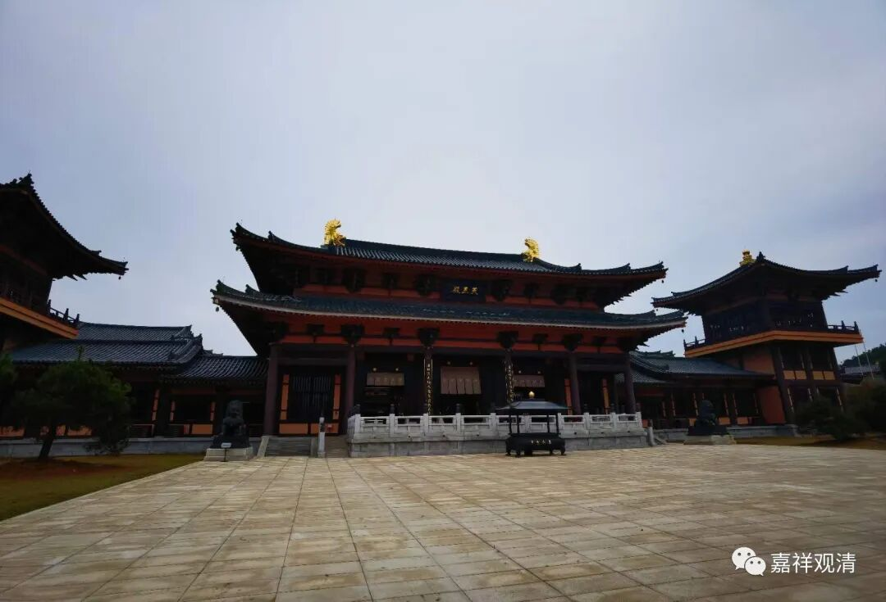

惠仁圣寺天王殿

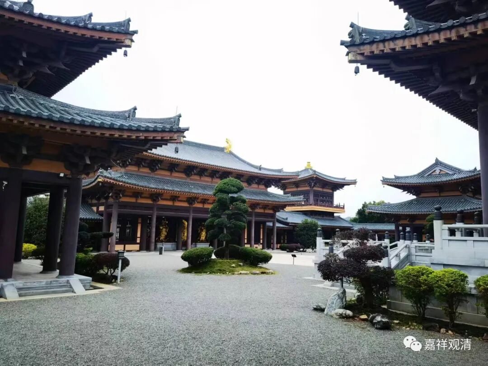

惠仁圣寺一角

研究所的阿毗达摩已经搬到了惠仁圣寺，七年来，经过精心地设计建设，这里的硬件条件已经非常完善，有独立的教学楼——

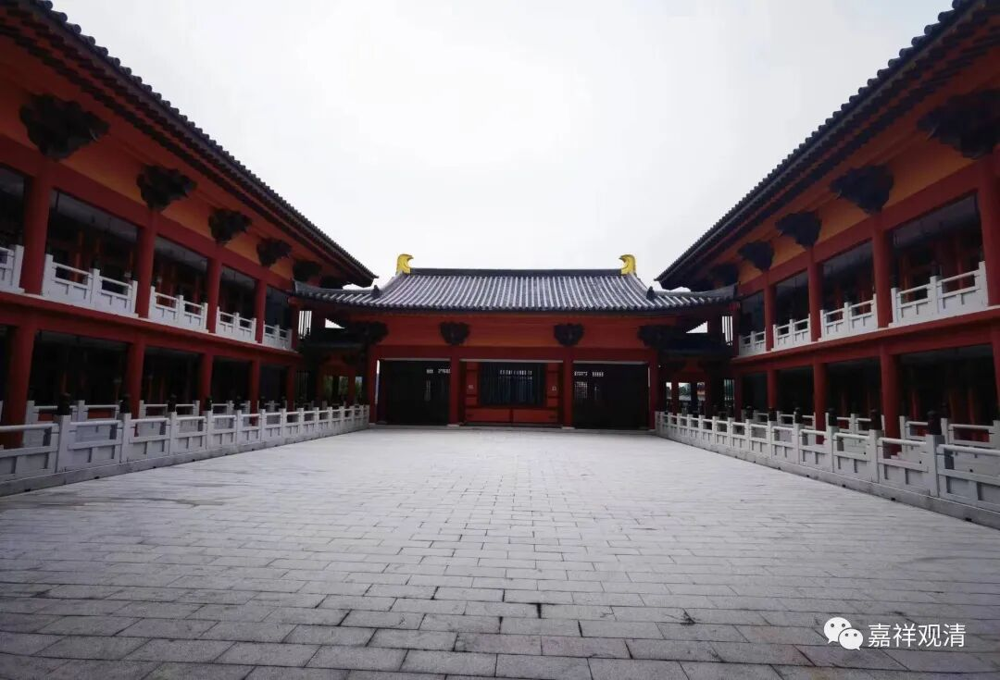

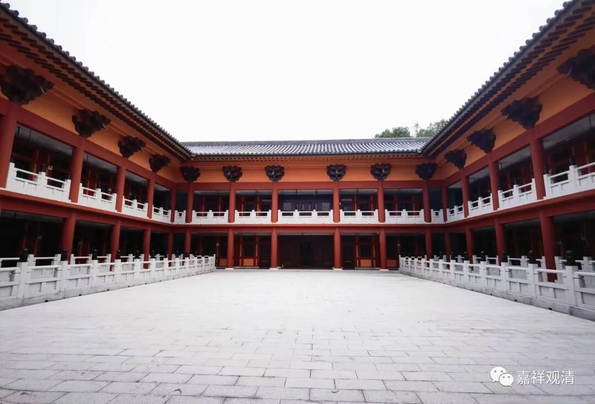

这是宿舍区，好干净……

是不是大家看着都觉得好羡慕。

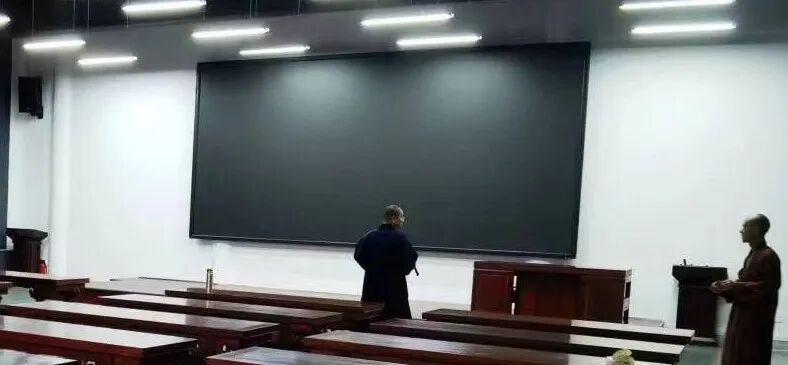

看看这一面整面墙的电子屏幕，老板砸银子了。

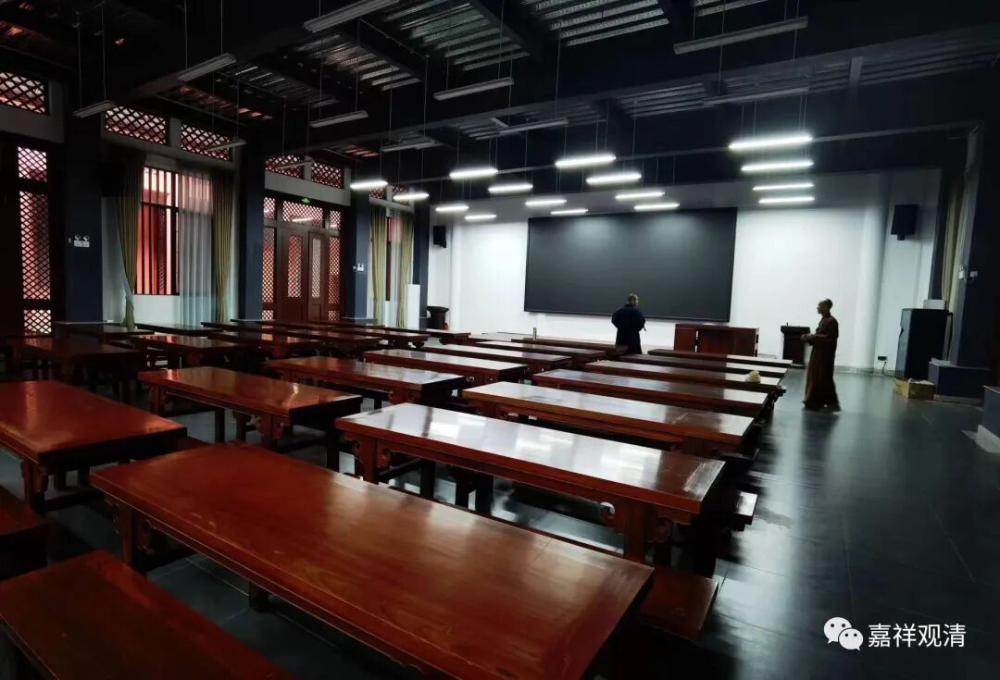

这大教室，都能开大会了。呃，也有点不好的……就是太新了……油漆味还没全部散完，进去我就打喷嚏流鼻涕，忙不迭的找纸巾……我这老鼻炎哦！

住几天，聊聊大藏经，聊聊佛教史……

