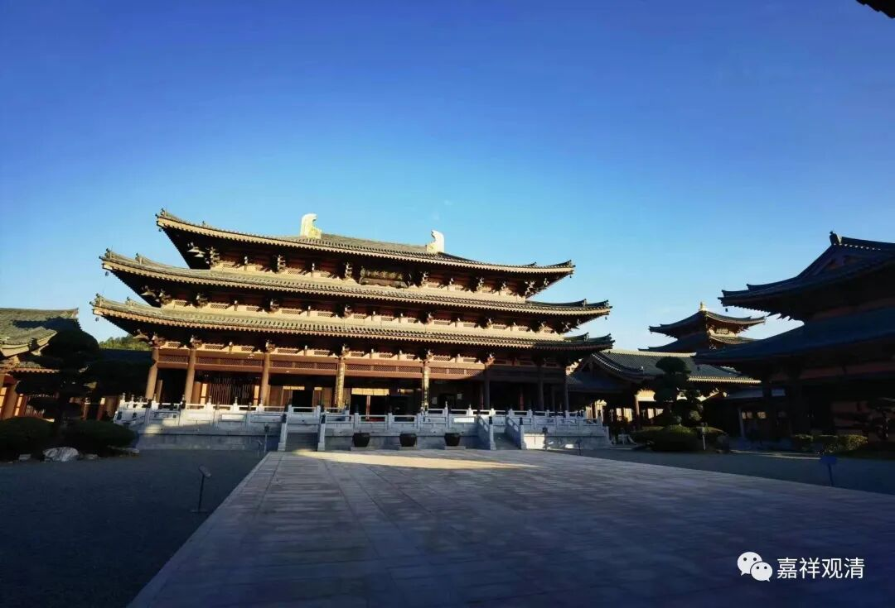
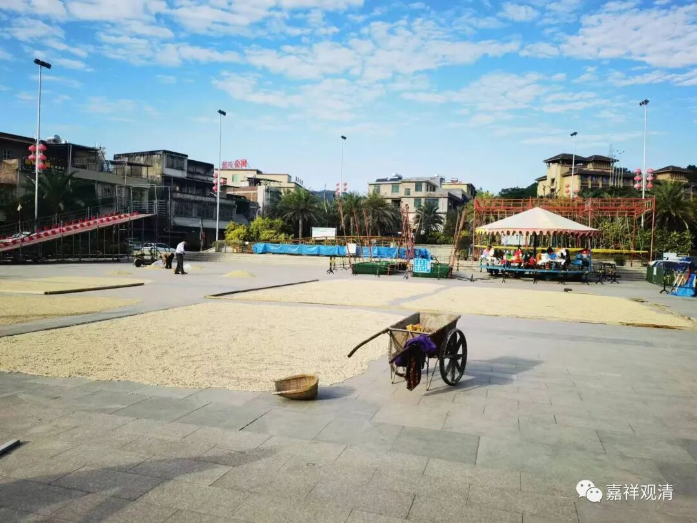
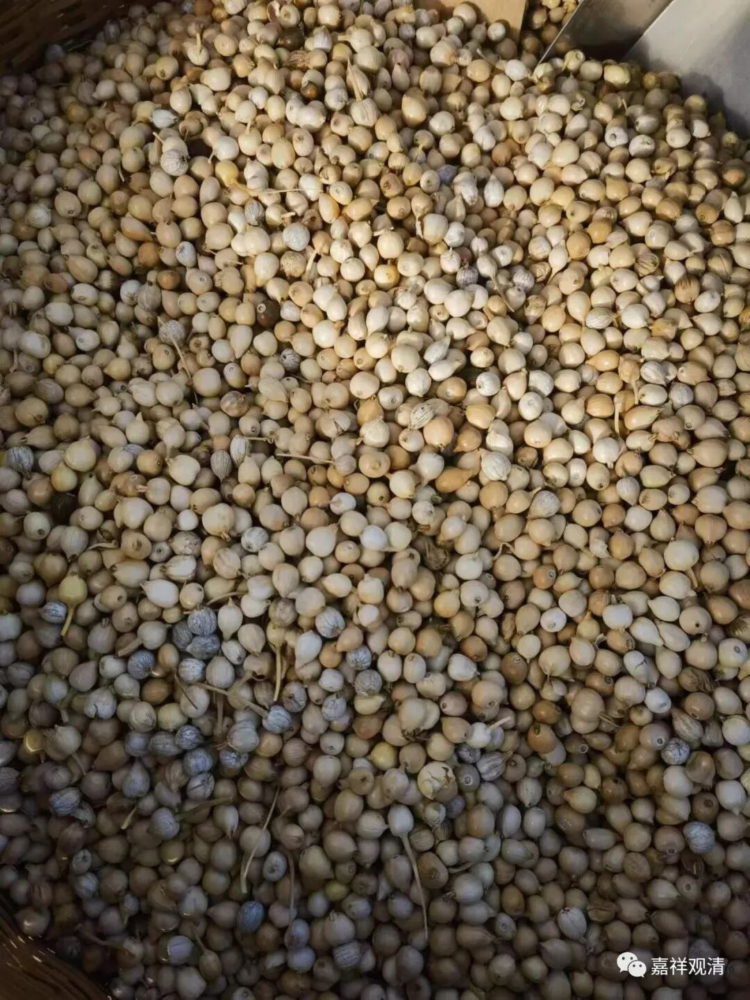
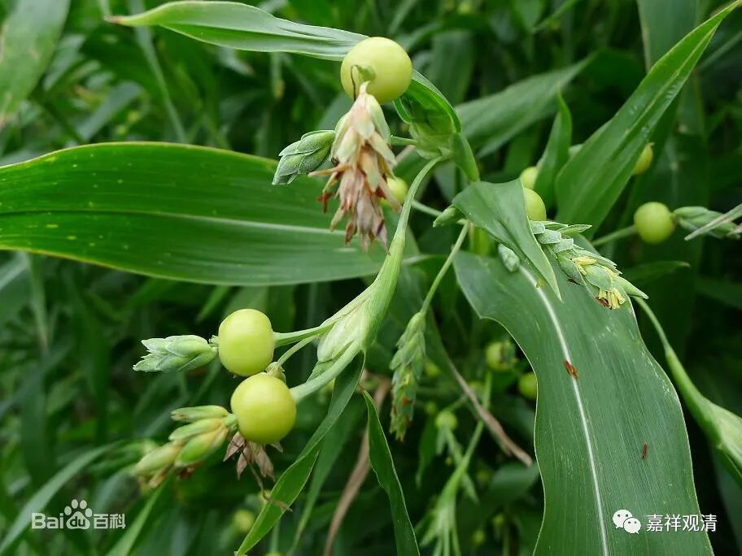
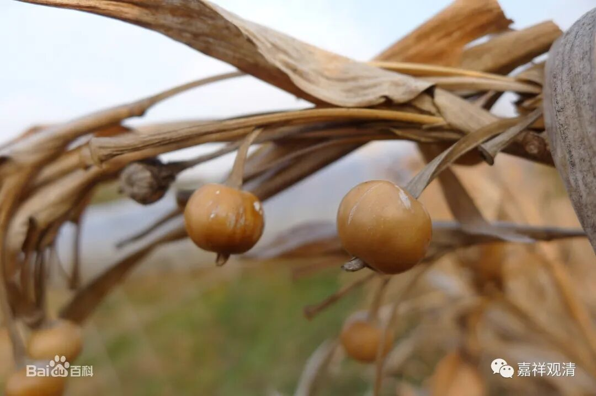
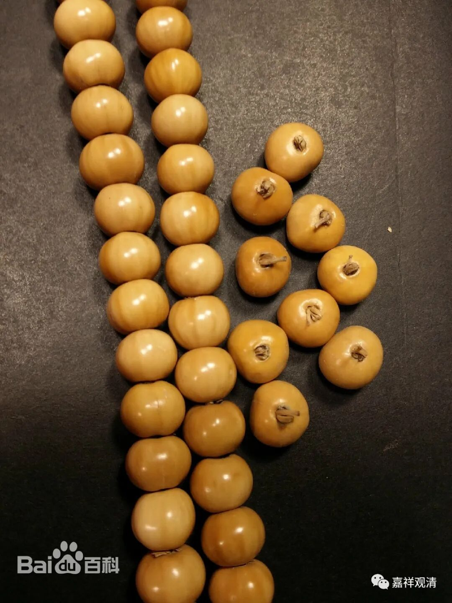
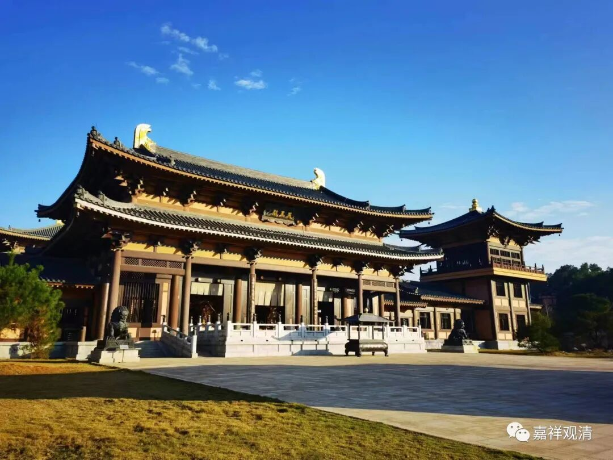
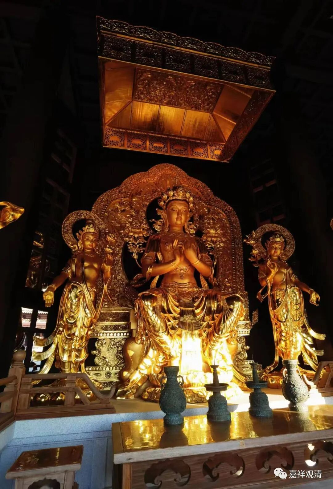
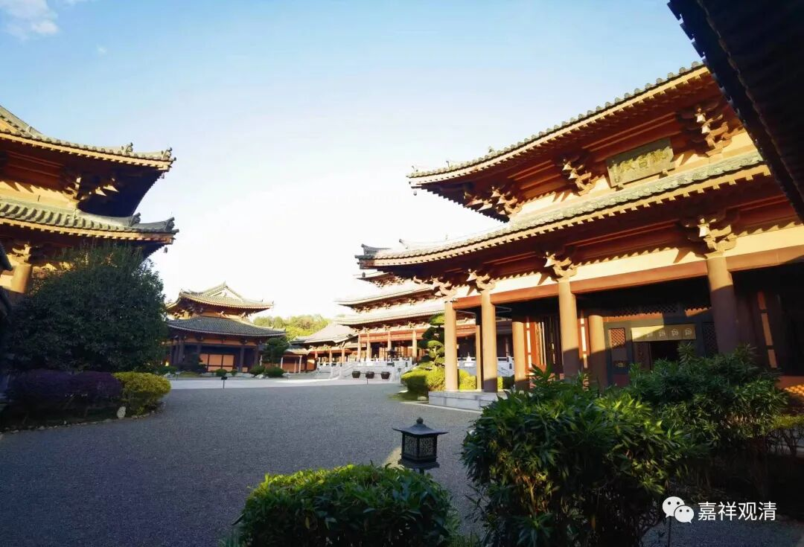
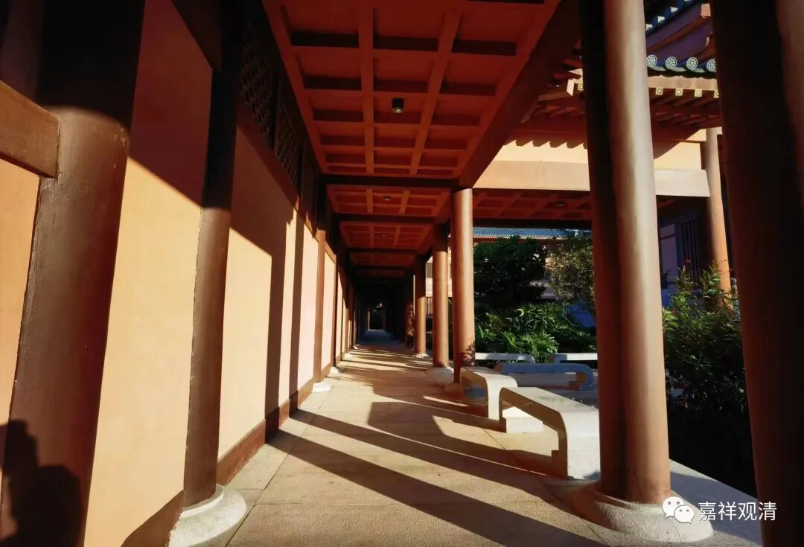

上午佛学院连着上了三节课“大藏经”，下午两三点下山走走。

这会儿气温说是回到二十度了，但感觉还是有点冷，寺院是朝西向的，可能温度要上来还得等会儿。跑鞋落在北京了，再加上外面确实有点凉，果断放弃了跑步的想法，走走就好。

以前来是住山下的温泉宾馆，这次住在山上寺院里了。

那次大和尚硬让我们住宾馆、泡温泉，结果那天温泉的水管爆了，泡出了场大病……所以我一直“迷信”地不敢来，这不，都七年了嘛。特别是这次来之前北京大雪，其实还是有点吓到我了——这是不让我去吗？

顺着柏油路下山，路边七年前就在卖的房子还在卖，路边的店面房也还是空着……

一路到山下，去温泉宾馆门口回忆回忆……广场上有人在晒什么

我走进去问，回答我说“是yì米，但不是yì米，是中药，但不是吃的yì米……”。我知道肯定说的是不是“玉米”，但是什么东西听不出来，难道是“薏米”？

蹲下来看，咦，这不是小时候串念珠用的“草菩提”吗？

梅州方言交流困难，她们让我去问一位老叔，老叔跟我说“yàn米，草字头的yàn”，我拿出手机打出“燕米”，他作势看一看说“是”。然后手机各种搜“燕米”，结果是“燕麦”……但是，根本不像啊。

回来按“草菩提”去检索，果然，草菩提就是“薏米”——中药“薏苡仁”！

我一直知道“薏苡仁”，但不知道原来“薏苡仁”就是“草菩提”里面的籽，以前用这个做念珠的时候那都是把里面的籽捅出去的。

回山，正好西面的太阳照过来，寺院就是这样了。

惠仁圣寺的弥勒殿供奉的是“天冠弥勒”，不是常见的大肚和尚契此。

