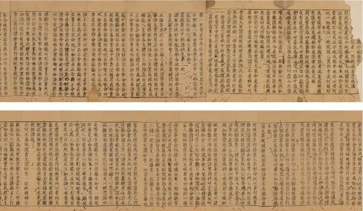

**一则《大正藏》校勘记引发的“探案”**

前两天我介绍西泠印社的一件拍品时说到——

“……《大正藏》校勘记里，则说“阿毘达磨【宋】【元】【明】【宫】”，意思是，【宋】《思溪藏》本、【元】《普宁藏》本、【明】《嘉兴藏》本和【宫】宫内本都做“阿毗达摩大毗婆沙论”而非“说一切有部发智大毘婆沙论”，《大正藏》这个和拍卖的这件有点不符的样子。考虑到《普宁藏》的流行短暂，《大毗婆沙论》也不是常见的流通经典，似乎《普宁藏》不应该有不同的版本才对。又考虑到《大正藏》的校勘有一些常见的错漏，有必要有机会去核对一下这几个原版看看。”

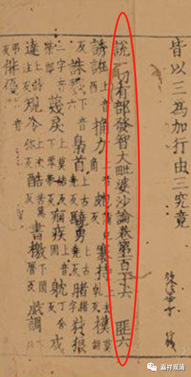

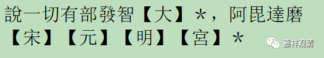

之后萧博士发来他查阅的资料，发现，《高丽藏》、《赵城金藏》、《思溪藏》、《普宁藏》等在《大毗婆沙论》各卷卷尾都一致地做“说一切有部发智大毗婆沙论”而非《大正藏》校勘记所说的作“阿毗达摩大毗婆沙论”，看来还是《大正藏》的校勘记出了问题。

我们看图版——

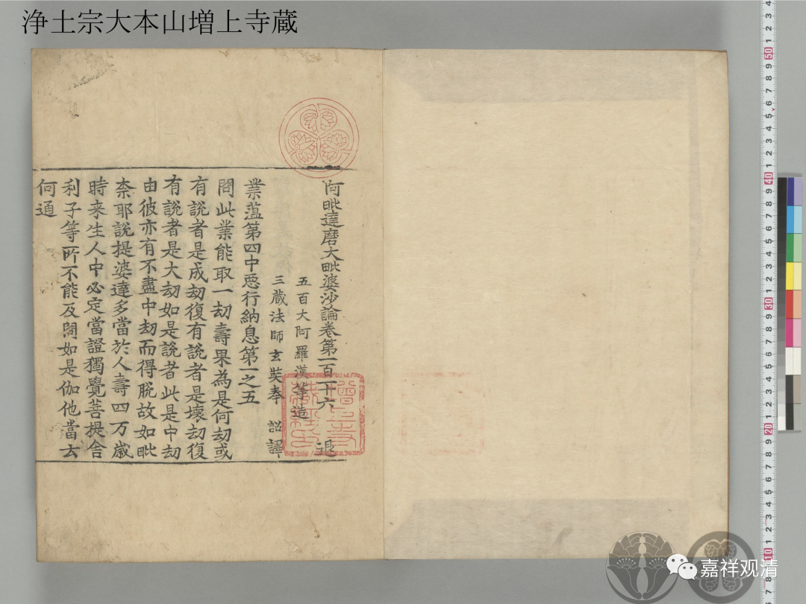

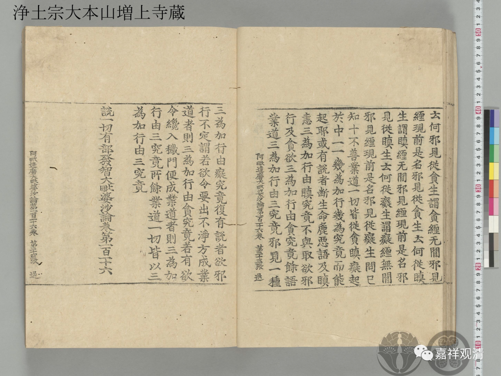

以上《高丽藏》。

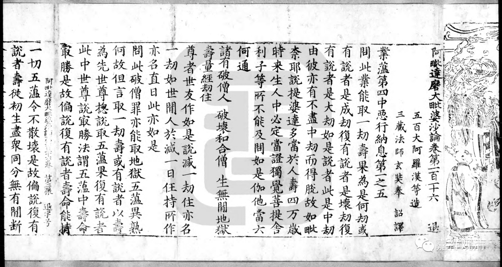

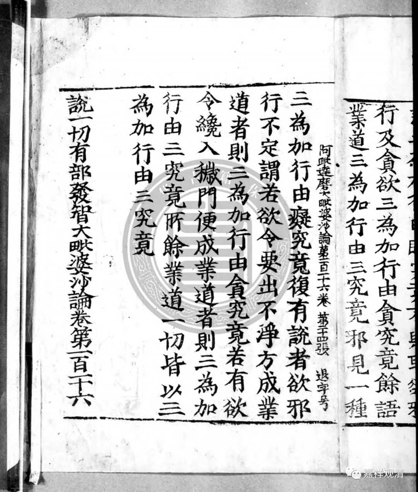

这是《赵城金藏》。

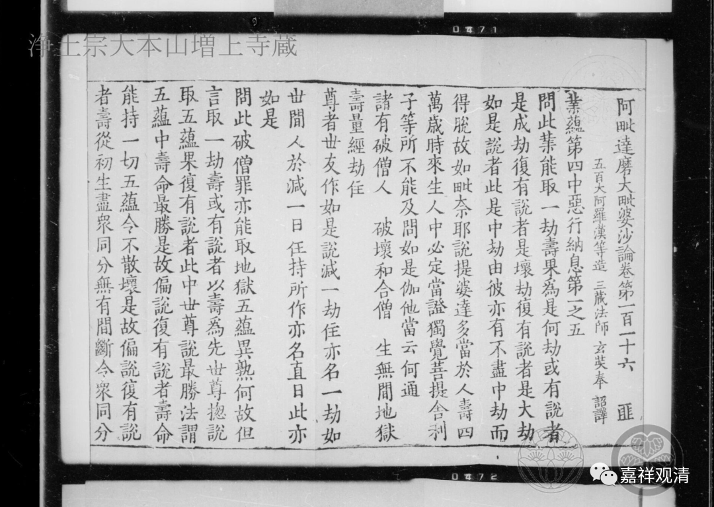

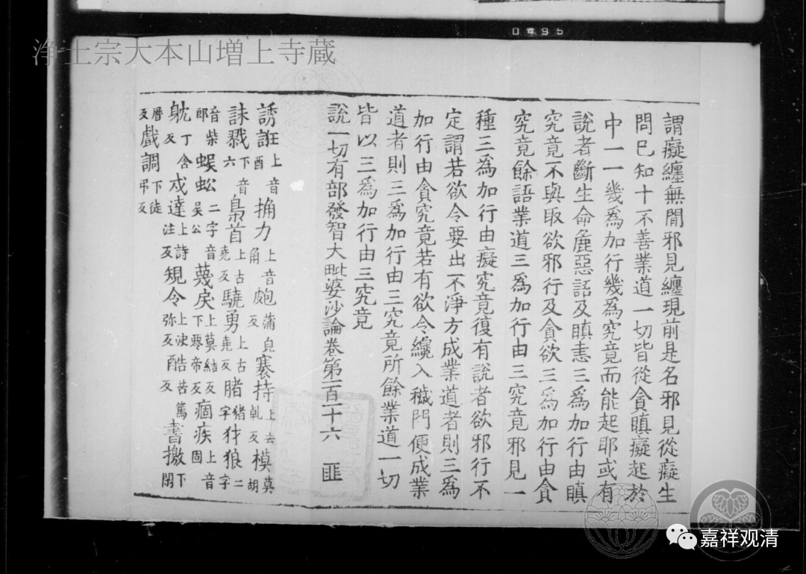

《思溪藏》。

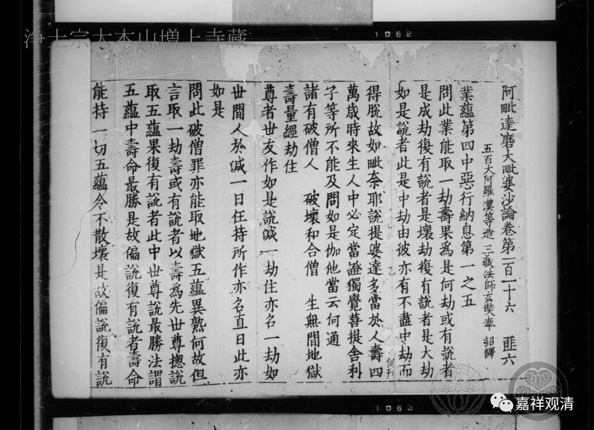

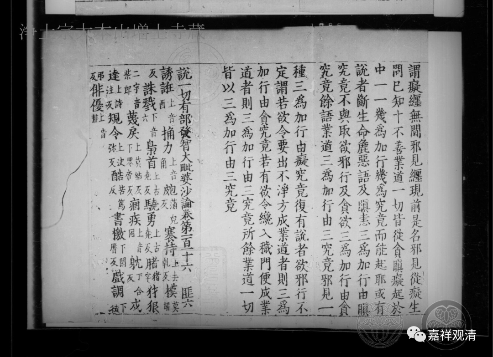

《普宁藏》。

其中，《高丽藏》和《赵城金藏》是源自《开宝藏》的《大藏经》刻经系统（每行十四字），《思溪藏》和《普宁藏》则是源出《福州藏》的刻经系统（每行十七字），两个不同系统的大藏经在这个地方是一致的，并非如《大正藏》校勘记所说地不同。（但每一卷开始和卷末确实是不同，这些大藏经版本里面，卷首都做“阿毗达摩大毗婆沙论”，卷末都做“说一切有部发智大毗婆沙论”。）

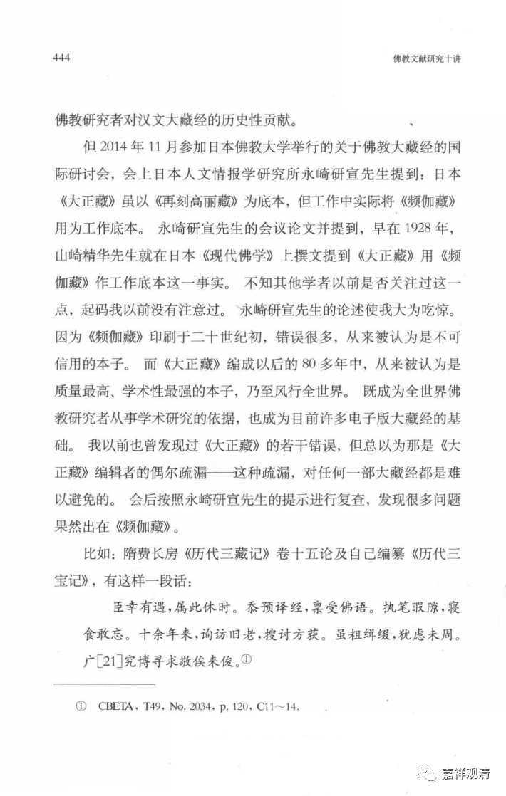

《大正藏》的校勘出问题已是常见了，大概也就比《频伽藏》好一点。《大正藏》号称以《再刻高丽藏》为底本，而实际的工作本却是《频伽藏》（就像我们平时写作号称引用自《大正藏》，实际却是在引用cbeta，哈哈）。《频伽藏》的错误极多，二十多年前读了很多影印《频伽藏》的本子，至今“记忆犹新”——那些书好像今天还在。

谢谢萧博士给的资料和意见。

修订一下前文，顺便敷衍了今天的文章……

