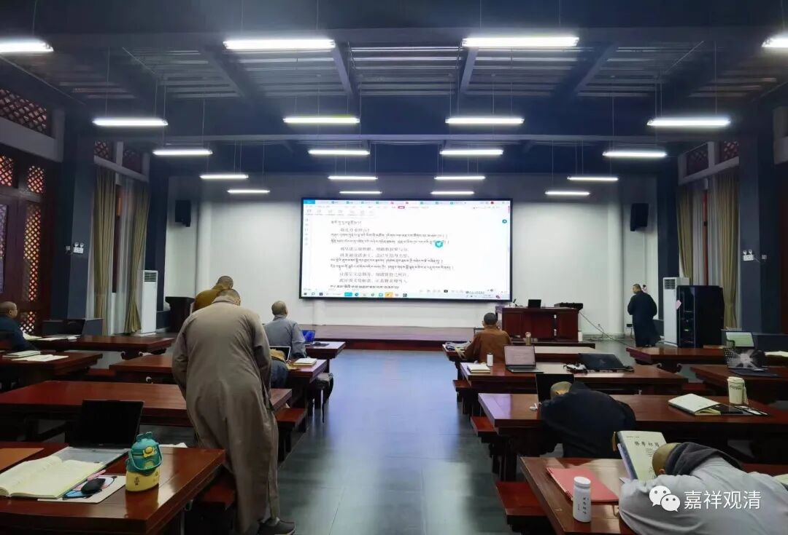
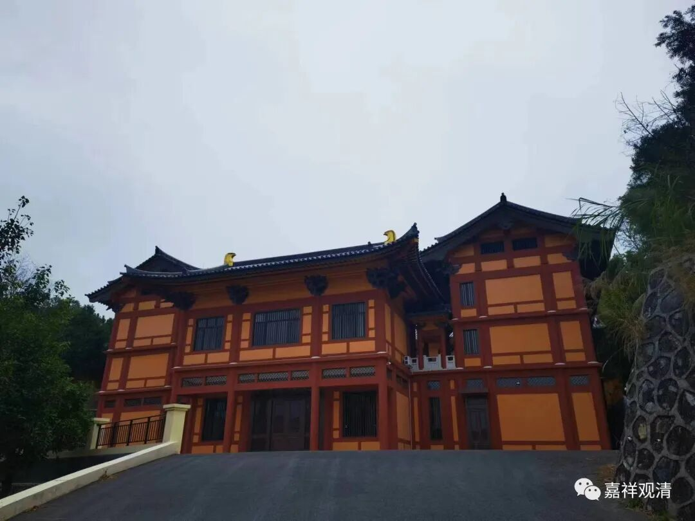

**“快问快答”之“有部的分类”**

扎巴协珠《一切宗义摄要》：

“（说一切有部，）若予分类，由体性门分为二种：迦湿弥罗毗婆沙师、外方毗婆沙师；若由分裂之理区分，有十八部……”

有人对这一段宗义书里说到的“说一切有部的”分类部分不太理解（其他宗义书的说法也大致接近），问：什么叫“体性门分”，什么叫“分裂之理区分”？

其实我们换一个说法（暂时不站在宗义书本身的语境下）就容易解释了。

前者，“‘说一切有部’之分为克什米尔的婆沙师、西方师、东方师、外国师、中印度有部师……”——这类说法是从“狭义的有部”的角度说的，“狭义的说一切有部”就是单纯地指持“三世实有、法体恒有”的那些人。

而说“‘说一切有部’分裂为十八部……”，这里的“说一切有部”实际指的是“广义的‘说一切有部’”，“广义的有部”其实就是指除了“经量部”以外的全部小乘宗派。

这里，前后的两个“有部”的概念完全不同，单纯从“体性门”“分裂之理”的文字上不容易看得出来，如果跳出文本本身，从佛教史的“大历史”角度来看就一目了然了，不难理解。关键点在不能混淆两个“有部”的概念。

（呵呵，又在佛学院讲佛教宗派。这是我最喜欢的课了。）

