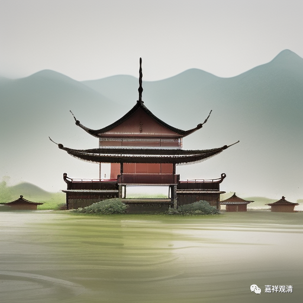

**《宗义略讲》001·020**

我不知道这一次会不会讲到，讲到的话就有些复杂，比如说极微，大乘到最后意思不就是你小乘，这么费力所建立的物质终极终极存在的极微等等，我都给你打破了，根本不重要啊，你有部那么重要的核心观点“得”，在我的大乘阿毗达磨当中是个分位差别的心不相应行法，根本不重要。

学习宗派论的时候，有时候我们要做加法，有时候我们要做减法，我们讲宗派的背景，不仅是做加法，也要做减法，其实讲到有些地方的时候，也希望大家知道，这些说法，未见得是重要的；比如说有部非常重要的观点，建立的三世实有，比如说，“心法刹那有”，“物质最终是由极微构成的实有”，还有无比复杂的“得”。“得”“成就”在有部系统中是重要得不得了的一个重点、难点，但是一旦你一脚迈入大乘，他直接就给他取消了，那就是个“假法，非实有”，你看，只要给他加个“假法”这个词，突然之间这个那个高大的形象就垮掉了，难点不难了。他确实是个假法。那么有部建立的教义当中，类似“得”这种“被假法”的情况还有很多。

西方哲学史当中，有一个人，很重要的一个人，奥康，著名的“奥康剃刀”就说，“如无必要，勿增实体”，我们也挥起这个刀把，挥起这个刀，宗派史里面很多无必要而有的这类“实体”，统统砍掉。砍掉以后，我们会觉得还是中观好，确实根本没有那么多实体，我们中观说了——根本不存在那些实体！

宗义书以有部和经部来概括小乘佛教，其原因是因为他们相信了后期根本说一切有部的说法，后期的有部说：“其他部派都是从根本上座部那里分出来的，而我们就是这个根本！”就像今天我们也是一样的，今天我们讲，我们才是正统的马列，其他都是托洛斯基，都是这个派那个派等等，朝鲜也认为他们是最正统的，都觉得其他是修正的，其他是错误的。这些宗派当中也是一样的，只有自己最正宗，其他都是歧出。

宗义书提到了四宗，一方面的原因是这四宗都是梵语佛教系统的。我们讲过的，这些都是梵语系统的，梵语系统的当中，包括小乘当中，最重要的目前看来确实是有部，因为它的经典系统特别繁杂，它的论典系统特别繁杂，这就给了我们很多学习研究的机会。还有一点，就是即使不听有部的“自赞自夸”，有部这个体系也足够作为小乘的一个代表——它可以是一个很重要的一个代表。如果我们把南传作为小城的代表的话，我们会出现一个问题，就是接下去学唯识学阿毗达磨可能还要重学，因为这里面系统的差别相对较大。假如今天我们有正量部的阿毗达磨，那我们学完后，再学唯识，肯定也要近乎于重学，但是学有部的话，再学经部、唯识这些就不需要回炉再造了，你只要在相应的地方做做微调就可以了，而且这这调整非常小，并不大。所以根本说一切有部可以拿来做小乘的一个代表。

