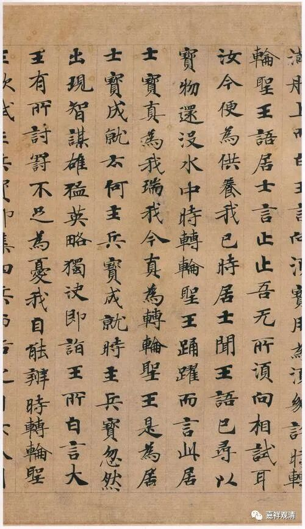
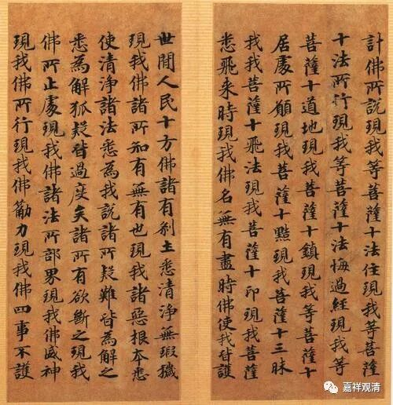
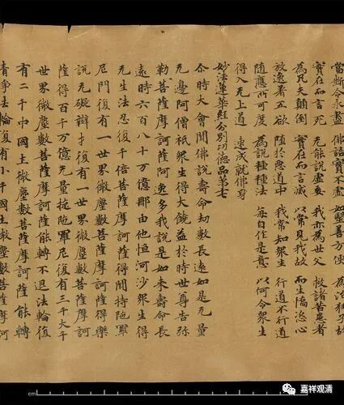
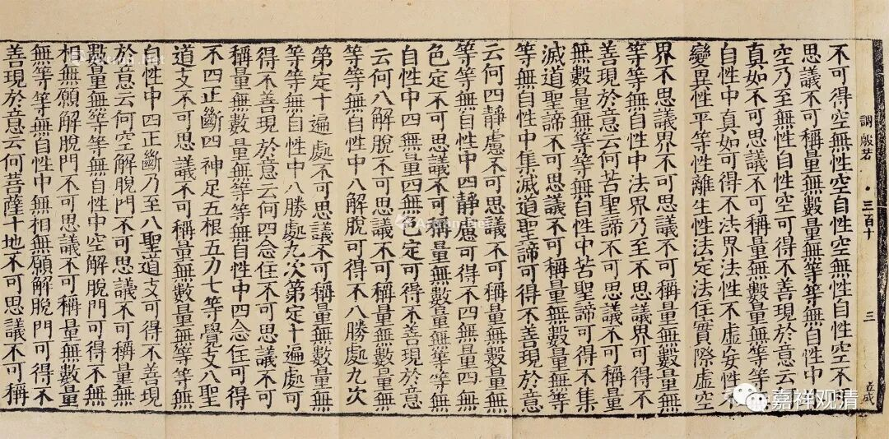
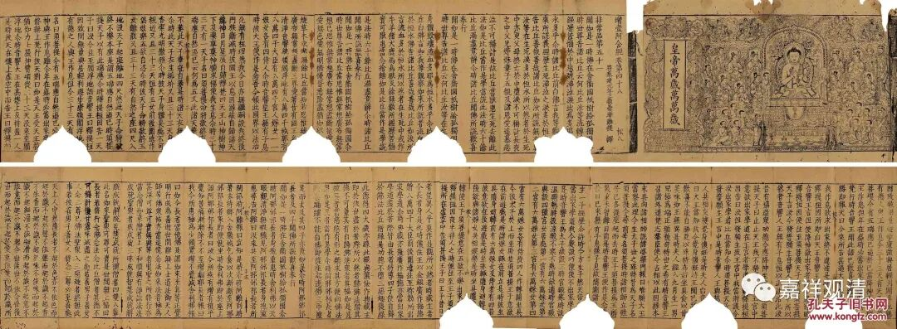
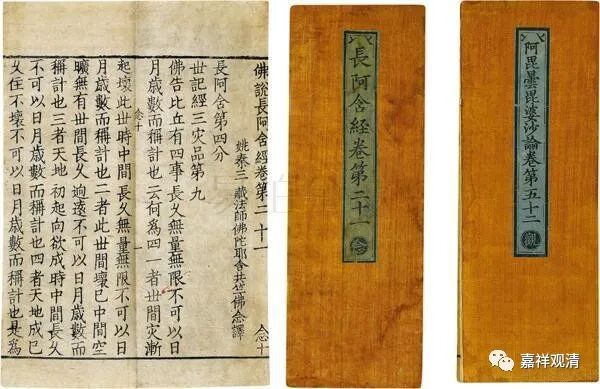
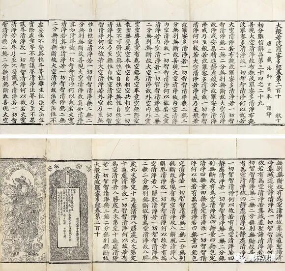

时散论师

《提婆菩萨释<楞伽经>中外道小乘涅槃论》在述及外道“时论师”时说：

“答曰：第十七外道时散论师作如是说，时熟一切大、时作一切物、时散一切物。”

这里的“第十七外道”做“时散论师”，而本《论》之初则谓“十七者时论师”，二者不同。按：此处实当作“时论师”。

《大正藏》（cbeta）校勘记谓：【宋】思溪藏【元】普宁藏【明】嘉兴藏【宫】宫内本无“散”字。

清按：

这一处的文字很明显就是抄经的经生抄错行了。

我们看，从“时散论师”的“散”到“时散一切物”的‘散”，中间的文字为“论师作如是说时熟一切大时作一切物时”，共一十七个字，而“十七个字”正是唐写本和自福州大藏经以下大藏经每行的标准字数。

以上写经，每行十七字

思溪藏，每行十七字

碛砂藏，每行十七字

永乐南藏，每行十七字

也就是说，衍文的“散”字，就是抄写的人不小心抄到隔壁一行去了，于是，“时散一切物”的“散”就加到“时论师”的“时”后面，变成“时散论师”了。

永乐北藏，每行十七字

印度的时论师认为，“时间”是一切事物生成的根本，他们举例说，比如有的人身上中了一百多箭还不死，就是时间不到的原因，时间到了，小草一碰也死。时论师说，一切事物由时间产生、因时间成熟、时间到了就灭……时间是一切的根本，解脱也要靠时间。

胜论师说时间是实体，时论师说时间是一切法的生因，也是印度婆罗门教系统里一种特别发挥的时间观了。

