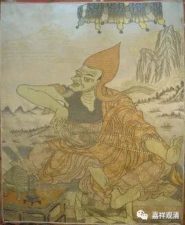
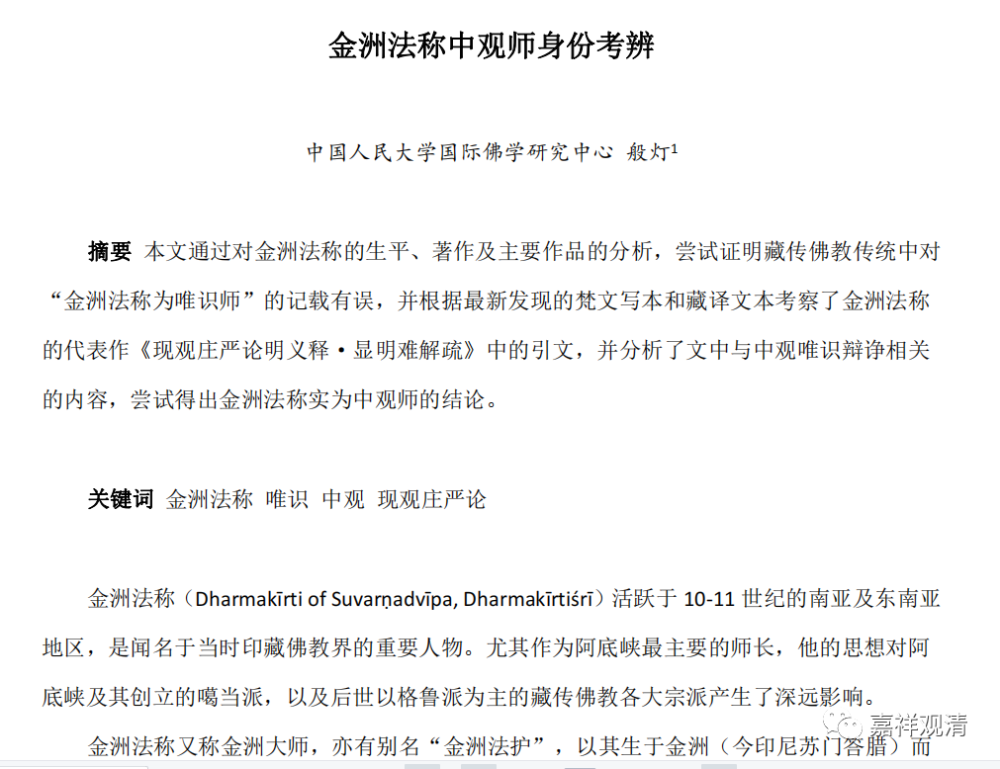

**金洲慈氏**

** ——金洲法称大师是中观派还是唯识派？**

金洲法称大师是中观派还是唯识派？

下面据般灯法师最新发表的论文《金洲法称中观师身份考辨》，我们做如下介绍——

传统上似乎多说金洲法称大师是唯识派的，比如《阿底峡广传》中说：“见依唯识而行，从金洲大师请受”，《菩提道次第广论》中说“金洲大师持唯识中实相之见”，然而从从金洲法称的求学经历、现存著作、著作引文三方面来看，却很难得出他是唯识师的结论。相反，从他驳斥唯识的态度来看，金洲法称更应该是中观师。

1、从金洲法称本人的求学经历中，没有提到涉及学习唯识教典。（《金洲传》《赴金洲传》《阿底峡传》）

2、从阿底峡尊者求学经历中，没有记载从金洲法称学习唯识教典。（《阿底峡传》等。）

3、已知署名金洲法称的作品共有17 部，可以确认为金洲法称的著作有 9 部，疑似有 8 部。这十七部作品中，修心类有六，般若类有一，密法类有七，其余有三，唯识类无一。

4、从金洲法称的著作引用上来看，金洲法称并不持唯识观点。般灯《金洲法称中观师身份考辨》中对现观《金洲疏》引文统计如下：

“从引用次数来看，引用次数最多的是量论类，确定出处的有 13 次，不确定 2 次。但只有 2 部论。其次是中观类，引用 12 次，包含 9 部论。而唯识宗的论典只引用了 8 次，且其中只有引用《唯识三十颂》时提到了唯识宗不共的见解，其他的引用都是与菩萨行相关的。但这一处引用《三十颂》，是作为辩论的敌方提出的，随后就被金洲法称引用龙树的《六十正理论》破斥了。因而仅从引文我们也能看出，金洲法称应该不是以唯识宗的角度来撰写这部论著的。”

5、从法称著作中经常以中观破唯识来看，法称不是唯识见。

那么为什么大家会误读金洲法称为唯识见呢？

我觉得，可能是他的外号带给大家的误解——金洲法称因为传菩提心教授而被称为“金洲慈氏”，就是这个“慈氏”（弥勒）的名字，让后人误读他为唯识宗见！

