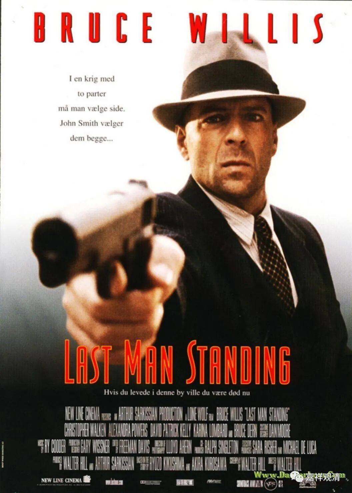
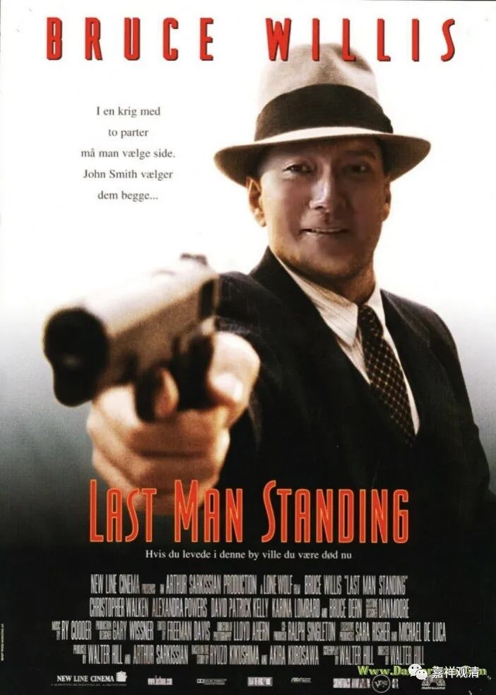

**LAST MAN STANDING！**

** 最后一个站着的人！**

地点：深圳。

约了“法称”大师在品茶居素斋馆吃素食。

品茶居，我是看着它开起来的。经历疫情之种种，深圳的素食馆里，我最爱的“金海阁”已经阵亡，静怡也不见了，而品茶居依然还“在”，真的不容易。借此发出同样的问题：换装修、换厨子、换老板、换菜色……到底什么是“品茶居”？

参！

我和宝大师都是单人赴会，哇哈哈哈，其实兄弟们想看的是这个——

或者这个——

让大家失望了，哈哈哈哈哈哈……

和宝大师聊天中，我问了个问题——

我说听说某法师给学生们上课直接用《简单逻辑学》，我觉得这种做法很有想法，可以参考。对有兴趣接触佛教逻辑的初学来说，因明或者因类学这类课程或许可以换成这种模式，你看怎么样？

大师完全赞成，对初学来说，简单学一点逻辑学就可以了。（如果深入学习的话，则需要知道相关的格式、套路。）

我说那请你推荐一两本逻辑学入门教材。

大师说，其实百度“三段论”找出来的文章就足够做初学入门教材了。甚至都不用全部讲完，只需要挑里面和佛教因明有关的三种讲讲就可以了。

嗯，可以研究一下。或者直接让大师写个提纲？

